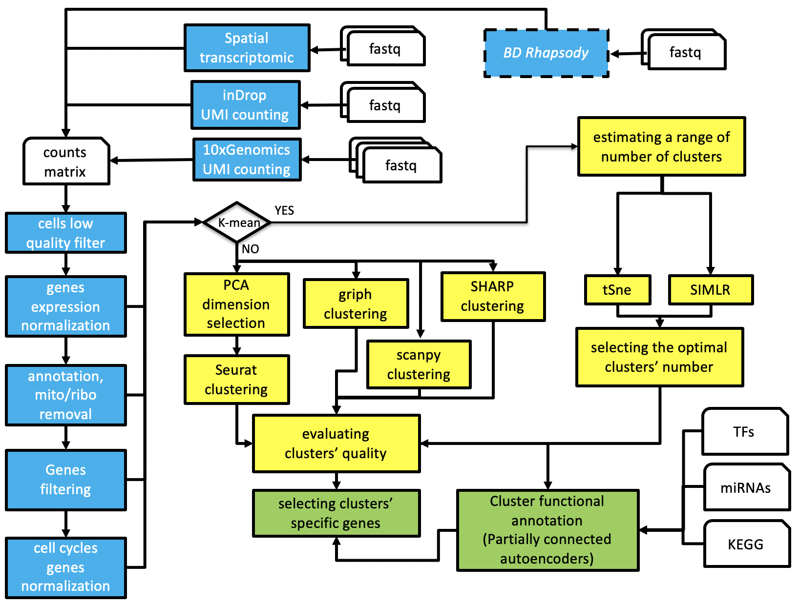

# rCASC
Since the end of the 90's omics high-throughput technologies have generated an enormous amount of data, reaching today an exponential growth phase. Analysis of omics big data is a revolutionary means of understanding the molecular basis of disease regulation and susceptibility, and this resource is accessible to the biological/medical community via bioinformatics frameworks. However, because of the fast evolution of computation tools and omics methods, the [*reproducibility crisis*](https://en.wikipedia.org/wiki/Replication_crisis) is becoming a very important issue [[*Nature, 6 July 2018*](https://www.nature.com/collections/prbfkwmwvz)] and there is a mandatory need to to guarantee robust and reliable results to the research community [[*Global Engage Blog*](http://www.global-engage.com/life-science/reproducibility-computational-biology/)].

Our group is deeply involved in developing workflows that guarantee both **functional** (i.e. the information about data and the utilized tools are saved in terms of meta-data) and **computation** reproducibility (i.e. the real image of the computation environment used to generate the data is stored). For this reason we have founded a bioinformatics community called [*reproducible-bioinformatics.org*](http://www.reproducible-bioinformatics.org/) [*Kulkarni et al. BMC Bioinformatics*](https://rdcu.be/9gMq) designed to provide to the biological community a reproducible bioinformatics ecosystem  [[*Beccuti et al. Bioinformatics 2018*](https://academic.oup.com/bioinformatics/article/34/5/871/4562334)]. 

rCASC, Cluster Analysis of Single Cells, is part of the [*reproducible-bioinformatics.org*](http://www.reproducible-bioinformatics.org/) project and provides single cell analysis functionalities within the reproducible rules described by Sandve et al. [[*PLoS Comp Biol. 2013*](http://journals.plos.org/ploscompbiol/article?id=10.1371/journal.pcbi.1003285)]. rCASC is designed to provide a complete workflow (Figure 1) for cell-subpopulation discovery. 
rCASC was published by Alessandri et al. in [GigaScience in 2019](https://academic.oup.com/gigascience/article/8/9/giz105/5565135)

# Recent updates
We have added sparsely-connected-autoencoders as data mining tools, please see: [npj systems biology and applications 2021](https://www.nature.com/articles/s41540-020-00162-6) and [Int. J. Mol. Sci. 2021](https://www.mdpi.com/1422-0067/22/23/12755). See functions: wrapperAutoencoder, autoencoder4Pseudobulk



**rCASC** is registed with RRID SCR_017005 at [*SciCrunch*](scicrunch.org). **rCASC** is part of  [*Elixir bio.tools*](https://bio.tools/).


## Installation

```
install.packages("devtools")
library(devtools)
install_github("kendomaniac/rCASC", ref="master")
```

## Requirements

You need to have docker installed on your linux machine, for more info see this document: https://docs.docker.com/engine/installation/. 

The functions in rCASC package require that user is sudo or part of a docker group. See the following document for more info: https://docs.docker.com/engine/installation/linux/ubuntulinux/#/manage-docker-as-a-non-root-user

IMPORTANT The first time casc is installed the downloadContainers needs to be executed to download to the local repository the containers that are needed for the use of docker4seq

```
library(rCASC)
downloadContainers()
```

More info at [**rCASC web site**](https://kendomaniac.github.io/rCASC/)

**IMPORTANT** In case you are running rCASC in a virtual linux machine is important to assign to the machine at least 8 Gb RAM

## New features

We have recently implemented a new set of functions allowing the functional mining of single cell subpopulations, i.e. clusters detected using rCASC tool, exploiting sparsely connected autoencoders (SCAs).
The full description of this new module is available  [**here**](https://kendomaniac.github.io/rCASC/articles/rCASC_vignette.html#section-10-mining-clusters-with-sparsely-connected-autoencoders-scas-)

## Roles to write an rCASC function
Results generated by within docker container must be saved in *DataFolder/Results/matrixName/nCluster*.
The docker schema expect the *DataFolder/Results/matrixName* folder is mounted as */scratch*. 
The count matrix presents in *DataFolder* must be copied in  *DataFolder/Results/matrixName*
In the docker, absolute paths are required to move between folders.
In the docker, scripts are usually located in */home*.


