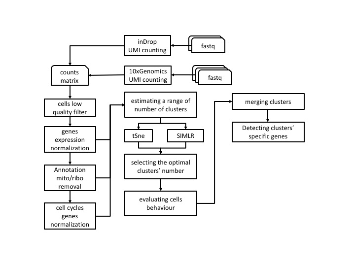
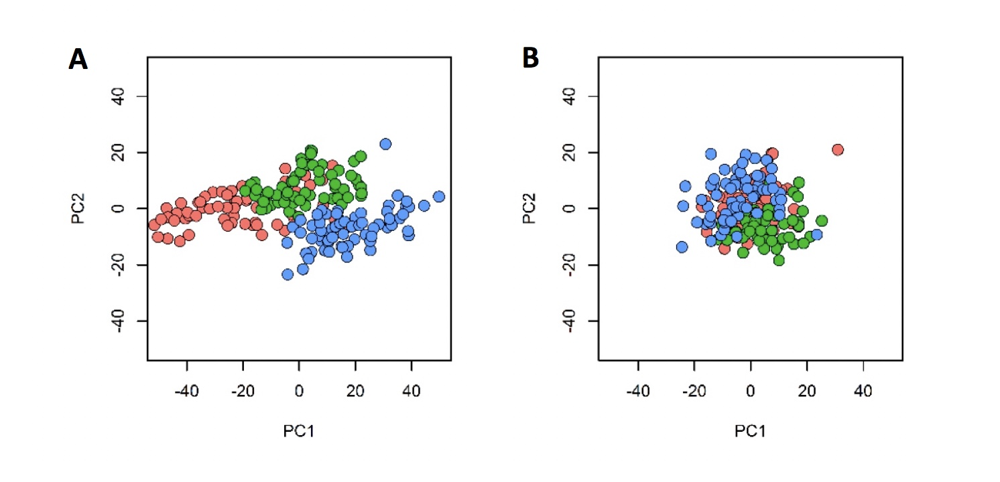
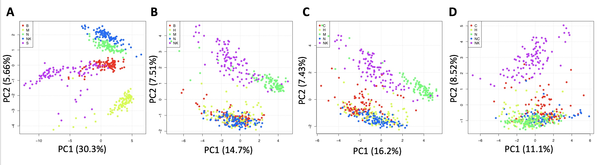
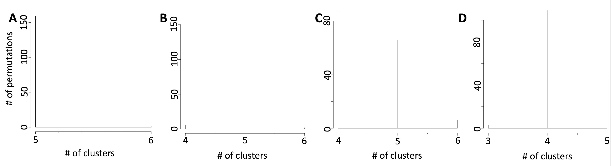
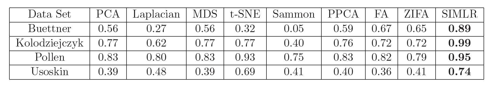
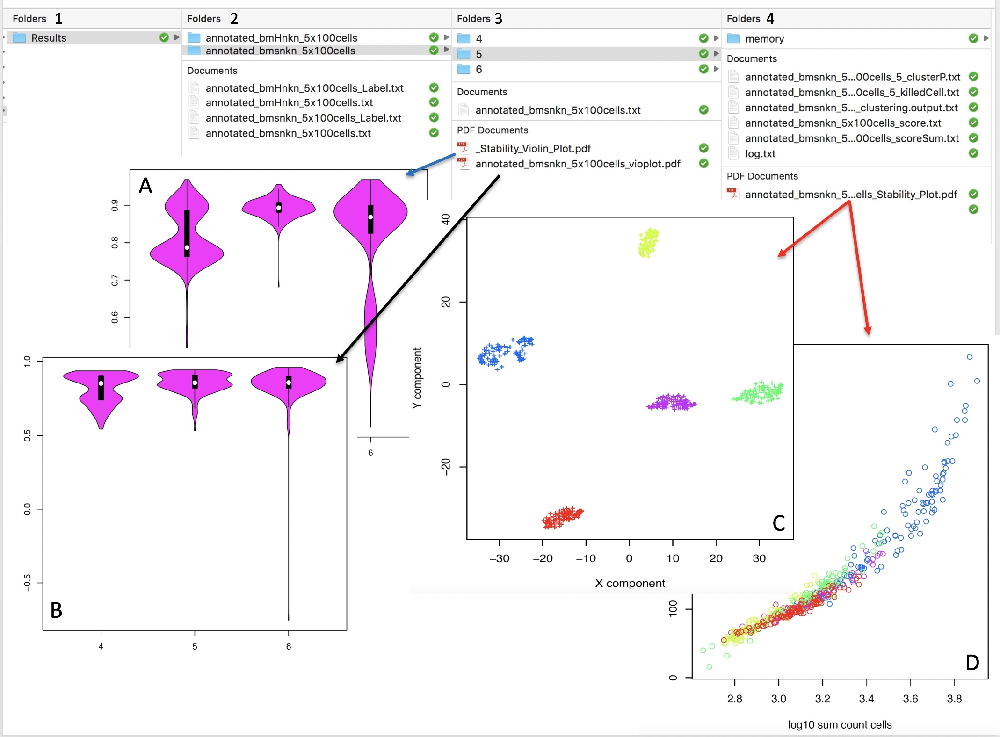
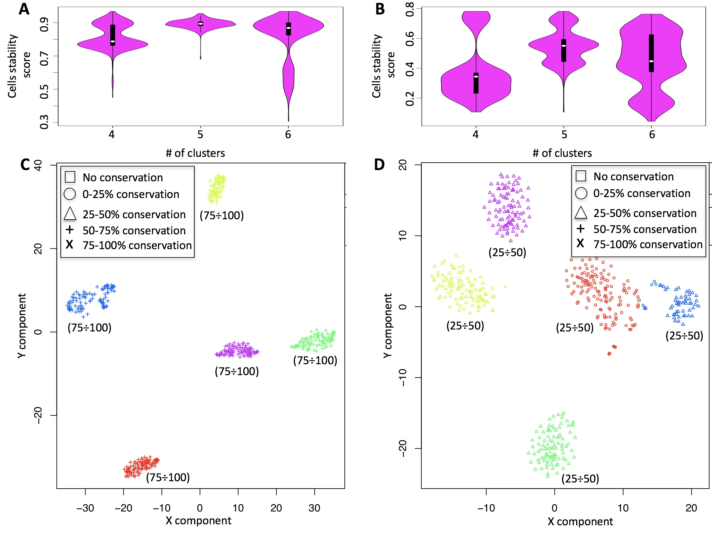

```{r global_options, include=FALSE}
knitr::opts_chunk$set(fig.pos = 'h')
```

## **Section 1** CASC: a single cell analysis workflow designed to provide data reproducibility

Because of the massive data generation given by the omics platforms the [*reproducibility crisis*](https://en.wikipedia.org/wiki/Replication_crisis) is becoming a very important issue [[*Nature, 6 July 2018*](https://www.nature.com/collections/prbfkwmwvz)] and there is a mandatory need to to guarantee robust and reliable results to the research community [[*Global Engage Blog*](http://www.global-engage.com/life-science/reproducibility-computational-biology/)].
\newline
Our group is deeply involved in developing workflows that guarantee both **functional** (i.e. the information about data and the utilized tools are saved in terms of meta-data) and **computation** reproducibility (i.e. the real image of the computation environment used to generate the data is stored). For this reason we are managing a bioinformatics community called [*reproducible-bioinformatics.org*](http://www.reproducible-bioinformatics.org/) [*Kulkarni et al. BMC Bioinformatics, in press*] designed to provide to the biological community a reproducible bioinformatics ecosystem  [[*Beccuti et al. Bioinformatics 2018*](https://academic.oup.com/bioinformatics/article/34/5/871/4562334)]. 
\newline
CASC, Cluster Analysis of Single Cells, is part of the [*reproducible-bioinformatics.org*](http://www.reproducible-bioinformatics.org/) project and provides single cell analysis functionalities within the reproducible rules described by Sandve et al. [[*PLoS Comp Biol. 2013*](http://journals.plos.org/ploscompbiol/article?id=10.1371/journal.pcbi.1003285)]. CASC is designed to provide a complete workflow (Figure \ref{fig:fig.1}) for cell-subpopulation discovery. 

```{r fig.1, fig.cap="CASC workflow", echo=FALSE, eval=TRUE, out.width="70%", fig.align="center"}
library(knitr)



```


The workflow allows the direct analysis of fastq files generated with [*10X Genomics platform*](https://www.10xgenomics.com/), [*InDrop technology*](https://1cell-bio.com/) or a count matrix having as column cell identifier and as row names ENSEMBL gene annotation. In the following paragraphs the fuctionalities of CASC workflow are described.
\newline


### **Section 1.1** Minimal hardware requirements to run CASC
The RAM and CPU requirements are dependent on the data set under analysis, e.g. 500-600 cells can be effectively analysed using the hardware described by Beccuti [[*Bioinformatics 2018*](https://academic.oup.com/bioinformatics/article/34/5/871/4562334)]: 

- 32 Gb RAM and 

- 2.6 GHz Core i7 6700HQ with 8 threads.

- 500 GB SSD

The analysis time can be significantly improved increasing the number of cores using a multi-core achitecture system, cluster implementation of the workflow using [*swarm*](https://docs.docker.com/engine/swarm/) is under implementation. 

### **Section 1.2** Installation

A workstation/server running 64 bits linux.

Docker daemon installed on the machine, for more info see this document:

[*https://docs.docker.com/engine/installation/*](https://docs.docker.com/engine/installation/).

A scratch folder should be present, e.g. /data/scratch, and it should be writable by everybody:

```
chmod 777 /data/scratch
```

The functions in CASC package require that user is part of a docker group.
See the following document for more info:
[*https://docs.docker.com/install/linux/linux-postinstall/*](https://docs.docker.com/install/linux/linux-postinstall/)

CASC can be installed in [*R*](https://cran.r-project.org/) as described below:

\fontsize{8}{8}\selectfont
```{r, echo=TRUE, eval=FALSE}


install.packages("devtools")
library(devtools)
install_github("kendomaniac/casc")

# downloading the required containers
library(casc)
downloadContainers()


```
\fontsize{10}{10}\selectfont


## **Section 2** Counts generation

### **Section 2.1** inDrop seq

inDrop was originally pulished by Klein [[*Cell 2015*](https://www.ncbi.nlm.nih.gov/pubmed/26000487)]. Then, two year after that, the authors published the detailed protocol in [[*Zilionis et al. Nature Protocols 2017*](https://www.ncbi.nlm.nih.gov/pubmed/27929523)], which has different primer design comparing to the orginal paper (Figure \ref{fig:fig.2}). 

```{r fig.2, fig.cap="inDrop library structure", echo=FALSE, eval=TRUE, out.width="80%", fig.align="center"}
library(knitr)
include_graphics('../inst/img/indrop_v2.jpeg')
```


The analysis shown below is based on the protocol in Zilionis [[*Nature Protocols 2017*](https://www.ncbi.nlm.nih.gov/pubmed/27929523)], which is the version 2 of the inDrop technology. According to the [*inDrop github page*](https://github.com/indrops/indrops), there is a version 3, but the oligos and library structures are exactly the same as version 2, except the sequencing mode changed.

In version 2, three different reads are generated: 

```{r fig.3, fig.cap="inDrop v2", echo=FALSE, eval=TRUE, out.width="80%", fig.align="center"}
library(knitr)
include_graphics('../inst/img/indropv2.jpg')
```


In version 3, four different reads are generated:

```{r fig.4, fig.cap="inDrop v3", echo=FALSE, eval=TRUE, out.width="80%", fig.align="center"}
library(knitr)
include_graphics('../inst/img/indropv3.jpg')
```


#### **Section 2.1.1** inDrop data analysis

- **inDropseq**:
    + Creating a reference genome for inDrop V2: **indropIndex**
    + From fastq to UMI counts using inDrop workflow: **indropCounts**


The function *indropIndex* is available to generate the index files required for reads mapping and annotation.
\newline
\fontsize{8}{8}\selectfont
```{r, echo=TRUE, eval=FALSE}

library(casc)
#running indropCounts index build
indropIndex(group="docker", index.folder=getwd(),
 ensembl.urlgenome="ftp://ftp.ensembl.org/pub/release-87/fasta/mus_musculus/dna/Mus_musculus.GRCm38.dna.toplevel.fa.gz",
 ensembl.urlgtf="ftp://ftp.ensembl.org/pub/release-87/gtf/mus_musculus/Mus_musculus.GRCm38.87.gtf.gz")

```

\fontsize{10}{10}\selectfont
The function *indropCounts* starts from inDrop V2 library fastqs and generates UMI counts.
\newline
\fontsize{8}{8}\selectfont
```{r, echo=TRUE, eval=FALSE}

system("wget 130.192.119.59/public/testMm_S0_L001_R1_001.fastq.gz")
system("wget 130.192.119.59/public/testMm_S0_L001_R2_001.fastq.gz")
library(casc)
indropCounts(group="docker", scratch.folder="/data/scratch", fastq.folder=getwd(),
        index.folder="/data/genomes/indropMm10", sample.name="testMm", split.affixes="S0_L001",
        bowtie.index.prefix="genome", M=10, U=2, D=400, low.complexity.mask="False")

```
\fontsize{10}{10}\selectfont

### **Section 2.2** 10XGenomics

- **10XGenomics**:
    + Downloading a reference genome for 10XGenomics
    + Converting fastq in UMI counts matrix using cellranger: **cellrangerCount**


[Cellranger](https://support.10xgenomics.com/single-cell-gene-expression/software/pipelines/latest/algorithms/overview) is the 10xGenomics tool allowing the conversion of the fastq generated from 10XGenomics platform into a count matrix. 

Genome indexes downloadable from 10Xgenomics repository:
\newline
\fontsize{8}{8}\selectfont
```{r, echo=TRUE, eval=FALSE}
setwd("/data/genomes/cellranger_hg38")
#getting the hg38 human genome cellranger index 
system("wget http://cf.10xgenomics.com/supp/cell-exp/refdata-cellranger-GRCh38-2.1.0.tar.gz")
setwd("/data/genomes/cellranger_hg19")
#getting the hg19 human genome cellranger index
system("wget http://cf.10xgenomics.com/supp/cell-exp/refdata-cellranger-hg19-2.1.0.tar.gz")
setwd("/data/genomes/cellranger_mm10")
#getting the mm10 mouse genome cellranger index
system("wget http://cf.10xgenomics.com/supp/cell-exp/refdata-cellranger-mm10-2.1.0.tar.gz")
setwd("/data/genomes/cellranger_hg19mm10")
#getting the human and mouse cellranger index
system("wget http://cf.10xgenomics.com/supp/cell-exp/refdata-cellranger-hg19-and-mm10-2.1.0.tar.gz")
```

\fontsize{10}{10}\selectfont
The function *cellrangerCount* starts from 10Xgenomics library fastqs and generates UMI counts.
\newline
\fontsize{8}{8}\selectfont
```{r, echo=TRUE, eval=FALSE}

home <- getwd()
library(casc)
downloadContainers()
setwd("/data/genomes/cellranger_hg19mm10")
#getting the human and mouse cellranger index
system("wget http://cf.10xgenomics.com/supp/cell-exp/refdata-cellranger-hg19-and-mm10-2.1.0.tar.gz")
setwd(home)
# downloading 100 cells 1:1 Mixture of Fresh Frozen Human (HEK293T) and Mouse (NIH3T3) Cells
system("wget http://cf.10xgenomics.com/samples/cell-exp/2.1.0/hgmm_100/hgmm_100_fastqs.tar")
system("tar xvf hgmm_100_fastqs.tar")
# The cellranger analysis is run without the generation of the secondary analysis
cellrangerCount(group="docker",  transcriptome.folder="/data/genomes/cellranger_hg19mm10",  
                fastq.folder="/data/test_cell_ranger/fastqs",  expect.cells=100, 
                nosecondary=TRUE, scratch.folder="/data/scratch")
```
\fontsize{10}{10}\selectfont
 
The analysis done above took 56.4 mins on an [*SeqBox*](www.seqbox.com), equipped with an Intel i7-6770HQ (8 threads), 32 Gb RAM and 500Gb SSD.

The output of the above analysis are two cell counts matrices **results_cellranger.cvs** and **results_cellranger.txt** and a folder called **results_cellranger**, which contains the full cellranger output, more information on cellranger output can be found at [*10XGenomics web site*](https://support.10xgenomics.com/single-cell-gene-expression/software/pipelines/latest/output/overview).

## **Section 3** Counts matrix editing

This paragraph describes a set of functions that can be used to remove low quality cells and non-informative genes.

- **Counts manipulation**:
    + Removing non informative genes: **filterZeros**
    + Checking the genes versus total number of UMI: **genesUmi**
    + Removing low quality cells: **lorenzFilter**
    + Data normalization: **scnorm**, minimal requirements 10K counts/cell, works best with whole transcript sequencing
    + Data normalization: **umiNorm**, global normalization methods TMM and RLE are suitable for UMI data
    + ENSEMBL annotation and mitochodrial/ribosomal protein genes removal: **scannobyGtf**
    + Converting a count table in log10: **counts2log**
    + Removing cell cycle bias: **recatPrediction**/**ccremove**


### **Section 3.1** Removing non informative genes

The function **filterZeros** retains all genes that have cells without a user defined fraction of zeros (between 0 and 1, where 1 indicate only genes without 0s are retained, and 0 insted indicates that genes with at least a value different from zero are retained) and plots the frequency distribution of genes with counts in the cells. 

**IMPORTANT**: In case user would like to apply cell quality filter, e.g. *lorenzFilter*, it is covenient to remove only genes with 0 counts in all cells, i.e. threshold=0 (Figure \ref{fig:fig.5}).
\newline
\fontsize{8}{8}\selectfont
```{r, echo=TRUE, eval=FALSE}

system("wget http://130.192.119.59/public/testSCumi_mm10.csv.zip")
unzip("testSCumi_mm10.csv.zip")
tmp <- read.table("testSCumi_mm10.csv", sep=",", header=T, row.names=1)
dim(tmp)
#27998   806
write.table(tmp, "testSCumi_mm10.txt", sep="\t", col.names=NA)
filterZeros(data.folder=getwd(),counts.matrix="testSCumi_mm10.txt", threshold=0)
#Out of 27998 genes 11255 are left after removing genes with no counts
#output is filtered_testSCumi_mm10.txt

```
\fontsize{10}{10}\selectfont

```{r fig.5, fig.cap="Non zeros distribution in full table, orange, and filtered table, blue", echo=FALSE, eval=TRUE, out.width="40%", fig.align="center"}
library(knitr)
include_graphics('../inst/img/filterZero.jpeg')
```

### **Section 3.2** Plotting genes numbers versus total UMIs in each cell

To estimate the overall amount of genes detectable in each cell, the function *genesUmi* produces a plot of the genes number with respect to total number of UMI for each cell. The number of UMIs required to indicate that a gene is detected in a cell is a parameter defined by user. We suggest to use at least 3 UMI as minimal threshold to consider a gene called present in a cell.

\fontsize{8}{8}\selectfont
```{r, echo=TRUE, eval=FALSE}

library(casc)
genesUmi(data.folder=getwd(), counts.matrix="filtered_testSCumi_mm10.txt", umiXgene=3)

```
\fontsize{10}{10}\selectfont

In figure \ref{fig:fig.6} it is shown the distribution of genes in cells for 'filtered_testSCumi_mm10.txt' counts table. 

```{r fig.6, fig.cap="genesUmi output", echo=FALSE, eval=TRUE, out.width="40%", fig.align="center"}
library(knitr)
include_graphics('../inst/img/genesUMI.jpg')
```

#### **Section 3.2.1** Some considerations about the number of reads/UMI to be used in a single-cell sequencing experiment.

[*Ziegenhain and coworkers*](https://www.ncbi.nlm.nih.gov/pubmed/28212749) published a comparison between single cell sequencing protocols and they show that, in a simulated experiment, at least 250K reads/cell are requested for detecting at least 80% of differentially expressed genes between two groups (Figure \ref{fig:fig.6.1}). Ziegenhain observation clearly also apply to sub-populations clustering. 

```{r fig.6.1, fig.cap="Modified from Figure 6 in Ziegenhain et al. (Mol. Cell 2017). Power of scRNA-Seq methods. For more information on the experiment please see Z", echo=FALSE, eval=TRUE, out.width="50%", fig.align="center"}
library(knitr)
include_graphics('../inst/img/Ziegenhain2017.jpeg')
```

Sequencing depth, which affect differential expression analysis, modulates the data set under analysis at two levels: 

- number of genes called present in the experiment

- robustness of gene expression, i.e. number of reads associated to a gene. 

The number of genes called present in the experiment are the key element also for the discrimination between sub-populations. In Figure \ref{fig:fig.6.2} it shown the effect of sequencing depth on the number of detectable genes in a set of 10XGenomics sequencing experiments (25K reads/cell extracted from CD19 B-cells [[*Zheng et al*](https://community.10xgenomics.com/t5/Data-Sharing/10x-Single-Cell-3-Paper-Zheng-et-al-2016-Datasets/td-p/231)],  83K reads/cell extracted from GSM2833284_Naive_WT_Rep1 [[*Pace et al. 2018*](https://www.ncbi.nlm.nih.gov/pubmed/29326266)], 250K reads/cell from an unpublished mouse experiment) and one whole transcript sequencing experiment [[*Buettner et al Nat.Biotechnol. 2015*](https://www.ncbi.nlm.nih.gov/pubmed/25599176)] with a 3.5 milion median reads/cell. 
To make the datasets comparable we executed **genesUmi** on 288 randomly selected cells from each data set. We use  3 UMI as minimal threshold to call present a gene in 10XGenomics experiments and 5 reads [[*Tarazona et al. 2011*](https://genome.cshlp.org/content/21/12/2213.long)] as minimal threshold to call a gene present in a single cell whole trasncriptome experiment.  


\fontsize{8}{8}\selectfont
```{r, echo=TRUE, eval=FALSE}
#10XGenomics experiments
system("wget http://130.192.119.59/public/Zheng_cd19_288cells.txt.zip")
unzip("Zheng_cd19_288cells.txt.zip")
library(casc)
genesUmi(data.folder=getwd(), counts.matrix="Zheng_cd19_288cells.txt", umiXgene=3)
system("mv genes.umi.pdf genes.umi_25k.pdf")

system("wget http://130.192.119.59/public/GSM2833284_Naive_WT_Rep1_288cell.txt.zip")
unzip("GSM2833284_Naive_WT_Rep1_288cell.txt.zip")
library(casc)
genesUmi(data.folder=getwd(), counts.matrix="GSM2833284_Naive_WT_Rep1_288cell.txt", umiXgene=3)
system("mv genes.umi.pdf genes.umi_86k.pdf")

system("wget http://130.192.119.59/public/brain_unpublished_288cells.txt.zip")
unzip("brain_unpublished_288cells.txt.zip")
library(casc)
genesUmi(data.folder=getwd(), counts.matrix="brain_unpublished_288cells.txt", umiXgene=3)
system("mv genes.umi.pdf genes.umi_250k.pdf")

#whole transcript experiment
system("wget http://130.192.119.59/public/buettner_G1G2MS_counts.txt.zip")
unzip("buettner_G1G2MS_counts.txt.zip")
library(casc)
genesUmi(data.folder=getwd(), counts.matrix="buettner_G1G2MS_counts.txt", umiXgene=5)
system("mv genes.umi.pdf genes.umi_3.5M.pdf")

```
\fontsize{10}{10}\selectfont

Figure \ref{fig:fig.6.2} clearly show that the number of genes detectable by 10XGenomics sequencing is, even with 250K reads/cell (Figure \ref{fig:fig.6.2}C), far less of those detectable using a whole transcript experiment (Figure \ref{fig:fig.6.2}D). Since short reads sequencing will sample first the most represented genes, i.e. housekeeping genes, low sequencing depth will negatively affect the discrimination between similar cell-types. 

```{r fig.6.2, fig.cap="Number of detected genes with respect to mapped reads. A) 25K reads/cell 10XGenomics platform, 3\' end sequencing. B) 86K reads/cell 10XGenomics platform, 3\' end sequencing. C) 250K reads/cell 10XGenomics platform, 3\' end sequencing. D) 3.5 milion reads/cell C1 platform, whole transcript sequencing", echo=FALSE, eval=TRUE, out.width="70%", fig.align="center"}
library(knitr)
include_graphics('../inst/img/seq_depth.jpeg')
```


### **Section 3.3** Identifying and removing cell low-quality outliers

To identify outlier in single-cells sequencing, Diaz and coworkers [[*2016*](https://www.ncbi.nlm.nih.gov/pmc/articles/PMC4937196/)] developed a strategy to estimate genes expressed at background levels in a given sample. Then samples whose background fraction is significantly larger than average is filtered out (Lorenz statistics). Specifically, samples that had a small q-value for Lorenz statistic had low complexity, as measured by Gini-Simpson index, and/or they had low coverage, as estimated by the Good-Turing statistic [[*Diaz et al. 2016*](https://www.ncbi.nlm.nih.gov/pmc/articles/PMC4937196/)]. Furthermore, Lorenz statistics correlates with live-dead staining [[*Diaz et al. 2016*](https://www.ncbi.nlm.nih.gov/pmc/articles/PMC4937196/)]. Lorenz statistics was implemented in CASC **lorenzFilter** function.
\newline
\fontsize{8}{8}\selectfont
```{r, echo=TRUE,eval=FALSE}

#IMPORTANT: full path to the file MUST be cell count file included!
library(casc)
# the p_value indicate the probability that a low quality cell is retained in the 
# dataset filtered on the basis of Lorenz Statistics.
lorenzFilter(group="docker",scratch.folder="/data/scratch/", 
               file=paste(getwd(),"filtered_testSCumi_mm10.txt", sep="/"),
               p_value=0.05, separator='\t')

tmp0 <- read.table("filtered_testSCumi_mm10.txt", sep="\t", header=T, row.names=1)
#806 cells

tmp <- read.table("lorenz_filtered_testSCumi_mm10.txt", sep="\t", header=T, row.names=1)
#785 cells

```
\fontsize{10}{10}\selectfont


In the example above 21 cells were removed because of their low quality (Figure \ref{fig:fig.7}). 

```{r fig.7, fig.cap="Effect of Lorenz filtering, cells shown in blue have been discarded because of their low quality.", echo=FALSE, eval=TRUE, out.width="40%", fig.align="center"}
library(knitr)
include_graphics('../inst/img/lorenz_filter.jpg')
```

### **Section 3.4** Annotation and mitocondrial/ribosomal protein genes removal

The function *scannoByGtf* allows the annotation of single-cell matrix, if ENSEMBL gene ids are provided. The function requires the ENSEMBL GTF of the organism under analysis and allows the selection of specific annotation biotypes, e.g. protein_coding.
\newline
\fontsize{8}{8}\selectfont
```{r, echo=TRUE, eval=FALSE}

#running annotation and removal of mito and ribo proteins genes
system("wget ftp://ftp.ensembl.org/pub/release-92/gtf/mus_musculus/Mus_musculus.GRCm38.92.gtf.gz")
system("gunzip Mus_musculus.GRCm38.92.gtf.gz")
scannobyGtf(group="docker", file=paste(getwd(),"lorenz_filtered_testSCumi_mm10.txt",sep="/"),
                    gtf.name="Mus_musculus.GRCm38.92.gtf", biotype="protein_coding", 
                    mt=TRUE, ribo.proteins=TRUE,umiXgene=3)

```
\fontsize{10}{10}\selectfont

Ribosomal RNA and ribosomal proteins represent a significant part of the cell cargo. Large cells and actively proliferating cells will have respectively more ribosomes and more active ribosome synthesis. Thus, ribosomal proteins expression might represent a major confunding factor in cluster formation between active and dormient cells. Furthermore, the main function of mitochondria is to produce energy through aerobic respiration. The number of mitochondria a cell possesses depends on its metabolic demands. This might also affect clustering favoring the separation between active and dormient cells with respect to functional differences between subpopulations.
*scannobyGtf* allows also the removal of mitocondrial and ribosomal protein genes.
\newline
\fontsize{8}{8}\selectfont
```{r, echo=TRUE, eval=FALSE}

library(casc)
scannobyGtf(group="docker", file=paste(getwd(),"lorenz_filtered_testSCumi_mm10.txt",sep="/"),
                    gtf.name="Mus_musculus.GRCm38.92.gtf", biotype="protein_coding", 
                    mt=FALSE, ribo.proteins=FALSE,umiXgene=3)

```
\fontsize{10}{10}\selectfont

In figure \ref{fig:fig.8} is shown the effect of the removal of both mitocondrial and ribosomal protein genes. It is notable that, in this specific experiment, in cells with less than 1000 UMI nearly all detected genes were only mitocondrial and ribosomal protein genes. This filter is suitable to identify cells which do not contain any informative gene other the mitocondrial and ribosomal proteins. However, in case the difference between resting and actively proliferating cells is an important element of cell sub-population discovery this filter should not be applied.

```{r fig.8, fig.cap="Removing mithocondrial and ribosomal proteins genes, in red is shown the dataset after removal of mitocondrial and ribosomal protein genes.", echo=FALSE, eval=TRUE, out.width="40%", fig.align="center"}
library(knitr)
include_graphics('../inst/img/noMT-rib.jpg')
```


### **Section 3.5** Top expressed genes

For clustering purposes user might decide to use the top expressed genes. The function *topX* select the X top expressed genes given a user defined threshold. The function also produces a pdf file gene_expression_distribution.pdf showing the changes in the UMIs/gene expression distribution upon *topX* filtering.

\fontsize{8}{8}\selectfont
```{r, echo=TRUE, eval=FALSE}
 
library(casc)
genesUmi(data.folder=getwd(), counts.matrix="lorenz_filtered_testSCumi_mm10.txt", umiXgene=3)
topx(data.folder=getwd(),file.name="lorenz_filtered_testSCumi_mm10.txt",threshold=10000, logged=FALSE)
genesUmi(data.folder=getwd(), counts.matrix="lorenz_filtered_testSCumi_mm10_10000.txt", umiXgene=3)

```
\fontsize{10}{10}\selectfont

### **Section 3.6** Data normalization

[*The best way to normalize single-cell RNA-seq data has not yet been resolved*](https://www.ncbi.nlm.nih.gov/pmc/articles/PMC5549838/), expecially in the case of UMI data. We inserted in our workflow two possible options:

- [SCnorm](https://www.ncbi.nlm.nih.gov/pmc/articles/PMC5473255/), which works best with whole transcript data.

- [scone](https://www.biorxiv.org/content/early/2017/12/16/235382), which provides different global scaling methods that can be applyed to UMI single-cell data.

#### **Section 3.6.1** SCnorm

[*SCnorm*](https://www.ncbi.nlm.nih.gov/pmc/articles/PMC5473255/) performs a quantile-regression based approach for robust normalization of single-cell RNA-seq data.  SCnorm groups genes based on their count-depth relationship then applies a quantile regression to each group in order to estimate scaling factors which will remove the effect of sequencing depth from the counts.

IMPORTANT: SCnorm is not intended for datasets with more than ~80% zero counts, because of lack of algoritm convergency in these situations. 

##### **Section 3.6.1.1** Check counts-depth relationship

Before normalizing using **scnorm**, it is advised to check the data count-depth relationship.
If all genes have a similar relationship then a global normalization strategy such as median-by-ratio in the DESeq package or TMM in edgeR will also be adequate. However, when the count-depth relationship varies among genes global scaling strategies leads to poor normalization. In these cases the normalization provided by SCnorm is recommended.

**checkCountDepth** provides a wrapper, in CASC, for the checkCountDepth of the [*SCnorm package*](https://github.com/rhondabacher/SCnorm), which estimates the count-depth relationship for all genes.
\newline
\fontsize{8}{8}\selectfont
```{r, echo=TRUE, eval=FALSE}

#this specific example is an UMI counts table made of 12 cells having at least 10K UMIs/cell.
system("wget http://130.192.119.59/public/example_UMI.txt.zip")
unzip("example_UMI.txt.zip")
conditions=rep(1,12)
checkCountDepth(group="docker", file=paste(getwd(), "example_UMI.txt", sep="/"),
     conditions=conditions, FilterCellProportion=0.1, FilterExpression=0,
     ditherCounts=TRUE, outputName="example_UMI", nCores=8)

```
\fontsize{10}{10}\selectfont

The output is a PDF (Figure \ref{fig:fig.9}), providing a view of the counts distribution, and a file selected.genes.txt, which contains the genes selected to run the analysis.

```{r fig.9, fig.cap="checkCountDepth output plot", echo=FALSE, eval=TRUE, out.width="40%", fig.align="center"}
library(knitr)
include_graphics('../inst/img/checkCountDepth0.jpg')
```


##### **Section 3.6.1.2** scnorm

the **scnorm** function execute SCnorm from [*SCnorm package*](https://github.com/rhondabacher/SCnorm), which normalizes  across  cells  to  remove  the effect  of  sequencing  depth  on  the  counts  and  return  the  normalized expression count.
\newline
\fontsize{8}{8}\selectfont
```{r, echo=TRUE, eval=FALSE}

system("wget http://130.192.119.59/public/example_UMI.txt.zip")
unzip("example_UMI.txt.zip")
#this specific example is an UMI counts table made of 12 cells having at least 10K UMIs/cell.
conditions=rep(1,12)
scnorm(group="docker", file=paste(getwd(), "example_UMI.txt", sep="/"),
     conditions=conditions,outputName="example_UMI", nCores=8, filtercellNum=10,
     ditherCount=TRUE, PropToUse=0.1, PrintProgressPlots=TRUE, FilterExpression=1)

```
\fontsize{10}{10}\selectfont

The output files are  plot of the normalization effects ((Figure \ref{fig:fig.10})), a tab delimited file containing the normalized data, with the prefix **normalized_**,  and **discarded_genes.txt**, which contains the discarded genes..

```{r fig.10, fig.cap="Effect of the SCnorm on the dataset in Figure 9", echo=FALSE, eval=TRUE, out.width="40%", fig.align="center"}
library(knitr)
include_graphics('../inst/img/scnorm.jpeg')
```

**scnorm** is compliant with [*SIMLR*](https://www.ncbi.nlm.nih.gov/pubmed/28263960), the CASC core clustering tool.

#### **Section 3.6.2** scone

scone package embeds:

- Centered log-ratio (**CLR**) normalization 

- Relative log-expression (**RLE**; DESeq) scaling normalization

    + the scaling factors are calculated for each lane as median of the ratio, for each gene, of its read count of its geometric mean across all lanes. 

- Full-quantile normalization

    + quantile normalization is a technique for making two or more distributions identical in statistical properties. To quantile normalize two or more samples to each other, sort the samples, then set to the average (usually, arithmetic mean) of the samples. So the highest value in all cases becomes the mean of the highest values, the second highest value becomes the mean of the second highest values, and so on.

- Simple deconvolution normalization 

- Sum scaling normalization

    + Gene counts are divided by the total number of mapped reads (or library size) associated with their lane and multiplied by the mean total count across all the samples of the dataset.

- Weighted trimmed mean of M-values (**TMM**, edgeR) scaling normalization (suitable for single-cell)

    + to compute the TMM factor, one lane is considered a reference sample and the others test samples, with TMM being the weighted mean of log ratios between test and reference, after excluding the most expressed genes and the genes with the largest log ratios. 

- Upper-quartile (**UQ**) scaling normalization

    + the total counts are replaced by the upper quartile of counts different from 0 in the computation of the normalization factors.

\fontsize{8}{8}\selectfont
```{r, echo=TRUE, eval=FALSE}

#Weighted trimmed mean of M-values (TMM) scaling normalization
system("wget http://130.192.119.59/public/example_UMI.txt.zip")
unzip("example_UMI.txt.zip")
umiNorm(group="docker", file=paste(getwd(), "example_UMI.txt", sep="/"),
       outputName="example_UMI", normMethod="TMM_FN")

```
\fontsize{10}{10}\selectfont


**IMPORTANT**: In case sub-population discovery is the analysis task, it is important to check if a specific normalization is compliant with the clustering approach in use. For example in the case of [*SIMLR*](https://www.ncbi.nlm.nih.gov/pubmed/28263960), the CASC core clustering tool, the normalizations provided in **scone** are not compliant, because they remove some of the features required to run the SIMLR multikernel learning analysis. TMM is instead compliant with the CASC implementation of [**tSne**](https://lvdmaaten.github.io/tsne/).

### **Section 3.7** Converting a count table in log10

The function **counts2log** can convert a count table in a log10 values saved in a comma separated or tab delimited file.

\fontsize{8}{8}\selectfont
```{r, echo=TRUE, eval=FALSE}

counts2log(file=paste(getwd(), "example_UMI.txt", sep="/"), log.base=10)

```
\fontsize{10}{10}\selectfont


### **Section 3.8** Removing cell cycle bias

Single-cell RNA-Sequencing measurement of expression often suffers from large systematic bias. A major source of this bias is the cell cycle, which introduces large within-cell-type heterogeneity that can obscure the differences in expression between cell types. [*Barron and Li*](https://www.nature.com/articles/srep33892) developed in 2016 a R package called [*ccRemover*](https://cran.r-project.org/web/packages/ccRemover/index.html) which removes cell cycle effects and preserves other biological signals of interest (Figure \ref{fig:fig.11}).


```{r fig.11, fig.cap="Removal of cell cycle bias as described in Barron and Li. [Sci. Rep. 2016]. A) PCA analysis of Buettner et al. (Nat.Biotechnol. 2015) raw dataset, B) PCA analysis of ccRemover cell-cycle normalized dataset. Figure edited from supplementary data in Barron and Li [Sci. Rep. 2016].", echo=FALSE, eval=TRUE, out.width="50%", fig.align="center"}
library(knitr)

```


However, the critical point is if it is really needed the removal of cell cycle effect. [*reCAT*](https://www.nature.com/articles/s41467-017-00039-z) is a modelling framework for unsynchronized single-cell transcriptome data that can reconstruct cell cycle time-series.  Thus, reCAT cell cycle prediction step can be used to check if  a clear cell cycle effect in a dataset (Figure \ref{fig:fig.12}) can be detected and therefore ccRemover normalization approach will be needed.


```{r fig.12, fig.cap="reCAT prediction of cell cycle in Buettner et al. (Nat.Biotechnol. 2015) dataset. Figure extracted from reCAT github", echo=FALSE, eval=TRUE, out.width="40%", fig.align="center"}
library(knitr)
include_graphics('../inst/img/ola_2i_bayes.png')
```


- **Removing cell cycle bias**:
    + Reconstructing cell cycle time-series: **recatPrediction**
    + Removing cell cycle effect: **ccRemove**

**reCAT** prediction step is implemented in CASC in the function **recatPrediction**, which requires a data set annotated using **scannobyGtf**.

**ccRemover** software is implemented in CASC in the function **ccRemove**, which also requires a data set annotated using **scannobyGtf**.

**IMPORTANT**: The output of ccRemover does not require log transformation to be used in clustering analysis.

To show the differences existing between a dataset characterized by cell clycle bias and one that is not, we used two datasets:

- the dataset published by [*Buettner et al Nat.Biotechnol. 2015*](https://www.ncbi.nlm.nih.gov/pubmed/25599176), containing naive-T-cells and T-helper2-cells mixed togheter and sorted on the basis of the cell cycle state. 

- The quescent naive T-cell dataset part of the pubblication of [*Pace et al. Science 2018*](https://www.ncbi.nlm.nih.gov/pubmed/?term=29326266), expected to be in G0. 

To execute the analysis on the same number of cells, 288 cells were randomly selected from quescent naive T-cell dataset. In Figure \ref{fig:fig.13}A the presence of oscillatory behaviour is evident in the predicted cells time serie and the G1 and G2M trends are indicated respectively in blue and red dashed courves. On the other hand the oscillatory behaviour is totally absent (Figure \ref{fig:fig.13}B) in the naive T-cells, which are expected to be quiescent in G0.

```{r fig.13, fig.cap="Cell cycle assigment to the cells. A) Buettner et al. (Nat.Biotechnol. 2015) raw dataset, cells are expected to be distributed in G1, S and G2M, B) Naive T-cells, expected to be mainly in G0.", echo=FALSE, eval=TRUE, out.width="70%", fig.align="center"}
library(knitr)
include_graphics('../inst/img/recat1.jpeg')
```


\fontsize{8}{8}\selectfont
```{r, echo=TRUE, eval=FALSE}

#preparing the data for the analysis
 system("wget http://130.192.119.59/public/buettner_G1G2MS_counts.txt.zip")
 unzip("buettner_G1G2MS_counts.txt.zip")

#annotatiing the data set to obtain the gene names in the format ensemblID:symbol 
scannobyGtf(group="docker", file=paste(getwd(),"buettner_G1G2MS_counts.txt",sep="/"),
                    gtf.name="Mus_musculus.GRCm38.92.gtf", biotype="protein_coding", 
                    mt=TRUE, ribo.proteins=TRUE,umiXgene=3)

#selecting the top 10000 most expressed genes
topx(data.folder=getwd(),file.name="annotated_buettner_G1G2MS_counts.txt",threshold=10000, logged=FALSE)

#running cell cycle prediction
recatPrediction(group="docker",scratch.folder="/data/scratch",
                file=paste(getwd(), "annotated_buettner_G1G2MS_counts_10000.txt", sep="/"), 
                separator="\t", geneNameControl=1, window=10, seed=111)

#removing cell cycle effect
ccRemove(group="docker" , scratch.folder="/data/scratch",
        file=paste(getwd(),"annotated_buettner_G1G2MS_counts_10000.txt", sep="/"), separator="\t",
        seed=111, cutoff=3, species="mouse", rawCount=1)

#same analysis as above on 10XGenomix data of quescent naive-T cells
system("wget http://130.192.119.59/public/GSM2833284_Naive_WT_Rep1_288cell.txt.zip")
unzip("GSM2833284_Naive_WT_Rep1_288cell.txt.zip")
scannobyGtf(group="docker", file=paste(getwd(),"GSM2833284_Naive_WT_Rep1_288cell.txt",sep="/"),
                    gtf.name="Mus_musculus.GRCm38.92.gtf", biotype="protein_coding", 
                    mt=TRUE, ribo.proteins=TRUE,umiXgene=3)
topx(data.folder=getwd(),file.name="annotated_GSM2833284_Naive_WT_Rep1_288cell.txt",threshold=10000, logged=FALSE)
recatPrediction(group="docker",scratch.folder="/data/scratch",
                file=paste(getwd(), "annotated_GSM2833284_Naive_WT_Rep1_288cell_10000.txt", sep="/"), 
                separator="\t", geneNameControl=1, window=10, seed=111)


```

\fontsize{10}{10}\selectfont

The analyses above were done using a [SeqBox](www.seqbox.com), equipped with an Intel i7-6770HQ (8 threads), 32 Gb RAM and 1Tb SSD. They took  54 and 40 mins for recatPrediction respectively on Buettner and the naive T-cell datasets. 28 mins were needed by ccRemove on Buettner data set. ccRemover analysis produces a data normalized matrix, ready for clustering. The matrix can be identify by the prefix **LS_cc_**.
**ccRemove** output is compliant with [*SIMLR*](https://www.ncbi.nlm.nih.gov/pubmed/28263960), the CASC core clustering tool. **ccRemove** output does not require log transformation when applied to SIMLR.

\fontsize{8}{8}\selectfont
```{r, echo=TRUE, eval=FALSE}

#visualizing the dataset before and after cell cycle bias removal
#reformat the matrix header to be suitable with docker4seq PCA plotting function
tmp <- read.table("annotated_buettner_G1G2MS_counts_10000.txt", sep="\t", header=T, row.names=1)
tmp.n1 <- sapply(tmp.n, function(x)x[1])
tmp.n2 <- sapply(tmp.n, function(x)x[2])
names(tmp) <- paste(tmp.n2, tmp.n1, sep="_")
write.table(tmp, "annotated_buettner_G1G2MS_counts_10000bis.txt", sep="\t", col.names=NA)

library(devtools)
install_github("kendomaniac/docker4seq", ref="master")
library(docker4seq)

pca(experiment.table="annotated_buettner_G1G2MS_counts_10000bis.txt", type="counts", 
      legend.position="topright", covariatesInNames=TRUE, samplesName=FALSE,
      principal.components=c(1,2), pdf = TRUE, 
      output.folder=getwd())

#reformat the matrix header to be suitable with docker4seq PCA plotting function
tmp <- read.table("LS_cc_annotated_buettner_G1G2MS_counts_10000.txt", sep="\t", header=T, row.names=1)
tmp.n1 <- sapply(tmp.n, function(x)x[1])
tmp.n2 <- sapply(tmp.n, function(x)x[2])
names(tmp) <- paste(tmp.n2, tmp.n1, sep="_")
write.table(tmp, "LS_cc_annotated_buettner_G1G2MS_counts_10000bis.txt", sep="\t", col.names=NA)

pca(experiment.table="LS_cc_annotated_buettner_G1G2MS_counts_10000bis.txt", type="TPM", 
      legend.position="topright", covariatesInNames=TRUE, samplesName=FALSE,
      principal.components=c(1,2), pdf = TRUE, 
      output.folder=getwd())


```
\fontsize{10}{10}\selectfont

In Figure \ref{fig:fig.14} are shown the results obtained using the ccRemove implementation in CASC, using the Buettner dataset. The removal of the cell cycle effect (Figure \ref{fig:fig.14}B) is clearly shown by a reduction of the variance explained by PC1 and PC2 in the PCA plot.

```{r fig.14, fig.cap="As Figure 11, but done with CASC implementation of the ccRemove. A) PCA analysis of Buettner et al. (Nat.Biotechnol. 2015) raw dataset, B) PCA analysis of ccRemove cell-cycle normalized dataset.", echo=FALSE, eval=TRUE, out.width="70%", fig.align="center"}
library(knitr)
include_graphics('../inst/img/buettner_raw_ccremover.jpeg')
```

## **Section 4** Estimating the number of cluster to be used for cell sub-population discovery.

The CASC core clustering tool is [*SIMLR*](https://www.ncbi.nlm.nih.gov/pubmed/28263960), which requires as input the number of clusters to be used to aggregate cell sub-populations. Unfortunately, there is no definitive answer to the definition of the most probable number of clusters, in which cells will aggregate. Today, this point represents the [*weakest aspects of performing cluster analysis*](https://hlab.stanford.edu/brian/number_of_clusters_.html). [*Within the various ways addressing this issue*](http://www.sthda.com/english/articles/29-cluster-validation-essentials/96-determining-the-optimal-number-of-clusters-3-must-know-methods/),  we tested [*silhouette*](https://www.sciencedirect.com/science/article/pii/0377042787901257?via%3Dihub) and [*gap statistics*](http://web.stanford.edu/~hastie/Papers/gap.pdf), but none of the two approches resulted to be particularly effective (not shown). 

Another important aspect we are investigating is how the number of detectable clusters might change if the number of cells changes, e.g. upon removal of a random subset of cells. Because single-cell experiment, at least today, are rarely characterized by biological replications, and frequently they represent the initial step of an analysis aimed at the identification for new cell sub-populations, it is very important to assess how much stable are the cell aggregations detected by clustering.

Now a day, the best approach we could find to address the identification of the optimal number of clusters, in presence cells number perturbations, is [*griph*](https://ppapasaikas.github.io/griph/). The clustering performed by griph is graph-based and uses the community detection method  [*louvain modularity*](http://igraph.org/r/doc/cluster_louvain.html). Griph algorithm is closer to agglomerative clustering methods, since every node is initially assigned to its own community and communities are subsequently built by iterative merging. Griph is used by CASC function **clusterNgriph**, which evaluates the number of clusters in which a set of cells will aggregate upon a user defined leave-\%N-out cells bootstraps. In the example below the number of clusters are detected for the file 'annotated_buettner_G1G2MS_counts_10000bis.txt', used in **Section 3.8**.

\fontsize{8}{8}\selectfont
```{r, echo=TRUE, eval=FALSE}
library(casc)
clusterNgriph(group="docker",scratch.folder="/data/scratch/",file=paste(getwd(), 
              "annotated_buettner_G1G2MS_counts_10000bis.txt", sep="/"), nPerm=160, 
              permAtTime=8, percent=10, separator="\t",logTen=0, seed=111)

```
\fontsize{10}{10}\selectfont

In Figure \ref{fig:fig.14a} it is shown the output generated by **clusterNgriph**. The output folder is called **Results** and it is located in the folder from which the analysis started. Within Results is present a folder named as the dataset used for the analysis. In this case 'annotated_buettner_G1G2MS_counts_10000bis'. In the latter folder is present a folder, in this specific example '5', named with the number of clusters that were more represented as result of the bootstrap analysis. The file indicated with the blue arrow contains all the information to generate the griph output plot, including all cells, that was used as reference to allocate cells to a specific cluster at each bootstrap step. The file indicated with the green arrow contains the cluster position for each cell over all bootstrap steps. The file indicated with the red arrow contains the cells removed at  each bootstrap steps.The file called 'hist.pdf', indicated with the black arrow, is the plot of the frequency of different number of clusters generated by griph as consequence of the bootstrap steps. In this specific case, over 160 permutations, 80 produced 5 clusters, 70 4 clusters and 10 6 clusters. 

```{r fig.14a, fig.cap="Output of clusterNgriph", echo=FALSE, eval=TRUE, out.width="100%", fig.align="center"}
library(knitr)
include_graphics('../inst/img/griph3.jpeg')
```

It has to be noted that in principle, since this dataset has a strong cell cycle effect, we would have expected ideally only three clusters: G1, S and G2M. This toy experiment clearly show that perturbation of the dataset under analysis can affect the number of detectable clusters. Thus, to identify the clustering condition that guarantee the greatest cell stability in a cluster, in our opinion it is mandatory clustering cells taking in account perturbation effects. In Section 4.2 we further investigate this issue. 

### **Section 4.1** Creating 4 test datasets using [*Zheng* 2016](https://community.10xgenomics.com/t5/Data-Sharing/10x-Single-Cell-3-Paper-Zheng-et-al-2016-Datasets/td-p/231) paper data.

As indicated above we are interested to identify not only the optimal cluster number but also if the cluster number is affected by removal of a random subset of cells. 
To observe the effect of datasets preturbation in clustering we built 4 datasets combining different cell types available in [*Zheng* 2016](https://community.10xgenomics.com/t5/Data-Sharing/10x-Single-Cell-3-Paper-Zheng-et-al-2016-Datasets/td-p/231) paper:

- setA 100 cell randomly selected for each cell type:
    + B-cells (25K reads/cell), Monocytes  (100K reads/cell), **Stem cells** (24.7K reads/cell), Natural Killer cells (29K reads/cell), Naive T-cells (19K reads/cell)

- setB 100 cell randomly selected for each cell type:
    + B-cells, Monocytes, **T-helper cells** (21K reads/cell), Natural Killer, Naive T-cell
    
- setC 100 cell randomly selected for each cell type:
    + **Cytotoxic T-cells** (28.6K reads/cell), Monocytes, **T-helper cells**, Natural Killer, Naive T-cell
    
- setD 100 cell randomly selected for each cell type:
    + **Cytotoxic T-cells**, **Naive cytotoxic T-cells** (20K reads/cell), **T-helper cells**, Natural Killer, Naive T-cell
    
We used PCA (Figure \ref{fig:fig.15}A-D) to visualize the dissimilarity between cells subpopulations. PCA measures the variance between the elements of the dataset and the most important differences in variance are estimated by the PC1, which is getting smaller, i.e. cells are more similar, as we move from setA to setD. It is however important to highlight that the sequencing coverage in this experiment is quite limited, see **Section 3.2**, and providing a higher sequencing depth/cell would definetively improve the sub-populations resolution. 


\fontsize{8}{8}\selectfont    
```{r, echo=TRUE, eval=FALSE}

system("wget https://130.192.119.59/public/section4.1_examples.zip")
unzip("section4.1_examples.zip")
system("cd section4.1_examples")

#visualizing the complexity of the datasets using PCA
library(docker4seq)
topx(data.folder=getwd(),file.name="bmsnkn_5x100cells.txt",threshold=1000, logged=FALSE)
tmp <- read.table("bmsnkn_5x100cells_1000.txt", sep="\t", header=T, row.names=1)
tmp.n <- strsplit(names(tmp), "_")
tmp.n <- sapply(tmp.n, function(x)x[2])
tmp.n1 <- paste(tmp.n, seq(1:length(tmp.n)),"_",tmp.n, sep="")
names(tmp) <- tmp.n1
logtmp <- log10(tmp + 1)
write.table(logtmp, "log10_bmsnkn_5x100cells_1000.txt", sep="\t", col.names = NA)

pca(experiment.table="log10_bmsnkn_5x100cells_1000.txt", type="FPKM",
    legend.position="topleft", covariatesInNames=TRUE, samplesName=FALSE,
    principal.components=c(1,2), pdf = TRUE,
    output.folder=getwd())

topx(data.folder=getwd(),file.name="bmHnkn_5x100cells.txt",threshold=1000, logged=FALSE)
tmp <- read.table("bmHnkn_5x100cells_1000.txt", sep="\t", header=T, row.names=1)
tmp.n <- strsplit(names(tmp), "_")
tmp.n <- sapply(tmp.n, function(x)x[2])
tmp.n1 <- paste(tmp.n, seq(1:length(tmp.n)),"_",tmp.n, sep="")
names(tmp) <- tmp.n1
logtmp <- log10(tmp + 1)
write.table(logtmp, "log10_bmHnkn_5x100cells_1000.txt", sep="\t", col.names = NA)

pca(experiment.table="log10_bmHnkn_5x100cells_1000.txt", type="FPKM",
    legend.position="topleft", covariatesInNames=TRUE, samplesName=FALSE,
    principal.components=c(1,2), pdf = TRUE,
    output.folder=getwd())

topx(data.folder=getwd(),file.name="CmHnkn_5x100cells.txt",threshold=1000, logged=FALSE)
tmp <- read.table("CmHnkn_5x100cells_1000.txt", sep="\t", header=T, row.names=1)
tmp.n <- strsplit(names(tmp), "_")
tmp.n <- sapply(tmp.n, function(x)x[2])
tmp.n1 <- paste(tmp.n, seq(1:length(tmp.n)),"_",tmp.n, sep="")
names(tmp) <- tmp.n1
logtmp <- log10(tmp + 1)
write.table(logtmp, "log10_CmHnkn_5x100cells_1000.txt", sep="\t", col.names = NA)

pca(experiment.table="log10_CmHnkn_5x100cells_1000.txt", type="FPKM",
    legend.position="topleft", covariatesInNames=TRUE, samplesName=FALSE,
    principal.components=c(1,2), pdf = TRUE,
    output.folder=getwd())

topx(data.folder=getwd(),file.name="CNCHnkn_5x100cells.txt",threshold=1000, logged=FALSE)
tmp <- read.table("CNCHnkn_5x100cells_1000.txt", sep="\t", header=T, row.names=1)
tmp.n <- strsplit(names(tmp), "_")
tmp.n <- sapply(tmp.n, function(x)x[2])
tmp.n1 <- paste(tmp.n, seq(1:length(tmp.n)),"_",tmp.n, sep="")
names(tmp) <- tmp.n1
logtmp <- log10(tmp + 1)
write.table(logtmp, "log10_CNCHnkn_5x100cells_1000.txt", sep="\t", col.names = NA)

pca(experiment.table="log10_CNCHnkn_5x100cells_1000.txt", type="FPKM",
    legend.position="topleft", covariatesInNames=TRUE, samplesName=FALSE,
    principal.components=c(1,2), pdf = TRUE,
    output.folder=getwd())


```
\fontsize{10}{10}\selectfont


```{r fig.15, fig.cap="PCA is getting progressively unable to discriminate between the different cell subpopulations as the set of cells are getting functionally more similar to each other: A) PCA of setA, B) PCA of setB, C) PCA of setC, D) PCA of setD", echo=FALSE, eval=TRUE, out.width="80%", fig.align="center"}
library(knitr)

```

### **Section 4.2** The number of clusters in which sub-population of cells aggregate is affected by dataset perturbations.
    
To observe the effect of the reduced dissimilarity between subset of cells on the stability of the number of clusters we use the CASC **clusterNgriph** function on the above mentioned 4 datasets using 160 permutations/each, and randomly removing in each permutation 10\% of the cells. Each analysis took approximately 60 mins on a SeqBox hardware. 

\fontsize{8}{8}\selectfont
```{r, echo=TRUE, eval=FALSE}
#downloading datasets
system("wget http://130.192.119.59/public/section4.1_examples.zip")
unzip("section4.1_examples.zip")
setwd("section4.1_examples")

#setA
clusterNgriph(group="docker",scratch.folder="/data/scratch/",file=paste(getwd(), 
              "bmsnkn_5x100cells.txt", sep="/"), nPerm=160, permAtTime=8, 
              percent=10, separator="\t",logTen=0, seed=111)

#setB
clusterNgriph(group="docker",scratch.folder="/data/scratch/",file=paste(getwd(), 
              "bmHnkn_5x100cells.txt", sep="/"), nPerm=160,
              permAtTime=8, percent=10, separator="\t",logTen=0, seed=111)

#setC
clusterNgriph(group="docker",scratch.folder="/data/scratch/",file=paste(getwd(), 
              "CmHnkn_5x100cells.txt", sep="/"), nPerm=160,
              permAtTime=8, percent=10, separator="\t",logTen=0, seed=111)

#setD
clusterNgriph(group="docker",scratch.folder="/data/scratch/",file=paste(getwd(), 
              "CNCHnkn_5x100cells.txt", sep="/"), nPerm=160,
              permAtTime=8, percent=10, separator="\t",logTen=0, seed=111)


```

\fontsize{10}{10}\selectfont

It is notable that as the differences between the cells sub-populations is narrowing (i.e in setA cells types are quite different in overall functional activity, as in setD four out of five cell types are T-cells sub-populations) the fluctuation in the detected number of clusters increases. In setA, where PCA is able to discriminate between the five cell sub-populations (Figure \ref{fig:fig.15}A), out of 160 bootstraps only 1 gave a number of clusters different from the effective number of cell sub-populations (Figure \ref{fig:fig.16}A). In set D, where four out of five sub-populations are T-cell and PCA (Figure \ref{fig:fig.15}D) provides a good discrimination only for NK cells, the clusters detected by griph upon bootstraps fluctuate between 3 to 5 (Figure \ref{fig:fig.16}D). 

```{r fig.16, fig.cap="Clusters number stability is dependent by the cell type similarity: A) number of clusters detectable by griph in setA, B) number of clusters detectable by griph in setB, C) number of clusters detectable by griph in setC, D) number of clusters detectable by griph in setD", echo=FALSE, eval=TRUE, out.width="80%", fig.align="center"}
library(knitr)

```

The difficulties in detecting a stable number of clusters is due, in our opinion, to the limited number of subpopulation specific genes detectable with a reads depths about 20-25K reads/cell. To support this hypothesis we run a comparison between the most expressed genes in cell types used in the above example.

\fontsize{8}{8}\selectfont
```{r, echo=TRUE, eval=FALSE}

#downloading datasets
system("wget http://130.192.119.59/public/section4.1_examples.zip")
unzip("section4.1_examples.zip")
setwd("section4.1_examples")

#loading the datasets used to generate PCA
b <- read.table("cd19_b_100cell.txt", sep="\t", header=T, row.names=1)
mono <- read.table("cd14_mono_100cell.txt", sep="\t", header=T, row.names=1)
stem <- read.table("cd34_stem_100cell.txt", sep="\t", header=T, row.names=1)
nk <- read.table("cd56_nk_100cell.txt", sep="\t", header=T, row.names=1)
naiveT <- read.table("naiveT_100cell.txt", sep="\t", header=T, row.names=1)
cyto <- read.table("cytoT_100cell.txt", sep="\t", header=T, row.names=1)
naiveCyto <- read.table("naiveCytoT_100cell.txt", sep="\t", header=T, row.names=1)
helper <- read.table("cd4_h_100cell.txt", sep="\t", header=T, row.names=1)

#calculating the gene-level expression and ranking the genes from the most expressed to the least expressed
b.s <- sort(apply(b,1,sum), decreasing=T)
mono.s <- sort(apply(mono,1,sum), decreasing=T)
stem.s <- sort(apply(stem,1,sum), decreasing=T)
nk.s <- sort(apply(nk,1,sum), decreasing=T)
naiveT.s <- sort(apply(naiveT,1,sum), decreasing=T)
cyto.s <- sort(apply(cyto,1,sum), decreasing=T)
naiveCyto.s <- sort(apply(naiveCyto,1,sum), decreasing=T)
helper.s <- sort(apply(helper,1,sum), decreasing=T)

#function that measure the identity between lists of increasing lengths
overlap <- function(x,y){
  overlap.v <- NULL
  for(i in 1:length(x)){
     overlap.v[i] <- length(intersect(x[1:i], y[1:i]))
  }
  return(overlap.v)
}

#calculating the level of identity between lists of increasing lengths all comparisons are run with respect to naive T-cell.
naiveCyto.naiveT <- overlap(names(naiveT.s), names(naiveCyto.s))
b.naiveT <- overlap(names(naiveT.s), names(b.s))
mono.naiveT <- overlap(names(naiveT.s), names(mono.s))
stem.naiveT <- overlap(names(naiveT.s), names(stem.s))
nk.naiveT <- overlap(names(naiveT.s), names(nk.s))
naiveCyto.naiveT <- overlap(names(naiveT.s), names(naiveCyto.s))
helper.naiveT <- overlap(names(naiveT.s), names(helper.s))
cyto.naiveT <- overlap(names(naiveT.s), names(cyto.s))

#plotting the above data
plot(seq(1, 500), seq(1, 500), type="l", col="black", lty=2)
points(seq(1, 500), naiveCyto.naiveT[1:500], type="l", col="black")
points(seq(1, 500), cyto.naiveT[1:500], type="l", col="blue")
points(seq(1, 500), helper.naiveT[1:500], type="l", col="green")
points(seq(1, 500), mono.naiveT[1:500], type="l", col="red")
points(seq(1, 500), b.naiveT[1:500], type="l", col="brown")
points(seq(1, 500), stem.naiveT[1:500], type="l", col="orange")
points(seq(1, 500), nk.naiveT[1:500], type="l", col="violet")
legend("topleft", legend=c("Naive T-cytotoxic", "T-cytotoxic", "T-helper", "Monocytes", "B-cells", "Stem cells", "NK"),
       pch=15, col=c("black", "blue", "green", "red", "brown", "orange", "violet"))


```
\fontsize{10}{10}\selectfont


Figure \ref{fig:fig.17}  shows the number of genes, ordered by expression level, found in common between naive T-cells and the other sub-populations in setA and setD, using lists of increasing size. The plot shows that naive T-cytotoxic, T-cytoxic and T-helper, from setD, share with naive T-cells, within the top 500 most expressed genes, more genes with respect to the other cell types present in setA. 

```{r fig.17, fig.cap="Identity between naive T-cells and the other cell types in set A and D in lists of increasing length. Identity between two data sets is shown by the dashed line.", echo=FALSE, eval=TRUE, out.width="60%", fig.align="center"}
library(knitr)
include_graphics('../inst/img/griph4.jpeg')
```

The results describes in this section indicate that **clusterNgriph** is a valuable instrument to define a range of numbers of clusters to be further investigated.


## **Section 5** Clustering cell sub-populations by mean of kernel based similarity learning ([*SIMLR*](https://www.ncbi.nlm.nih.gov/pubmed/28263960)).


The number of clustering and dimension reduction methods for single cell progressively increased over the last few years. Last year [*Wang and coworkers*](https://www.ncbi.nlm.nih.gov/pubmed/28263960) published SIMLR, a framework which learns a similarity measure from single-cell RNA-seq data in order to perform dimensions reduction. We decided to select this method as core clustering tool in CASC, because outperformed eight methods published before 2017 (Figure \ref{fig:fig.18}).

```{r fig.18, fig.cap="Table 2 extracted from supplementary data in Wang et al. Nat Methods 2017.", echo=FALSE, eval=TRUE, out.width="60%", fig.align="center"}
library(knitr)

```

Specifically, we use SIMLR as clustering method and we record the effects of data pertubation, i.e. removal of random subset of cells, on the clustering structure. Although we think SIMLR provides important advantages with respect to other clustering methods, CASC structure can implement also other data reduction tools. At the present time, tSne is also implemented within the CASC data permutation framework.

As described in section 4, the peculiarity of CASC is the user tunable bootstrap procedure. CASC represents bootstrap results via a cell stability score (Figure \ref{fig:fig.19}). In brief, a set of cells to be organized in clusters  (Figure \ref{fig:fig.19}A) is analysed with SIMLR, applying a users defined k number of clusters (Figure \ref{fig:fig.19}B), see Section 4 for more information on how to identify a range of number of clusters to be passed to SIMLR. A user defined \% of cells is removed from the original data set and these cells are clustered again (Figure \ref{fig:fig.19}C). The clusters obtained in each bootstrap step are compared with the clusters generated on the full dataset using Jaccard index (Figure \ref{fig:fig.19}D-E). If the Jaccard index is greater of a user defined threshold, e.g. 0.8, the cluster is called confirmed in the bootstrap step (Figure \ref{fig:fig.19}F) and to each cell, belonging to that cluster, to its *cell stability score* is added 1 (Figure \ref{fig:fig.19}G). Then, cells are labelled with different symbols describing their stability in a specific cluster (Figure \ref{fig:fig.19}H), on the basis of the cells scores obtained as a consequence of the bootstrap analysis.

```{r fig.19, fig.cap="Cell stability score", echo=FALSE, eval=TRUE, out.width="60%", fig.align="center"}
library(knitr)
include_graphics('../inst/img/simlr_2.jpeg')
```


\fontsize{8}{8}\selectfont
```{r, echo=TRUE, eval=FALSE}
system("wget http://130.192.119.59/public/section4.1_examples.zip")
unzip("section4.1_examples.zip")
setwd("section4.1_examples")
library(casc)
#annotating data setA
scannobyGtf(group="docker", file=paste(getwd(),"bmsnkn_5x100cells.txt",sep="/"),
                    gtf.name="genome.gtf", biotype="protein_coding", 
                    mt=TRUE, ribo.proteins=TRUE,umiXgene=3)
#running SIMLR analysis using the range of clusters suggested by clusterNgriph in session 4.2
simlrBootstrap(group="docker",scratch.folder="/data/scratch/",
               file=paste(getwd(), "annotated_bmsnkn_5x100cells.txt", sep="/"), 
               nPerm=160, permAtTime=8, percent=10, range1=4, range2=6, 
               separator="\t",logTen=0, seed=111)


#annotating data setB
scannobyGtf(group="docker", file=paste(getwd(),"bmHnkn_5x100cells.txt",sep="/"),
                    gtf.name="genome.gtf", biotype="protein_coding", 
                    mt=TRUE, ribo.proteins=TRUE,umiXgene=3)
#running SIMLR analysis using the range of clusters suggested by clusterNgriph in session 4.2
simlrBootstrap(group="docker",scratch.folder="/data/scratch/",
               file=paste(getwd(), "annotated_bmHnkn_5x100cells.txt", sep="/"), 
               nPerm=160, permAtTime=8, percent=10, range1=4, range2=6, 
               separator="\t",logTen=0, seed=111)


```
\fontsize{10}{10}\selectfont

The output of **simlrBootstrap** function is described in Figure \ref{fig:fig.20}. The output is localized in the *Results* folder (Figure \ref{fig:fig.20} Folders 1), which is created in the folder where the analysis started. This folder contains the count matrices used in the analyses. In this example the count matrices are those belonging to setA and B (see Section 4.1). In the *Results* folder  are also present folders labelled with the name of the count matrix used in the analysis (Figure \ref{fig:fig.20} Folders 2, annotated\_bmsnkn\_5x100cells, annotated\_bmHnkn\_5x100cells). In each of these folders there are a set of folders indicated with a number that refers to the analysed range of number of clusters (Figure \ref{fig:fig.20} Folders 3). In this specific example  the range of clusters goes from 4 to 6. In each *NameOfCountMatrix* folder there is a file called **\_Stability\_Violin\_Plot.pdf** (Figure \ref{fig:fig.20}A) which represents the distribution of the cells stability scores over the bootstraps in the range of number of clusters investigated. In this example, it is clear that the analysis done with 5 clusters is the one providing the highest stability of cells within each cluster. The other plot that is also available in the folder (Figure \ref{fig:fig.20} Folders 4) is **NameOfCountMatrix\_vioplot.pdf**, Figure \ref{fig:fig.20}B, which contains the distribution of the [*Silhuette*](https://en.wikipedia.org/wiki/Silhouette_(clustering)) values for each cluster over the bootstraps. [*Silhuette*](https://en.wikipedia.org/wiki/Silhouette_(clustering)) value is a measure of how similar an object is to its own cluster (cohesion) compared to other clusters (separation). Clearly the information provided by Silhuette plot is much less informative for the definition of the optimal clustering number with respect to the information provided by the cells stability score (Figure \ref{fig:fig.20} blue arrow). In each clustering folder there is a pdf named *NameOfCountMatrix_Stability_Plot.pdf*, which contains two plots (Figure \ref{fig:fig.20}C-D) generated with the clustering program. The plot in Figure \ref{fig:fig.20}C provides a 2D view of the clustering results. In this plot each cell is labelled with a simbol indicating its cell stability score. In this specific example of the plot generated with 5 clusters shows that all cells remain in a cluster between 50 to 75\% of the bootstraps. The plot, Figure \ref{fig:fig.20}D, shows the genes detectable in each cell in function of the total number of reads/cell. In this plot cells are colored with the same color of their belonging cluster. This plot is useful to observe if the clustering is biased by the number of genes called in each cluster. In this specific example, only the blue cluster is charaterized by a number of detected genes, which is larger of those detectable in the other clusters (Figure \ref{fig:fig.20}D).

```{r fig.20, fig.cap="simlrBootstrap output", echo=FALSE, eval=TRUE, out.width="100%", fig.align="center"}
library(knitr)

```

 In Figure \ref{fig:fig.21} are shown the effects, on cell stability, in SIMLR analysis done with 4 and 6 clusters for SetA (*annotated_bmsnkn_5x100cells.txt*) counts matrix. The arrows in Figure \ref{fig:fig.21}A indicate cells characterized by a cell stability score between 25 to 50\%. The circles in Figure \ref{fig:fig.21}B show the clusters where the full cluster has a cell stability between 50 to 75\%. This observation indicates that the stability score is a useful measure to identify the optimal number of partitions to be used, i.e. the highest cell stability score  was observed when five clusters were selected, corresponding to the number of cell types combined in SetA, see Section 4.1. 
 
```{r fig.21, fig.cap="Cell stability plots", echo=FALSE, eval=TRUE, out.width="60%", fig.align="center"}
library(knitr)
include_graphics('../inst/img/simlr_4.jpeg')
```

### **Section 5.1** Visualizing the cell clusters relocation during bootstraps.

The function **permutationMovie** allows the generation of a video showing the relocation of cells at each bootstrap. In this example we use the results shown in Figure \ref{fig:fig.21}B, where circles show the clusters where all cells have a cell stability between 50 to 75\%. 

\fontsize{8}{8}\selectfont
```{r, echo=TRUE, eval=FALSE}
system("wget http://130.192.119.59/public/test_permutationvideo.zip")
unzip("test_permutationvideo.zip")
setwd("test_permutationvideo")
library("casc")
bootstrapsVideo(group="docker", scratch.folder="/data/scratch", 
                file=paste(getwd(), "annotated_bmsnkn_5x100cells.txt", sep="/"), 
                nCluster=6, separator="\t", framePP=200, permutationNumber=80)

```
\fontsize{10}{10}\selectfont

The video was generated in 8 minutes on SeqBox hardware. The video is saved in the cluster folder used for the analysis and it has the name **outputname.mp4**. The video generated with the above script is accessible [*here*](https://youtu.be/ZBP9W-WU-WQ).

In Figure \ref{fig:fig.23}A is shown a screenshot of the output of **bootstrapsVideo**. The output of this function provides extra information with respect to the standard output of the **simlrBootstrap**, since the video provides an overview of the area (colored circles) in which the cells of a specific cluster are localized as consequence of the bootstraps. This visualization provides a better description of the maximum size of the clusters and simplify the identification of clusters that are more near to each other, because of cluster structure fluctuations as consequence of cells perturbations induced at each bootstrap. In this specific example, is notable that, even if the yellow cluster as an high cell stability score, Figure \ref{fig:fig.23}B, the fluctuations in the cluster structure are much greater of those observable for all the other clusters.

```{r fig.23, fig.cap="Comparing the output of bootstrapsVideo with respect to the one produced by simrlBootstrap. A) Output of bootstrapsVideo. B) simrlBootstrap output. ", echo=FALSE, eval=TRUE, out.width="100%", fig.align="center"}
library(knitr)
include_graphics('../inst/img/bootstrapsVideo_2.jpeg')
```

#### **Section 5.1.1** An example of the use of CASC workflow.

 For this example we used a subset of data from the [*Pace's Science  paper*](https://www.ncbi.nlm.nih.gov/pubmed/29326266). We used part of the single cell data sets available at [*GEO:GSE106264*](https://www.ncbi.nlm.nih.gov/geo/query/acc.cgi?acc=GSE106264):

- naive CD8+ T lymphocytes, here named **N** 

- CD8+ T cells activated after Listeria monocytogenes infection, here named **NA**

- naive Suv39h1-defective CD8+ T lymphocytes, here named **Nd**

- Suv39h1-defective CD8+ T cells activated after Listeria monocytogenes infection, here named **NdA**

We combined 50 cells from **N** and **Nd** and 250 cells for **NA** and **NdA**.  The selected cells were those characterized by the highest numbers of reads/cell. The cell labels in the counts table were modified adding the groups *N*, *Nd*, *NA* and *NdA*. The rational of the different number of cells for the naive and the activated is due to the expectation that activated cells will be organize in mutiple clusters and naive are expected to be homogeneous. 

Questions to be addressed with this example: 

1. Is the KO of Suv39h1 gene affecting the transcriptome of naive CD8+ T lymphocytes?

2. Is the KO of Suv39h1 gene affecting the transcriptome of activated CD8+ T lymphocytes?

3. Is the KO of Suv39h1 gene affecting the generation of new sub-populations of activated CD8+ T lymphocytes?


With the script below we have:

- annotated the counts table, 

- removed the ribosomal and mitochondrial genes, 

- selected the most expressed 10K genes for the analysis

- detected the range of interesting number of cluster to be used for data partitioning (6-9)

- identified 6 as the optimal number of clusters and evaluated the cell stability in each cluster

- generated the video of the bootstrap analysis

\fontsize{8}{8}\selectfont
```{r, echo=TRUE, eval=FALSE}
#annotating genes and removing ribosomal and mitochondrial proteins
scannobyGtf(group="docker", file=paste(getwd(),"setPace.txt",sep="/"),
                    gtf.name="genome_mm10.gtf", biotype="protein_coding", 
                    mt=FALSE, ribo.proteins=FALSE,umiXgene=3)

#selecting 10K top expressed genes
topx(data.folder=getwd(),file.name="annotated_setPace.txt",threshold=10000, logged=FALSE)

#defining the range of number of clusters to be investigated
clusterNgriph(group="docker",scratch.folder="/data/scratch/",file=paste(getwd(),
              "annotated_setPace_10000.txt", sep="/"), nPerm=160,
              permAtTime=8, percent=10, separator="\t",logTen=0, seed=111)
#38 mins on SeqBox hardware

#running the SIMLR clustering in the range 6-9 detected by clusterNgriph
simlrBootstrap(group="docker",scratch.folder="/data/scratch/",
               file=paste(getwd(), "annotated_setPace_10000.txt", sep="/"), 
               nPerm=160, permAtTime=8, percent=10, range1=6, range2=9, 
               separator="\t",logTen=0, seed=111)

# visualizing cells instability
bootstrapsVideo(group="docker", scratch.folder="/data/scratch", 
                file=paste(getwd(), "annotated_setPace_10000.txt", sep="/"), 
                nCluster=6, separator="\t", framePP=200, permutationNumber=80)


```
\fontsize{10}{10}\selectfont

In Figure \ref{fig:fig.23} are summarized the results of the analysis executed on the Pace dataset. In Figure \ref{fig:fig.23}A data perturbations allows data organization betwee 6 to 9 clusters, where 7 clusters is the most represented group.   In Figure \ref{fig:fig.23}B is summarized the cell stability score for the SIMLR analysis executed on the above range of clusters. Six clusters seems to indicate a slighly higher stability with respect to the others. The overall stability of 6 clusters is however not particularly good, since is it si spread between 0 and 0.9.  In Figure \ref{fig:fig.23}C it is shown the clusters structure generated with SIMLR on 6 clusters.  Clusters 1, 3 and 4 show a quite good stability, Figure \ref{fig:fig.23}C. Cluster 3 is made of 44 naive and 48 naive KO suggesting that naive CD8+ T lymphocytes (approx. 88\% of total cells) are mainly not affected by the KO of Suv39h1 gene. Cluster 1 contains 16 wt activated cells (NA) and 14 activated KO cells (NdA) suggesting that at least a subpopulation of activated cells (5.6\% of total cells) are not  affected by the KO. Cluster 4 only contains activated KO cells (33\% of total cells), indicating that at least a subpopulation of KO activated cells has a specific transcription profile that differentiate them from the others. Cluster 6 is made of 35\% NA and 13.6\% of NdA. Cluster 2 is made of 44.8\% of NA and 39.6\% of NdA cells. Clusters 2 composition suggests to be an other subpopulation of activated cell which is not affected by KO of Suv39h1 gene. In cluster 6 the amount of NA and NdA is unbalance, suggesting that the KO of Suv39h1 gene does not guarantee the efficient activation of the cell subpopulation in cluster 6. Unfortunately the strong instability of cluster 6 and 2 makes the above functional hypothesis relatively weak. 
NB \% always refers to the total number of cells used in this example (50 N, 50 Nd, 250 NA, 250 NdA); [*annotated_setPace_10000_clustering.output.txt*](http://130.192.119.59/public/annotated_setPace_10000_clustering.output.txt), contains all information required to reproduce clusters shown in Figure \ref{fig:fig.23}C. 
In Figure \ref{fig:fig.23}D it is shown permutation 55 of the output of **bootstrapsVideo**, which can be seen [*here*](https://youtu.be/w5Jj8QxKXRU). This permutation is representative of the majority of the observed permutations. From **bootstrapsVideo** analysis is clear that cluster 5 is strongly affecting the cell score stability of clusters 6 and 2 ad for less extent that of cluster 3. Cluster 5 is made of 6 N cells, 34 NA cells, 2 Nd cells, 21 NdA cells. Despice the presence of a limited amount of naive cells, which might be explained as partially activated cells, cluster 5 is made mainly of activated cells, i.e. 13.6\% NA and 8.4\% NdA of total cells. The similarity of cells in cluster 5 with those in in cluster 6, 2 and 3 might be explained as being the precursors of those subpopulations.

From this part of the analysis we can provide at least some preliminary answers to the questions raised above:

1. Is the KO of Suv39h1 gene affecting the transcriptome of naive CD8+ T lymphocytes?

    a. No, 88\% of naive cells with/without KO of Suv39h1 gene cluster together.

2. Is the KO of Suv39h1 gene affecting the transcriptome of activated CD8+ T lymphocytes?

    a. Yes, cluster 4 is only made of an activated sub-population observable only in case Suv39h1 gene is inactivated. Although quite unstable, cluster 6 sub-population is less represented in activated KO cells, suggesting a reduction in efficiency in the activation of this sub-population upon KO of Suv39h1 gene
    
3. Is the KO of Suv39h1 gene affecting the generation of new sub-populations of activated CD8+ T lymphocytes?

    a.  Yes, cluster 4 is only made of an activated sub-population observable only in case Suv39h1 gene is inactivated.
    


```{r fig.24, fig.cap="Analysis of Pace dataset. A) Clusters detected by clusterNgriph. B) Cell stability score detected by simlrBootstrap. C) Clusterization with 6 clusters with simlrBootstrap, in parentesis is given the overall stability score of each cluster, where indicated are also indicated the major component of each cluster, in terms of cells experiment groups. D) Permutation 55 extracted from the video generate with bootstrapsVideo.", echo=FALSE, eval=TRUE, out.width="100%", fig.align="center"}
library(knitr)
include_graphics('../inst/img/pace_1.jpeg')

```


### **Section 5.2** Comparing SIMLR and tSne

In [*Wang*](https://www.ncbi.nlm.nih.gov/pubmed/28263960) article it is demonstrated that SIMLR outperforms other data reduction methods (Figure \ref{fig:fig.18}). Here, we run a comparison between SIMLR and tSne within the CASC bootstrap framework to observe how cells stability score is affected by the two clustering methods.

\fontsize{8}{8}\selectfont
```{r, echo=TRUE, eval=FALSE}

system("wget http://130.192.119.59/public/section4.1_examples.zip")
unzip("section4.1_examples.zip")
setwd("section4.1_examples")
library(casc)
#annotating data setA
scannobyGtf(group="docker", file=paste(getwd(),"bmsnkn_5x100cells.txt",sep="/"),
                    gtf.name="genome.gtf", biotype="protein_coding", 
                    mt=TRUE, ribo.proteins=TRUE,umiXgene=3)

#running tSne analysis using the range of clusters suggested by clusterNgriph in session 4.2
tsneBootstrap(group="docker",scratch.folder="/data/scratch/",
              file=paste(getwd(), "annotated_bmsnkn_5x100cells.txt", sep="/"), 
              nPerm=160, permAtTime=8, percent=10, range1=4, range2=6, separator="\t",
              logTen=0, seed=111, sp=0.8, perplexity=10)
# required time 159 mins

#running SIMLR analysis using the range of clusters suggested by clusterNgriph in session 4.2
simlrBootstrap(group="docker",scratch.folder="/data/scratch/",
               file=paste(getwd(), "annotated_bmsnkn_5x100cells.txt", sep="/"), 
               nPerm=160, permAtTime=8, percent=10, range1=4, range2=6, 
               separator="\t",logTen=0, seed=111)
# required time 168 mins

```
\fontsize{10}{10}\selectfont


We run the analysis on the SetA described in Section 4.1. Both SIMLR and tSne are able to detect that five clusters provide the more stable organization in terms of cells stability score (Figure \ref{fig:fig.22}A-B). However, SIMLR clustering produces highly stable clusters (Figure \ref{fig:fig.22}C), as instead tSne clustering produces much less stable clusters (Figure \ref{fig:fig.22}D). From the point of view of the computation time the two clustering methods are relatively similar. The above mentioned analysis took 159 mins for tSne and 168 mins for SIMLR.


```{r fig.22, fig.cap="Comparing SIMLR and tSne within CASC bootstrap framework. A,C) SetA clustered with SIMLR. B,D) SetA clustered with tSne.", echo=FALSE, eval=TRUE, out.width="100%", fig.align="center"}
library(knitr)

```


## **Section 6** Detecting the genes playing the major role in clusters formation

Nowaday there are a lot of methods for the identification of differentally expressed genes between two populations of single-cell experiments, however the number of tools, applicable to single-cells, allowing something similar to an ANOVA  are very few. An ANOVA-like approach is described as applicable to single-cells in [*edgeR Bioconductor package*](https://www.ncbi.nlm.nih.gov/pubmed/19910308). The edgeR ANOVA-like requires a comparison with respect to a reference set of cells. SIMLR also provides a raking score for the genes that are affecting mostly the clusters organization. SIMLR gene raking does not require a reference cluster for the analysis, thus providing wider applications with respect to ANOVA-like.
Both methods were implemented as part of the CASC bootstrap framework.

### **Section 6.1** EdgeR ANOVA-like


### **Section 6.2** SIMLR gene raking on the basis of importance in clusters organization.


