```{r setup, include=FALSE}
knitr::opts_chunk$set(echo = TRUE)
```

## Introduction

Single cell sequencing is a  recent technique, very powerful but not mature yet. Single cell sequencing data analysis is therefore a very dinamic field. The present workflow will undergo modifications on the basis of the availability of new tools and sequencing techniques.

The worflow is divided in two bocks: the first one designed to generate counts

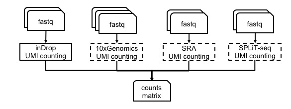

and the second made to analyze counts for the identification of cell sub-population clusters. The dashed elements are those parts of the workflow not finished, yet.

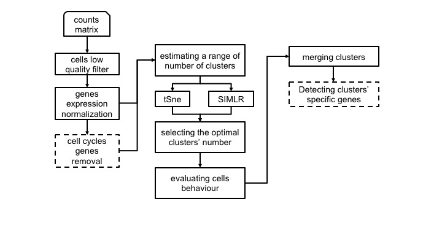

## Counts generation

- **inDropseq**:
    + Creating a reference genome for inDrop V2: **indropIndex**
    + From fastq to UMI counts using inDrop workflow: **indropCounts**

## inDrop seq

inDrop was originally pulished in Cell 161, 1187–1201 (2015). Then, two year after that, the authors published the detailed protocol in Nature Protocols 12, 44–73 (2017), which has different primer design comparing to the orginal paper. 

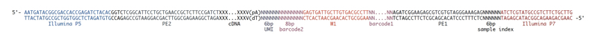

The workflow shown here is based on the protocol in Nature Protocols 12, 44–73 (2017), which seems to be the version 2 of the inDrop technology. According to the inDrop github page, there is a version 3, but the oligos and library structures are exactly the same as version 2, except the sequencing mode changed.
In version 2, three different reads are generated: 


In version 3, four different reads are generated:

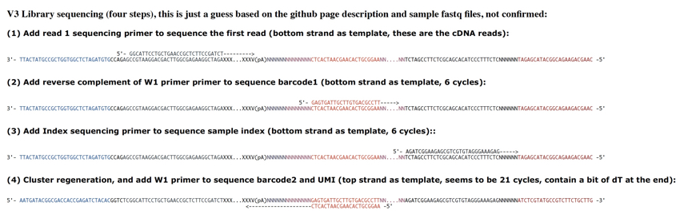

### inDrop data analysis

The function *indropIndex* is available to generate the index files required for reads mapping and annotation.

```{r, echo=TRUE, eval=FALSE}

library(casc)
#running indropCounts index build
indropIndex(group="docker", index.folder=getwd(),
 ensembl.urlgenome="ftp://ftp.ensembl.org/pub/release-87/fasta/mus_musculus/dna/Mus_musculus.GRCm38.dna.toplevel.fa.gz",
ensembl.urlgtf="ftp://ftp.ensembl.org/pub/release-87/gtf/mus_musculus/Mus_musculus.GRCm38.87.gtf.gz")

```


The function *indropCounts* starts from inDrop V2 library fastqs and generates UMI counts.

```{r, echo=TRUE, eval=FALSE}

system("wget 130.192.119.59/public/testMm_S0_L001_R1_001.fastq.gz")
system("wget 130.192.119.59/public/testMm_S0_L001_R2_001.fastq.gz")
library(casc)
indropCounts(group="docker", scratch.folder="/data/scratch", fastq.folder=getwd(),
        index.folder="/data/genomes/indropMm10", sample.name="C2", split.affixes="S2_L001",
        bowtie.index.prefix="genome", M=10, U=2, D=400, low.complexity.mask="False")

```


## Counts analysis

- **Counts manipulation**:
    + Removing non informative genes: **filterZeros**
    + Checking the genes versus total number of UMI: **genesUmi**
    + Removing low quality cells: **lorenzFilter**
    + Data normalization: **scnorm**, minimal requirements 10K counts/cell, works best with whole transcripts sequencing
    + Data normalization: **umiNorm**, global normalization methods TMM and RLE are suitable for UMI data
    + ENSEMBL annotation and mitochodrial/ribosomal protein genes removal: **scannobyGtf**
    + Converting a count table in log10: **counts2log**
    + Removing cell cycle genes: **ccremove**
    + Imputing dropouts: **cascImpute**


## Counts manipulation

We provide a set of functions allowing specific manipulation of a counts table.

### Removing non informative genes

The function **filterZeros** retains all genes that have cells without a user defined fraction of zeros (between 0 and 1, where 1 indicate only genes without 0s are retained, and 0 insted indicates that genes without any value different from zero are discarded) and plot the frequency distribution of genes with counts in the cells. 

- **IMPORTANT**: In case user would like to apply cell quality filter, e.g. *lorenzFilter*, it is covenient to remove only genes with 0 counts in all cells.

```{r, echo=TRUE, eval=FALSE}

#removing genes without counts in all cells
system("wget http://130.192.119.59/public/singlecells_counts.txt.gz")
system("gzip -d singlecells_counts.txt.gz")
filterZeros(data.folder=getwd(),counts.matrix="singlecells_counts.txt", threshold=0)

system("wget http://130.192.119.59/public/testSCumi_mm10.csv.zip")
unzip("testSCumi_mm10.csv.zip")
tmp <- read.table("testSCumi_mm10.csv", sep=",", heqder=T, row.names=1)
dim(tmp)
#27998   806
write.table(tmp, "testSCumi_mm10.txt", sep="\t", col.names=NA)
filterZeros(data.folder=getwd(),counts.matrix="testSCumi_mm10.txt", threshold=0)
#Out of 27998 genes 11255 are left after removing genes with no counts
#output is filtered_testSCumi_mm10.txt

```

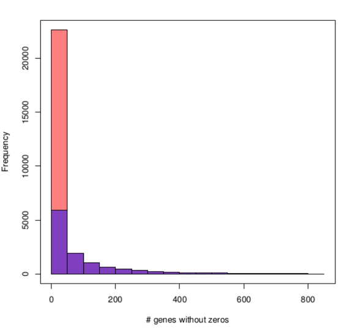


## Plotting genes numbers versus total UMIs in each cell

To estimate the overall amount of genes detectable in each cell, the function *genesUmi* produces a plot of the genes number with respect to total number of UMI for each cell. The number of UMI/reads required to indicate that a gene is detected in a cell are defined by user. We suggest to use 3 UMI/reads as minimal threshold to consider a gene called present in a cell.

```{r, echo=TRUE, eval=FALSE}

system("wget http://130.192.119.59/public/testSCumi_mm10.csv.zip")
unzip("testSCumi_mm10.csv.zip")
library(casc)
genesUmi(data.folder=getwd(), counts.matrix="filtered_testSCumi_mm10.txt", umiXgene=3)

```

In the figure below it is shown the distribution of genes in cells for filtered_testSCumi_mm10.txt counts table. 

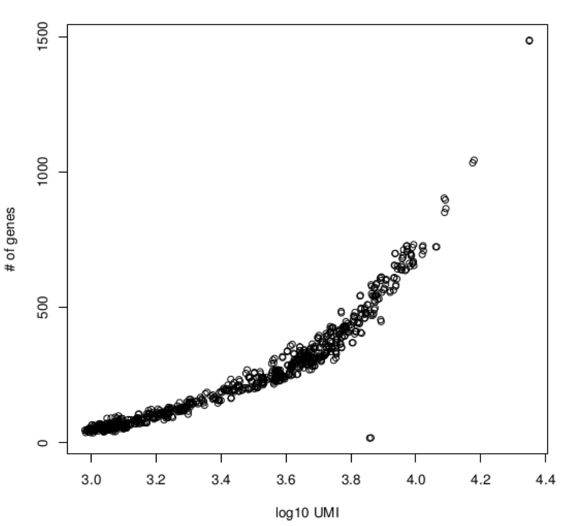


## Cell filtering

### Identifying outlier libraries

To identify outlier libraries, [Diaz et al.2016](https://www.ncbi.nlm.nih.gov/pmc/articles/PMC4937196/) developed a strategy to estimate genes expressed at background levels in a given sample. Then samples whose background fraction is significantly larger than average is filtered out (Lorenz statistics). Specifically, samples that had a small q-value for Lorenz statistic had low complexity, as measured by Gini-Simpson index, and/or they had low coverage, as estimated by the Good-Turing statistic. Furthermore, this statistics correlates with live-dead staining, Pearson-correlation 0.7 [Diaz et al.2016](https://www.ncbi.nlm.nih.gov/pmc/articles/PMC4937196/).


```{r, echo=TRUE,eval=FALSE}

system("wget http://130.192.119.59/public/testSCumi_mm10.csv.zip")
unzip("testSCumi_mm10.csv.zip")

library(casc)
lorenzFilter(group="docker",scratch.folder="/data/scratch/",
           data.folder=getwd(),matrixName="filtered_testSCumi_mm10",
           p_value=0.05,format="txt",separator='\t', genes.format="ens_symb")

tmp0 <- read.table("filtered_testSCumi_mm10.txt", sep="\t", header=T, row.names=1)
#806 cells

tmp <- read.table("lorenz_filtered_testSCumi_mm10.txt", sep="\t", header=T, row.names=1)
#785 cells

```


## Annotation and mitocondrial and ribosomal protein genes removal

The function *SCannoByGtf* allows the annotation of single-cell matrix if ENSEMBL gene ids are provided. The function requires the ENSEMBL GTF of the organism under analysis and allows the selection of specific annotation biotypes, e.g. protein_coding.

```{r, echo=TRUE, eval=FALSE}

system("wget http://130.192.119.59/public/test_umi_mm10.txt.zip")
unzip("test_umi_mm10.txt.zip")
filterZeros(data.folder=getwd(),counts.matrix="test_umi_mm10.txt", threshold=0)
# output filtered_test_umi_mm10
lorenzFilter(group="docker",scratch.folder="/data/scratch/",
           data.folder=getwd(),matrixName="filtered_test_umi_mm10",
           p_value=0.05,format="txt",separator='\t')
# output lorenz_filtered_test_umi_mm10.txt
#running annotation and removal of mit and ribo proteins genes
scannobyGtf(group="docker", data.folder=getwd(), counts.table="lorenz_filtered_test_umi_mm10.txt",
           gtf.name="Mus_musculus.GRCm38.92.gtf",
          biotype="protein_coding", mt=TRUE, ribo.proteins=TRUE, file.type="txt", umiXgene=3)

```

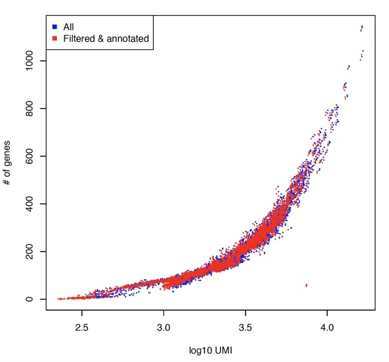

The above figure shows in red only protein coding biotype.

The main function of mitochondria is to produce energy through aerobic respiration. The number of mitochondria a cell possesses depends on its metabolic demands. This might affect clustering favoring the separation between active and dormient cells with respect to functional differences between subpopulations.
*scannobyGtf* allows also the removal of mitocondrial genes.

```{r, echo=TRUE, eval=FALSE}

library(casc)
scannobyGtf(group="docker", data.folder=getwd(), counts.table="lorenz_filtered_test_umi_mm10.txt",
           gtf.name="Mus_musculus.GRCm38.92.gtf",
          biotype="protein_coding", mt=FALSE, ribo.proteins=TRUE, file.type="txt", umiXgene=3)

```

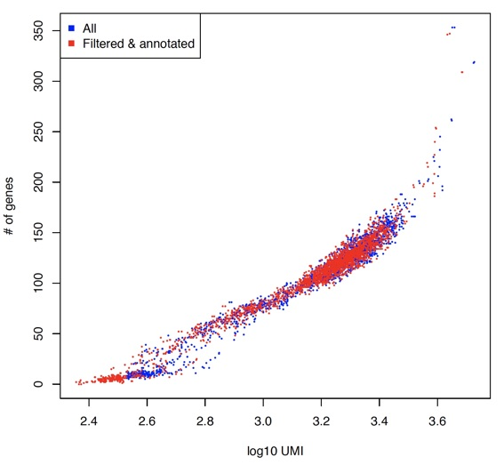

Moreover, ribosomal RNA and ribosomal proteins represent a significant part of the cell cargo. Large cells and actively proliferating cells will have respectively more ribosomes and more active ribosome synthesis. Thus, ribosomal proteins expression might represent a major confunding factor in cluster formation between active and dormient cells.
*scannobyGtf* allows also the removal of ribosomal proteins genes.

```{r, echo=TRUE, eval=FALSE}

library(casc)
scannobyGtf(group="docker", data.folder=getwd(), counts.table="lorenz_filtered_test_umi_mm10.txt",
           gtf.name="Mus_musculus.GRCm38.92.gtf",
          biotype="protein_coding", mt=FALSE, ribo.proteins=FALSE, file.type="txt", umiXgene=3)

```

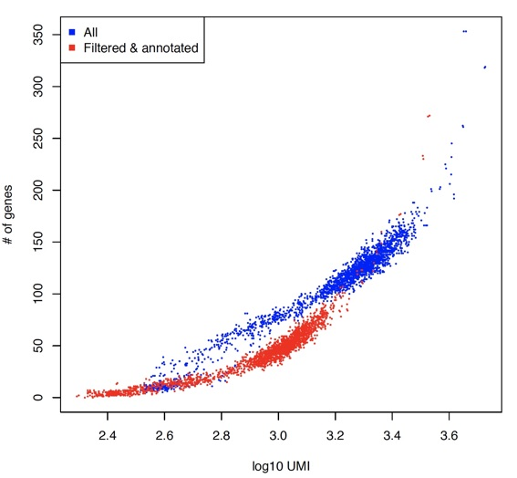

It is notable how important is the effect of the removal of ribosomal protein genes with respect to the mithocondrial component.


## Top expressed genes

For clustering purposes user might decide to use the top expressed genes. The function *topX* select the X top expressed genes given a user defined threshold. The function also produces a pdf file gene_expression_distribution.pdf showing the changes in the UMIs/reads expression distribution upon *topX* filtering.

```{r, echo=TRUE, eval=FALSE}
 
library(casc)
genesUmi(data.folder=getwd(), counts.matrix="lorenz_filtered_testSCumi_mm10.txt", umiXgene=3)
topx(data.folder=getwd(),file.name="lorenz_filtered_testSCumi_mm10.txt",threshold=10000, logged=FALSE)
genesUmi(data.folder=getwd(), counts.matrix="lorenz_filtered_testSCumi_mm10_10000.txt", umiXgene=3)

```

AGGIUNGERE FIGURA

### Data normalization

[The best way to normalize single-cell RNA-seq data has not yet been resolved](https://www.ncbi.nlm.nih.gov/pmc/articles/PMC5549838/), expecially for UMI data. We inserted in our workflow two possible options:

- [SCnorm](https://www.ncbi.nlm.nih.gov/pmc/articles/PMC5473255/), which works best with whole transcript data.

    + **IMPORTANT**: SCnorm requires at least 10K UMI/reads in each cell to be applied.

- [scone](https://www.biorxiv.org/content/early/2017/12/16/235382), which provides different global scaling methods that can be applyed to UMI single-cell data.

    + **IMPORTANT**: Only log10 conversion is required when SIMLR clustering is performed.

#### SCnorm

[SCnorm](https://www.ncbi.nlm.nih.gov/pmc/articles/PMC5473255/) performs a quantile-regression based approach for robust normalization of single-cell RNA-seq data.  SCnorm groups genes based on their count-depth relationship then applies a quantile regression to each group in order to estimate scaling factors which will remove the effect of sequencing depth from the counts.

IMPORTANT: SCnorm is not intended for datasets with more than ~80% zero counts, because of lack of algoritm convergency in these situations. 

##### Check counts-depth relationship

Before normalizing using **scnorm**, it is advised to check the data count-depth relationship.
If all genes have a similar relationship then a global normalization strategy such as median-by-
ratio in the DESeq package or TMM in edgeR will also be adequate. However, when the count-depth relationship varies among genes using global scaling strategies leads to poor normalization. In these cases the normalization provided by SCnorm is recommended.

**checkCountDepth** provides a wrapper, in CASC, for the checkCountDepth of the [**SCnorm package**](https://github.com/rhondabacher/SCnorm), which estimates the count-depth relationship for all genes.

```{r, echo=TRUE, eval=FALSE}

#this specific example is an UMI counts table made of 12 cells having at least 10K UMIs/cell.
system("wget http://130.192.119.59/public/example_UMI.txt.zip")
unzip("example_UMI.txt.zip")
conditions=rep(1,12)
checkCountDepth(group="docker", data.folder=getwd(), counts.matrix="example_UMI.txt",
     conditions=conditions, FilterCellProportion=0.1, FilterExpression=0,
     ditherCounts=TRUE, outputName="example_UMI", nCores=8)

```

The output is a PDF that provides a view of the counts distribution of the data and a file selected.genes.txt, which contains the genes selected to run the analysis.


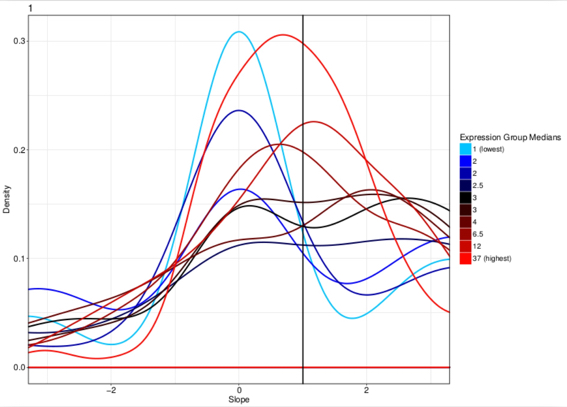

#### scnorm

the **scnorm** function execute SCnorm of the [**SCnorm package**](https://github.com/rhondabacher/SCnorm), which normalizes  across  cells  to  remove  the effect  of  sequencing  depth  on  the  counts  and  return  the  normalized expression count.

```{r, echo=TRUE, eval=FALSE}

system("wget http://130.192.119.59/public/example_UMI.txt.zip")
unzip("example_UMI.txt.zip")
#this specific example is an UMI counts table made of 12 cells having at least 10K UMIs/cell.
conditions=rep(1,12)
scnorm(group="docker", data.folder=getwd(),counts.matrix="example_UMI.txt",
     conditions=conditions,outputName="example_UMI", nCores=8, filtercellNum=10,
     ditherCount=TRUE, PropToUse=0.1, PrintProgressPlots=TRUE, FilterExpression=1)

```

The output is file, *discarded_genes.txt*, which contains the discarded genes and a tab delimited file containing the normalized data, with the prefix *normalized_*.

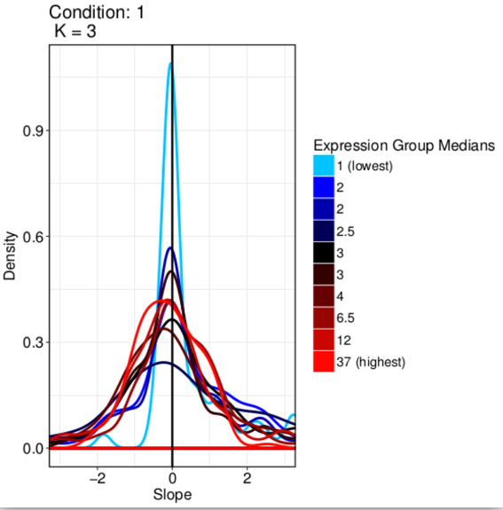

#### scone

scone package embeds:

- Centered log-ratio (**CLR**) normalization 

- Relative log-expression (**RLE**; DESeq) scaling normalization

    + the scaling factors are calculated for each lane as median of the ratio, for each gene, of its read count of its geometric mean across all lanes. 

- Full-quantile normalization

    + quantile normalization is a technique for making two or more distributions identical in statistical properties. To quantile normalize two or more samples to each other, sort the samples, then set to the average (usually, arithmetic mean) of the samples. So the highest value in all cases becomes the mean of the highest values, the second highest value becomes the mean of the second highest values, and so on.

- Simple deconvolution normalization 

- Sum scaling normalization

    + Gene counts are divided by the total number of mapped reads (or library size) associated with their lane and multiplied by the mean total count across all the samples of the dataset.

- Weighted trimmed mean of M-values (**TMM**, edgeR) scaling normalization

    + to compute the TMM factor, one lane is considered a reference sample and the others test samples, with TMM being the weighted mean of log ratios between test and reference, after excluding the most expressed genes and the genes with the largest log ratios. 

- Upper-quartile (**UQ**) scaling normalization

    + the total counts are replaced by the upper quartile of counts different from 0 in the computation of the normalization factors.


```{r, echo=TRUE, eval=FALSE}

#Weighted trimmed mean of M-values (TMM) scaling normalization
system("wget http://130.192.119.59/public/example_UMI.txt.zip")
unzip("example_UMI.txt.zip")
umiNorm(group="docker", data.folder=getwd(), counts.matrix="example_UMI.txt",
     outputName="example_UMI.txt", normMethod="TMM_FN")

```

**IMPORTANT**: Only log10 conversion is required for the counts table when SIMLR clustering is performed.


### Converting a count table in log10

The function **counts2log** can convert a count table in a log10 values saved in a comma separated or tab delimited file.

```{r, echo=TRUE, eval=FALSE}
#downloading fastq files
system("wget http://130.192.119.59/public/singlecells_counts.txt.gz")
system("gzip -d singlecells_counts.txt.gz")
counts2log(counts.matrix="singlecells_counts.txt", data.folder=getwd(), 
           log.base=10, type="txt")

#an other example
counts2log(counts.matrix="normalized_example_UMI.txt", data.folder=getwd(), 
           log.base=10, type="txt")

#return a comma separated file

```


### Imputing dropouts 

VEDERE SE VALE LA PENA SPOSTARLO PER MIGLIORARE LE HEATMAP DOPO FEATURE SELECTION

the **cascImpute** function execute scImpute of the [**scImpute package**](https://github.com/Vivianstats/scImpute), which impute the dropout values in scRNA-seq data.

```{r, echo=TRUE, eval=FALSE}
#downloading fastq files
system("wget http://130.192.119.59/public/singlecells_counts.txt.gz")
system("gzip -d singlecells_counts.txt.gz")
cascImpute(group="docker", data.folder=getwd(), counts.matrix="singlecells_counts.txt", drop.thre=0.5, cores=8)

#Modifying drop.thre value A quick version of the imputing can be used to refine drop.thre values indicating refining=TRUE. It has to be done in the same folder where the frst run was done.
cascImpute(group="docker", data.folder=getwd(), counts.matrix="singlecells_counts.txt", drop.thre=0.3, cores=8, refining=TRUE)
```

The output is a matrix file containing the imputed data. 


#### Defining the optimal number of clusters

An important step in the single-cell transcriptome analysis is to group cells that belong to the same type based on gene expression patterns [Usoskin et al, Pollen et al, Kolodziejczyk et al].
This can be done using supervised and unsupervised clustering. A lot of tools are actually available for single-cell transcriptome clustering [ref]. At the present time we have implemented tSne and SIMLR.

```{r, echo=TRUE, eval=FALSE}
#downloading fastq files
system("wget http://130.192.119.59/public/log10_singlecells_counts.csv.gz")
system("gzip -d log10_singlecells_counts.csv.gz")

permutationClustering("docker", scratch.folder="/data/scratch", data.folder=getwd(), 
                      matrixName="normalized_example_UMI", nPerm=36, permAtTime=8,
                      percent=10, range1=4, range2=7, format="txt", separator="\t", 
                      logTen=0, clustering="SIMLR", perplexity=10)


```

The function **permutationClustering** run [SIMLR](https://www.ncbi.nlm.nih.gov/pubmed/28263960) using a range of clusters and produces as output two violin plots:

- silhouette.pdf: Silhouette refers to a method of interpretation and validation of consistency within clusters of data. The technique provides a succinct graphical representation of how well each object lies within its cluster. Here instead of using the average silhouette we represent the silhouette values distribution using a violin plot. Thus, silhouette distributions being skewed to the positive values and with short negative tail is representative of a consistent cluster. In the example below, fig. A, it seems that 4 clusters are the most consistent by silhouette analysis.


- cell.stability.pdf: Cell stability plot represent the distribution of the fraction of times, given a N number of permutations, that the cell are stabily localized in a cluster. The example below, fig. B, 3 clusters are characterized by an higher cell stability with respect to 4 clusters. 

Taking in account the two plots and the clusters structure observed for 3 and 4 clusters, fig C and D, it is clear that 4 clusters provide a better separation between cells but keeping very high the cell permanence in a cluster.


The function **cascOutputReformat** use SilhouetteParameters.csv (the file containing the cell silhouette scores), mainVector.csv (the file that associates each cell to a specific SIMLR cluster), scoreVector.csv (the file associating each cell to a specific cell stability score), dataPlot.csv (containing SIMLR component 1 and 2 cohordinates) to generate a summary file called **summary_table.csv**.

```{r, echo=TRUE, eval=FALSE}
 #downloading fastq files
system("wget http://130.192.119.59/public/example.zip")
unzip("example.zip")
setwd("./example")
cascOutputReformat(data.folder=getwd())
```


