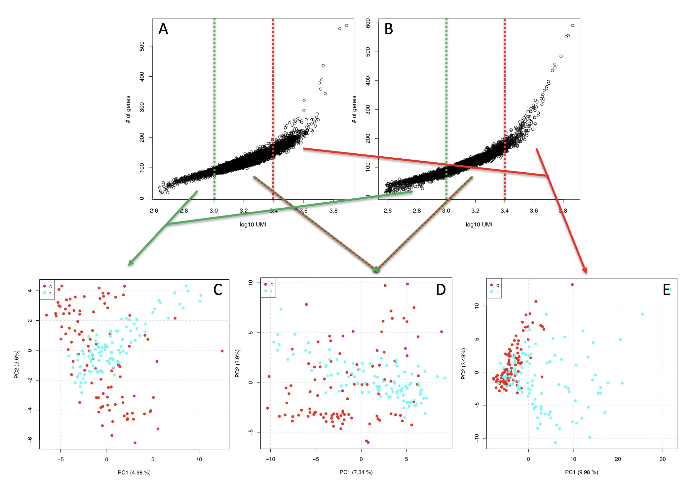
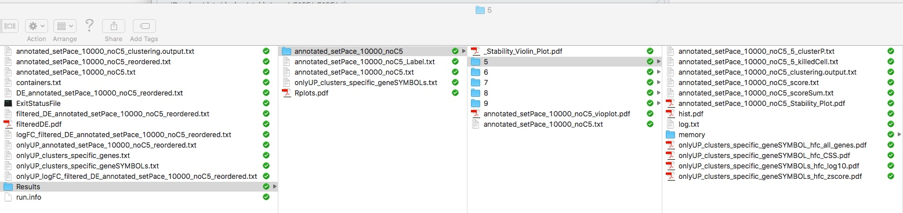
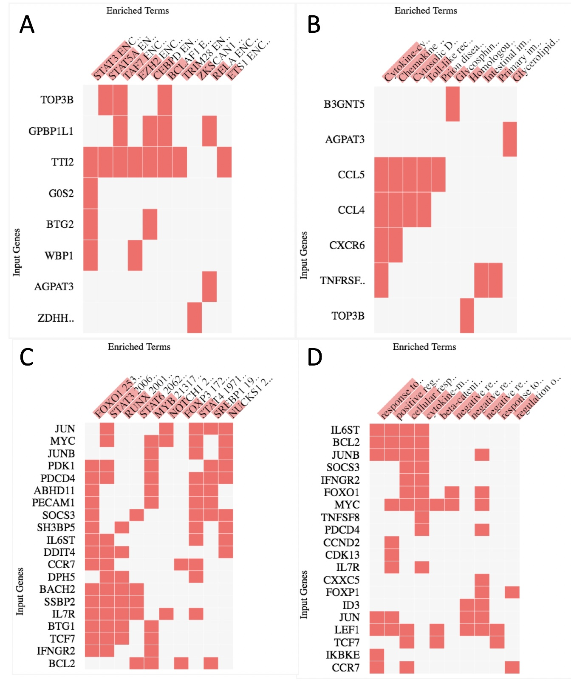
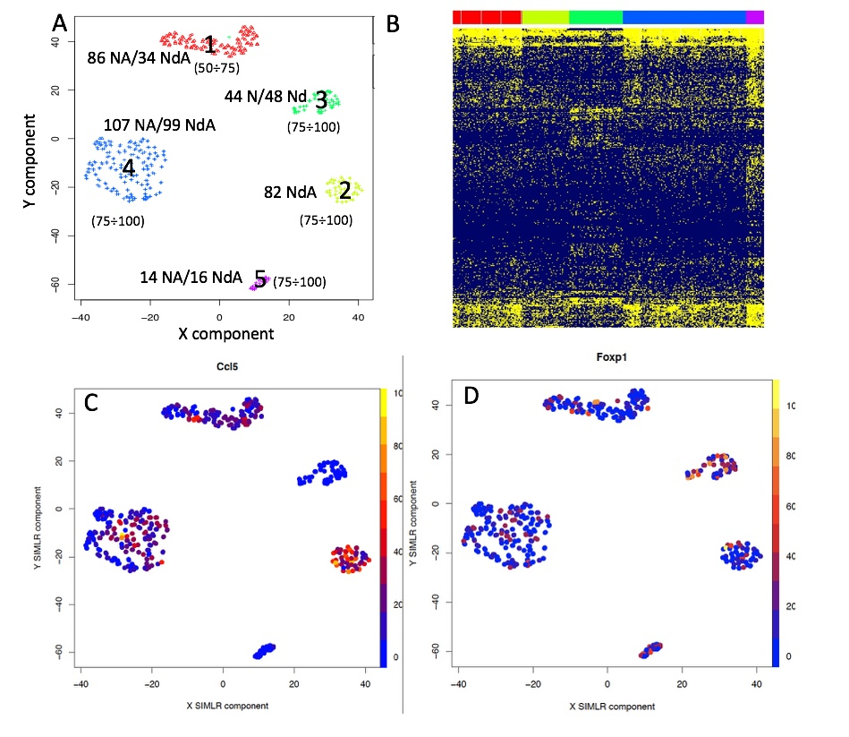

\newpage
\tableofcontents


```{r global_options, include=FALSE}
knitr::opts_chunk$set(fig.pos = 'h')
```

## **Section 1** rCASC: a single cell analysis workflow designed to provide data reproducibility

Since the end of the 90's omics high-throughput technologies have generated an enormous amount of data, reaching today an exponential growth phase. Analysis of omics big data is a revolutionary means of understanding the molecular basis of disease regulation and susceptibility, and this resource is accessible to the biological/medical community via bioinformatics frameworks. However, because of the fast evolution of computation tools and omics methods, the [*reproducibility crisis*](https://en.wikipedia.org/wiki/Replication_crisis) is becoming a very important issue [[*Nature, 6 July 2018*](https://www.nature.com/collections/prbfkwmwvz)] and there is a mandatory need to to guarantee robust and reliable results to the research community [[*Global Engage Blog*](http://www.global-engage.com/life-science/reproducibility-computational-biology/)].

Our group is deeply involved in developing workflows that guarantee both **functional** (i.e. the information about data and the utilized tools are saved in terms of meta-data) and **computation** reproducibility (i.e. the real image of the computation environment used to generate the data is stored). For this reason we are managing a bioinformatics community called [*reproducible-bioinformatics.org*](http://www.reproducible-bioinformatics.org/) [*Kulkarni et al. BMC Bioinformatics, in press*] designed to provide to the biological community a reproducible bioinformatics ecosystem  [[*Beccuti et al. Bioinformatics 2018*](https://academic.oup.com/bioinformatics/article/34/5/871/4562334)]. 

rCASC, Cluster Analysis of Single Cells, is part of the [*reproducible-bioinformatics.org*](http://www.reproducible-bioinformatics.org/) project and provides single cell analysis functionalities within the reproducible rules described by Sandve et al. [[*PLoS Comp Biol. 2013*](http://journals.plos.org/ploscompbiol/article?id=10.1371/journal.pcbi.1003285)]. rCASC is designed to provide a complete workflow (Figure \ref{fig:fig.1}) for cell-subpopulation discovery. 

```{r fig.1, fig.cap="rCASC workflow", echo=FALSE, eval=TRUE, out.width="70%", fig.align="center"}
library(knitr)

include_graphics('../inst/img/CASC_workflow.jpeg')

```


The workflow allows the direct analysis of fastq files generated with [*10X Genomics platform*](https://www.10xgenomics.com/), [*InDrop technology*](https://1cell-bio.com/) or a count matrix having as column cell identifier and as row names ENSEMBL gene annotation. In the following paragraphs the fuctionalities of rCASC workflow are described.

\pagebreak

### **Section 1.1** Minimal hardware requirements to run rCASC
The RAM and CPU requirements are dependent on the data set under analysis, e.g. 500-600 cells can be effectively analysed using the hardware described by Beccuti [[*Bioinformatics 2018*](https://academic.oup.com/bioinformatics/article/34/5/871/4562334)]: 

- 32 Gb RAM and 

- 2.6 GHz Core i7 6700HQ with 8 threads.

- 500 GB SSD

The analysis time can be significantly improved increasing the number of cores. Cluster implementation of the workflow using [*swarm*](https://docs.docker.com/engine/swarm/) is under implementation. 

### **Section 1.2** Installation

- A workstation/server running 64 bits linux.

- Docker daemon installed on the machine, for more info see this document:

    + [*https://docs.docker.com/engine/installation/*](https://docs.docker.com/engine/installation/).

- A scratch folder, e.g. /data/scratch, possibly on a fast I/O SSD disk, writable by everybody:

```
chmod 777 /data/scratch
```

The functions in rCASC package require that user is part of a docker group.
See the following document for more info:
[*https://docs.docker.com/install/linux/linux-postinstall/*](https://docs.docker.com/install/linux/linux-postinstall/)

rCASC can be installed in [*R*](https://cran.r-project.org/) as described below:

\fontsize{8}{8}\selectfont
```{r, echo=TRUE, eval=FALSE}


install.packages("devtools")
library(devtools)
install_github("kendomaniac/rCASC")

# downloading the required containers
library(rCASC)
downloadContainers()


```
\fontsize{10}{10}\selectfont


## **Section 2** Counts generation

### **Section 2.1** inDrop seq

inDrop single-cell sequencing approach was originally published by Klein [[*Cell 2015*](https://www.ncbi.nlm.nih.gov/pubmed/26000487)]. Then, two year after that, the authors published the detailed protocol in [[*Zilionis et al. Nature Protocols 2017*](https://www.ncbi.nlm.nih.gov/pubmed/27929523)], which has different primer design comparing to the orginal paper (Figure \ref{fig:fig.2}). 

```{r fig.2, fig.cap="inDrop library structure", echo=FALSE, eval=TRUE, out.width="100%", fig.align="center"}
library(knitr)
include_graphics('../inst/img/indrop_v2.jpeg')
```


The analysis shown below is based on the protocol in Zilionis [[*Nature Protocols 2017*](https://www.ncbi.nlm.nih.gov/pubmed/27929523)], which is the version 2 of the inDrop technology, actually distributed by [*1CellBio*](https://1cell-bio.com/product/indrop-system/). 

In version 2, three different reads are generated: 

```{r fig.3, fig.cap="inDrop v2", echo=FALSE, eval=TRUE, out.width="100%", fig.align="center"}
library(knitr)
include_graphics('../inst/img/indropv2.jpg')
```


#### **Section 2.1.1** inDrop data analysis

There are two main functions, **indropIndex** and **indropCounts**, allowing to go from fastq files to counts table.
    
##### **Section 2.1.1.1** indropIndex: Creates a reference genome for inDrop V2 

- *Parameters* (only those without default, for the full list of parameters, please refer to the function help):
    + *index.folder*: the folder where the reference genome will be created 

    + *ensembl.urlgenome*:	the link to the ENSEMBL unmasked genome sequence of interest.

    + *ensembl.urlgtf*: the link to the ENSEMBL GTF of the genome of interest.


\fontsize{8}{8}\selectfont
```{r, echo=TRUE, eval=FALSE}

library(rCASC)
#running indropCounts index build
indropIndex(group="docker", index.folder=getwd(),
 ensembl.urlgenome="ftp://ftp.ensembl.org/pub/release-87/fasta/mus_musculus/dna/Mus_musculus.GRCm38.dna.toplevel.fa.gz",
 ensembl.urlgtf="ftp://ftp.ensembl.org/pub/release-87/gtf/mus_musculus/Mus_musculus.GRCm38.87.gtf.gz")

```
\fontsize{10}{10}\selectfont


##### **Section 2.1.1.2** indropCounts: Converts fastq in UMI counts using [*inDrop workflow*](https://github.com/indrops)

- *Parameters* (only those without default, for the full list of parameters, please refer to the function help):

    + *scratch.folder*,	the folder located on a fast hardrive, i.e. SSD, in which all the I/O will be  located. Having the scratch folder on a SSD strongly reduces the analysis time.	
    + *fastq.folder*,  the folder where input data are located and where output will be written.
    + *index.folder*,	the folder where inDrop reference genome was created with indropIndex.
    + *sample.name*, the name to be associated to the fastq files, e.g. C2 for C2\_S2\_L001\_R1\_001.fastq.gz, IMPORTANT input fastq should have the format SAMPLENAME_Sx_L00y_Rz_001.fastq.gz, where x is an integer, y is an integer, z is 1 or 2
    + *split.affixes*,	the string separating SAMPLENAME from the Rz_001.fastq.gz


\fontsize{8}{8}\selectfont
```{r, echo=TRUE, eval=FALSE}

system("wget 130.192.119.59/public/testMm_S0_L001_R1_001.fastq.gz")
system("wget 130.192.119.59/public/testMm_S0_L001_R2_001.fastq.gz")
library(rCASC)
indropCounts(group="docker", scratch.folder="/data/scratch", fastq.folder=getwd(),
        index.folder="/data/genomes/indropMm10", sample.name="testMm", split.affixes="S0_L001",
        bowtie.index.prefix="genome", M=10, U=2, D=400, low.complexity.mask="False")

```
\fontsize{10}{10}\selectfont

### **Section 2.2** 10XGenomics

The function, **cellrangerCount** allows to go from fastq files to counts table. This function implements [*Cellranger*](https://support.10xgenomics.com/single-cell-gene-expression/software/pipelines/latest/algorithms/overview) , the 10xGenomics tool allowing the conversion of the fastqs, generated with 10XGenomics platform, into a count matrix. 
Genome indexes are retrieved from 10Xgenomics repository:

\fontsize{8}{8}\selectfont
```{r, echo=TRUE, eval=FALSE}
setwd("/data/genomes/cellranger_hg38")
#getting the hg38 human genome cellranger index 
system("wget http://cf.10xgenomics.com/supp/cell-exp/refdata-cellranger-GRCh38-2.1.0.tar.gz")
setwd("/data/genomes/cellranger_hg19")
#getting the hg19 human genome cellranger index
system("wget http://cf.10xgenomics.com/supp/cell-exp/refdata-cellranger-hg19-2.1.0.tar.gz")
setwd("/data/genomes/cellranger_mm10")
#getting the mm10 mouse genome cellranger index
system("wget http://cf.10xgenomics.com/supp/cell-exp/refdata-cellranger-mm10-2.1.0.tar.gz")
setwd("/data/genomes/cellranger_hg19mm10")
#getting the human and mouse cellranger index
system("wget http://cf.10xgenomics.com/supp/cell-exp/refdata-cellranger-hg19-and-mm10-2.1.0.tar.gz")
```
\fontsize{10}{10}\selectfont

- *Parameters* (only those without default, for the full list of parameters, please refer to the function help):
    + *fastq*, the path to the folder, where 10XGenomics fastq.gz files are located.
    + *transcriptome*,	the path to the Cell Ranger compatible transcriptome reference
    
\fontsize{8}{8}\selectfont
```{r, echo=TRUE, eval=FALSE}

home <- getwd()
library(rCASC)
downloadContainers()
setwd("/data/genomes/cellranger_hg19mm10")
#getting the human and mouse cellranger index
system("wget http://cf.10xgenomics.com/supp/cell-exp/refdata-cellranger-hg19-and-mm10-2.1.0.tar.gz")
setwd(home)
# downloading 100 cells 1:1 Mixture of Fresh Frozen Human (HEK293T) and Mouse (NIH3T3) Cells
system("wget http://cf.10xgenomics.com/samples/cell-exp/2.1.0/hgmm_100/hgmm_100_fastqs.tar")
system("tar xvf hgmm_100_fastqs.tar")
# The cellranger analysis is run without the generation of the secondary analysis
cellrangerCount(group="docker",  transcriptome.folder="/data/genomes/cellranger_hg19mm10",  
                fastq.folder="/data/test_cell_ranger/fastqs",  expect.cells=100, 
                nosecondary=TRUE, scratch.folder="/data/scratch")
```
\fontsize{10}{10}\selectfont
 
The analysis done above took 56.4 mins on a [*SeqBox*](www.seqbox.com), equipped with an Intel i7-6770HQ (8 threads), 32 Gb RAM and 500Gb SSD.

The output of the above analysis are two cell counts matrices **results_cellranger.cvs** and **results_cellranger.txt** and a folder called **results_cellranger**, which contains the full cellranger output, more information on cellranger output can be found at [*10XGenomics web site*](https://support.10xgenomics.com/single-cell-gene-expression/software/pipelines/latest/output/overview).

## **Section 3** Counts matrix editing

This paragraph describes a set of functions that can be used to remove low quality cells and non-informative genes.

- **Counts manipulation**:
    + Removing non informative genes: **filterZeros**
    + Plotting detected genes versus total number of UMI/reads: **genesUmi**
    + Removing low quality cells: **lorenzFilter**
    + Data normalization: **scnorm**, minimal requirements 10K counts/cell, works best with whole transcript sequencing
    + Data normalization: **umiNorm**, global normalization methods TMM and RLE are suitable for UMI data
    + ENSEMBL annotation and mitochodrial/ribosomal genes removal: **scannobyGtf**
    + Converting a count table in log10: **counts2log**
    + Removing cell cycle bias: **recatPrediction**/**ccremove**


### **Section 3.1** Removing non informative genes

The function **filterZeros** retains all genes that have cells without a user defined fraction of zeros (between 0 and 1, where 1 indicate only genes without any 0s are retained, and 0 insted indicates that genes with at least a value different from zero are retained), and plots the frequency distribution of gene counts in the dataset.

- *Parameters* (only those without default, for the full list of parameters, please refer to the function help):
    + *data.folder*,	the folder where filtered file will be saved. The saved file will have the prefix **filtered\_**.
    + *counts.matrix*,	the name of tab delimited file of cells un-normalized expression counts
    + *threshold*, the fraction of 0s to be accepted in gene, default is 0, removing only genes without any value different from 0.

The output is a PDF providing zeros distributions before and after removal of genes with 0s counts. A tab delimited file with the prefix **filtered\_** in which the filtered data are saved.

**IMPORTANT**: In case user would like to apply cell quality filter, e.g. *lorenzFilter*, it is covenient to remove only genes with 0 counts in all cells, i.e. threshold=0 (Figure \ref{fig:fig.5}).
\newline
\fontsize{8}{8}\selectfont
```{r, echo=TRUE, eval=FALSE}

system("wget http://130.192.119.59/public/testSCumi_mm10.csv.zip")
unzip("testSCumi_mm10.csv.zip")
tmp <- read.table("testSCumi_mm10.csv", sep=",", header=T, row.names=1)
dim(tmp)
#27998   806
write.table(tmp, "testSCumi_mm10.txt", sep="\t", col.names=NA)
filterZeros(data.folder=getwd(),counts.matrix="testSCumi_mm10.txt", threshold=0)
#Out of 27998 genes 11255 are left after removing genes with no counts
#output is filtered_testSCumi_mm10.txt

```
\fontsize{10}{10}\selectfont

```{r fig.5, fig.cap="Zeros distribution in full table, orange, and filtered table, blue", echo=FALSE, eval=TRUE, out.width="60%", fig.align="center"}
library(knitr)
include_graphics('../inst/img/filterZero.jpeg')
```

\pagebreak

### **Section 3.2** Plotting genes numbers versus total UMIs in each cell

To estimate the overall amount of genes detectable in each cell, the function *genesUmi* generates a plot of the number of genes present in a cell with respect to the total number of UMI in the same cell. The number of UMIs required to call a gene present in a cell is a parameter defined by user, the suggested value is 3 UMIs.

- *Parameters* (only those without default, for the full list of parameters, please refer to the function help):
    + *data.folder*,	the folder where the counts table is located.
    + *counts.matrix*,	the name of tab delimited file of cells un-normalized expression counts
    + *umiXgene*, minimal number of UMI/reads to call a gene present in a cell.
    
The output is a pdf named **genes.umi.pdf**, where each dot represents a cell. X axis is the total number of reads mapped on each cell il log10 format and Y axis is the number of detected genes. 

\fontsize{8}{8}\selectfont
```{r, echo=TRUE, eval=FALSE}

library(rCASC)
genesUmi(data.folder=getwd(), counts.matrix="filtered_testSCumi_mm10.txt", umiXgene=3)

```
\fontsize{10}{10}\selectfont

In figure \ref{fig:fig.6} it is shown the distribution of genes in cells for 'filtered_testSCumi_mm10.txt' counts table. 

```{r fig.6, fig.cap="genesUmi output", echo=FALSE, eval=TRUE, out.width="60%", fig.align="center"}
library(knitr)
include_graphics('../inst/img/genesUMI.jpg')
```

\pagebreak

#### **Section 3.2.1** Further considerations about the number of reads/UMI to be used in a single-cell sequencing experiment.

[*Ziegenhain et al.*](https://www.ncbi.nlm.nih.gov/pubmed/28212749) published a comparison between single cell sequencing protocols and they show that, in a simulated experiment, at least 250K reads/cell are required for the detection at least 80% of differentially expressed genes between two groups (Figure \ref{fig:fig.6.1}). Ziegenhain observation clearly also apply to sub-populations clustering. 

```{r fig.6.1, fig.cap="Modified from Figure 6 in Ziegenhain et al. (Mol. Cell 2017). Power of scRNA-Seq methods. For more information on the experiment please see Ziegenhain paper.", echo=FALSE, eval=TRUE, out.width="50%", fig.align="center"}
library(knitr)
include_graphics('../inst/img/Ziegenhain2017.jpeg')
```

Sequencing depth, which affect differential expression analysis and sub-population partitioning, influence the structure of a single-sequencing dataset at two levels: 

- number of genes called present in the experiment,

- robustness of gene expression, i.e. number of reads associated to a gene. 

In particular, the number of genes called present in the experiment is the key element for the discrimination between sub-populations. In Figure \ref{fig:fig.6.2} it shown the effect of sequencing depth on the number of detectable genes in a set of 10XGenomics sequencing experiments (25K sequenced reads/cell extracted from CD19 B-cells [[*Zheng et al*](https://community.10xgenomics.com/t5/Data-Sharing/10x-Single-Cell-3-Paper-Zheng-et-al-2016-Datasets/td-p/231)],  83K sequenced reads/cell extracted from  naive CD8+ T-cells [[*GSM2833284*](https://www.ncbi.nlm.nih.gov/geo/query/acc.cgi?acc=GSM2833284)], and 250K sequenced reads/cell from an unpublished brain mouse experiment) and in an unpublished whole transcript human MAIT-cells  single-cell sequencing done on Fluidigm C1 (25K, 100K, and 250K sequenced reads/cell were subsampled from the original fastqs). 
3 UMI are used as minimal threshold to call present a gene in 10XGenomics experiments and 5 reads [[*Tarazona et al. 2011*](https://genome.cshlp.org/content/21/12/2213.long)] as minimal threshold to call a gene present in single cell whole transcriptome experiments.  


\fontsize{8}{8}\selectfont
```{r, echo=TRUE, eval=FALSE}

#10XGenomics experiments
system("wget http://130.192.119.59/public/Zheng_cd19_288cells.txt.zip")
unzip("Zheng_cd19_288cells.txt.zip")
library(rCASC)
genesUmi(data.folder=getwd(), counts.matrix="Zheng_cd19_288cells.txt", umiXgene=3)
system("mv genes.umi.pdf genes.umi_25k.pdf")

system("wget http://130.192.119.59/public/GSM2833284_Naive_WT_Rep1_288cell.txt.zip")
unzip("GSM2833284_Naive_WT_Rep1_288cell.txt.zip")
library(rCASC)
genesUmi(data.folder=getwd(), counts.matrix="GSM2833284_Naive_WT_Rep1_288cell.txt", umiXgene=3)
system("mv genes.umi.pdf genes.umi_86k.pdf")

system("wget http://130.192.119.59/public/brain_unpublished_288cells.txt.zip")
unzip("brain_unpublished_288cells.txt.zip")
library(rCASC)
genesUmi(data.folder=getwd(), counts.matrix="brain_unpublished_288cells.txt", umiXgene=3)
system("mv genes.umi.pdf genes.umi_250k.pdf")

#whole transcript experiment
system("wget http://130.192.119.59/public/c1_experiment.zip")
unzip("c1_experiment.zip")
setwd("c1_experiment")
library(rCASC)
genesUmi(data.folder=getwd(), counts.matrix="250K_counts.txt", umiXgene=5)
system("mv genes.umi.pdf genes.umi_250K.pdf")
genesUmi(data.folder=getwd(), counts.matrix="100K_counts.txt", umiXgene=5)
system("mv genes.umi.pdf genes.umi_100K.pdf")
genesUmi(data.folder=getwd(), counts.matrix="25K_counts.txt", umiXgene=5)
system("mv genes.umi.pdf genes.umi_25K.pdf")

```
\fontsize{10}{10}\selectfont

Figure \ref{fig:fig.6.2} clearly shows that the number of genes detectable by 10XGenomics sequencing (Figure \ref{fig:fig.6.2}A-C) is far less of those detectable using a whole transcript experiment (Figure \ref{fig:fig.6.2}D-F). In the case of 25K reads/cells in 3' end sequencing (Figure \ref{fig:fig.6.2}A) the number of called genes goes from a doxen of genes to 350. In the corresponding whole transcript sequencing experiment (Figure \ref{fig:fig.6.2}D), 350 genes is the lowest number of genes detectable in a cell. At 250K reads/cell the range of detectable genes in 3' end experiment (few hunders genes to 2000 genes)  and in whole transcripts experiments (less than 1000 genes to 3500 genes) are more similar. 
The larger scatterring and the overall lower number of detectable genes in 3' end sequencing experiment, with respect to whole transcript experiments, is a peculiarity of the technology [[*Ziegenhain et al.*](https://www.ncbi.nlm.nih.gov/pubmed/28212749)].  
It has also to be highlighted that cells with a very low number of genes called present will have a gene repertoire made mainly of housekeeping genes, ribosomal and mitochondrial genes, see Figure \ref{fig:fig.8} in **Section 3.4**. Thus, the lack of cell-type specific genes make this type of cells useless for the identification of functional cell sub-populations.  

```{r fig.6.2, fig.cap="Number of detected genes with respect to mapped reads. A) 25K reads/cell 10XGenomics platform, 3\' end sequencing. B) 86K reads/cell 10XGenomics platform, 3\' end sequencing. C) 250K reads/cell 10XGenomics platform, 3\' end sequencing. D) 25K reads/cell C1 platform, whole transcript sequencing, E) 100K reads/cell C1 platform, whole transcript sequencing, F) 250K reads/cell C1 platform, whole transcript sequencing.", echo=FALSE, eval=TRUE, out.width="100%", fig.align="center"}
library(knitr)
include_graphics('../inst/img/seq_depth.jpeg')
```

We have further investigated the following point:

- Is the number of total UMIs/cell affecting the separation between sub-populations?

To address the above point we used two types of cells belonging to the T-cells [[*Zheng* 2016](https://community.10xgenomics.com/t5/Data-Sharing/10x-Single-Cell-3-Paper-Zheng-et-al-2016-Datasets/td-p/231)]. The two sets of cells were sequenced with a coverage of approximately 21K reads/cell: 

- T-cytotoxic (10209 cells, Figure \ref{fig:fig.27}A) cells, 

- T-regulatory (10263, Figure \ref{fig:fig.27}B) cells. 

We generated three datasets:

- **d3.4**, which is made of 100 cells randomly selected within cells having, in each of the two datasets, a total UMIs/cell value greater than 2511 in each cell.

- **d3**, which is made of 100 cells randomly selected within cells having, in each of the two datasets, a total UMIs/cell value comprised between 2511 and 1000 in each cell.

- **d3m**, which is made of 100 cells randomly selected within cells having, in each of the two datasets, a total UMIs/cell smaller than 1000 in each cell.

The separation between T-cytoxic and T-regulatory achievable with PCA is shown in Figure \ref{fig:fig.27}C-E.

\fontsize{8}{8}\selectfont
```{r, echo=TRUE, eval=FALSE}

system("wget http://130.192.119.59/public/counts_effect.zip")
unzip(counts_effect.zip)
setwd("counts_effect")

topx(data.folder=getwd(),file.name="df3.4.txt",threshold=1000, logged=FALSE)
library(docker4seq)
pca(experiment.table="df3.4_1000.txt", type="counts",
    legend.position="topleft", covariatesInNames=TRUE, samplesName=FALSE,
    principal.components=c(1,2), pdf = TRUE,
    output.folder=getwd())

topx(data.folder=getwd(),file.name="df3.txt",threshold=1000, logged=FALSE)
library(docker4seq)
pca(experiment.table="df3_1000.txt", type="counts",
    legend.position="topleft", covariatesInNames=TRUE, samplesName=FALSE,
    principal.components=c(1,2), pdf = TRUE,
    output.folder=getwd())

topx(data.folder=getwd(),file.name="df3m.txt",threshold=1000, logged=FALSE)
library(docker4seq)
pca(experiment.table="df3m_1000.txt", type="counts",
    legend.position="topleft", covariatesInNames=TRUE, samplesName=FALSE,
    principal.components=c(1,2), pdf = TRUE,
    output.folder=getwd())

```
\fontsize{10}{10}\selectfont  


```{r fig.27, fig.cap="Zheng set subset detectable genes. A) T-cytotoxic genes versus total cell reads plot. B) T-regulatory  genes versus total cell reads plot. C) df3m set, made of cells with less than 1000 counts each, D) df3, made of cells with counts between 1000 and 2511. E) d3.4, made of cells with more than 2511 counts each.", echo=FALSE, eval=TRUE, out.width="100%", fig.align="center"}
library(knitr)

```

\pagebreak

It is notable that only the datasets including cells with more than 2511 reads/cell (Figure \ref{fig:fig.27}E) is the one that allows a separation between the two T-cell types, this separation is supported by at least 150 genes called in each cell of the two datasets. In the d3 and d3m (Figure \ref{fig:fig.27}C,D) the amount of variance explained by the first component is much lower of that observable in d3.4 and the datasets are intersperse. 

Taken together, the above observations indicates that 3' end sequencing has a much lower genes called present (Figure \ref{fig:fig.6.2}) with respect to whole transcript sequencing. However, since 3' end sequencing platforms (10Xgenomics, inDrop) produce a high number of sequenced cells, users might decide to selected for clustering the subset of cells with the highest number of genes called present. 

### **Section 3.3** Identifying and removing cell low-quality outliers

To identify outlier in single-cells sequencing, Diaz and coworkers [[*2016*](https://www.ncbi.nlm.nih.gov/pmc/articles/PMC4937196/)] developed a strategy to estimate genes expressed at background levels in a given sample. Then, samples whose background fraction is significantly larger than average is filtered out (Lorenz statistics). Specifically, samples that had a small q-value for Lorenz statistic had low complexity, as measured by Gini-Simpson index, and/or they had low coverage, as estimated by the Good-Turing statistic [[*Diaz et al. 2016*](https://www.ncbi.nlm.nih.gov/pmc/articles/PMC4937196/)]. Furthermore, Lorenz statistics correlates with live-dead staining [[*Diaz et al. 2016*](https://www.ncbi.nlm.nih.gov/pmc/articles/PMC4937196/)]. Lorenz statistics was implemented in rCASC **lorenzFilter** function.

- *Parameters* (only those without default, for the full list of parameters, please refer to the function help):
    + *scratch.folder*,	the path of the scratch folder
    + *file*,	full path to the count file MUST be provided
    + *p_value*,	 lorenz statistics threshold, suggested value 0.05, i.e. 5% probability that the a cell of low quality is selected
    + *separator*,	separator used in count file, e.g. '\\t', ','

The output is a counts table without low quality cells. Output will be in the same format and with the same separator of input.

\fontsize{8}{8}\selectfont
```{r, echo=TRUE,eval=FALSE}

system("wget http://130.192.119.59/public/testSCumi_mm10.csv.zip")
unzip("testSCumi_mm10.csv.zip")
#IMPORTANT: full path to the file MUST be cell count file included!
library(rCASC)
# the p_value indicate the probability that a low quality cell is retained in the 
# dataset filtered on the basis of Lorenz Statistics.
lorenzFilter(group="docker",scratch.folder="/data/scratch/", 
               file=paste(getwd(),"filtered_testSCumi_mm10.txt", sep="/"),
               p_value=0.05, separator='\t')

tmp0 <- read.table("filtered_testSCumi_mm10.txt", sep="\t", header=T, row.names=1)
#806 cells

tmp <- read.table("lorenz_filtered_testSCumi_mm10.txt", sep="\t", header=T, row.names=1)
#785 cells

```
\fontsize{10}{10}\selectfont


In the example above 21 cells were removed because of their low quality (Figure \ref{fig:fig.7}). 

```{r fig.7, fig.cap="Effect of Lorenz filtering, cells shown in blue have been discarded because of their low quality.", echo=FALSE, eval=TRUE, out.width="40%", fig.align="center"}
library(knitr)
include_graphics('../inst/img/lorenz_filter.jpg')
```

### **Section 3.4** Annotation and mitocondrial/ribosomal protein genes removal

The function **scannobyGtf** allows the annotation of single-cell matrix, if ENSEMBL gene ids are provided. The function requires the ENSEMBL GTF of the organism under analysis and allows the selection of specific annotation biotypes, e.g. protein_coding.

- *Parameters* (only those without default, for the full list of parameters, please refer to the function help):
    + *file*,	full path to the count file MUST be provided
    + *gtf.name*,	ENSEMBL gtf file name. GTF is located inthe same folder where counts file is.
    + *biotype*,	biotype of interest. See [*www.ensembl.org/info/genome/genebuild/biotypes.html*](https://www.ensembl.org/info/genome/genebuild/biotypes.html) for more information
    + *mt*,	a boolean to define if mitochondrial genes have to be removed, FALSE mean that mt genes are removed
    + *ribo.proteins*,	a boolean to define if ribosomal proteins have to be removed, FALSE mean that ribosomal proteins (gene names starting with rpl or rps) are removed
    + *umiXgene*,	a integer defining how many UMIs are required to call a gene as present. default: 3


\fontsize{8}{8}\selectfont
```{r, echo=TRUE, eval=FALSE}

#running annotation and removal of mito and ribo proteins genes
system("wget ftp://ftp.ensembl.org/pub/release-92/gtf/mus_musculus/Mus_musculus.GRCm38.92.gtf.gz")
system("gunzip Mus_musculus.GRCm38.92.gtf.gz")
scannobyGtf(group="docker", file=paste(getwd(),"lorenz_filtered_testSCumi_mm10.txt",sep="/"),
                    gtf.name="Mus_musculus.GRCm38.92.gtf", biotype="protein_coding", 
                    mt=TRUE, ribo.proteins=TRUE, umiXgene=3)

```
\fontsize{10}{10}\selectfont

Ribosomal RNA and ribosomal proteins represent a significant part of cell cargo. Large cells and actively proliferating cells will have respectively more ribosomes and more active ribosome synthesis [[*Montanaro et al. 2008*](https://www.ncbi.nlm.nih.gov/pubmed/18583314)]. Thus, ribosomal proteins expression might represent one of the major confunding factor in cluster formation between active and dormient cells. Furthermore, the main function of mitochondria is to produce energy through aerobic respiration. The number of mitochondria a cell possesses depends on its metabolic demands [[*Nasrallah and Horvath*](https://www.ncbi.nlm.nih.gov/pubmed/25200564)]. This might also affect clustering favoring the separation between metabolic active and resting cells with respect to functional differences between sub-populations.
*scannobyGtf* allows also the removal of mitocondrial and ribosomal protein genes.
\newline
\fontsize{8}{8}\selectfont
```{r, echo=TRUE, eval=FALSE}

library(rCASC)
scannobyGtf(group="docker", file=paste(getwd(),"lorenz_filtered_testSCumi_mm10.txt",sep="/"),
                    gtf.name="Mus_musculus.GRCm38.92.gtf", biotype="protein_coding", 
                    mt=FALSE, ribo.proteins=FALSE, umiXgene=3)

```
\fontsize{10}{10}\selectfont

In figure \ref{fig:fig.8} is shown the effect of the removal of both mitocondrial and ribosomal protein genes. It is notable that, in this specific experiment, in cells with less than 1000 UMI nearly all detected genes were only mitocondrial and ribosomal protein genes. This observation further support the observation in Figure \ref{fig:fig.27}C, showing that the genes detectable with 1000 UMIs/cell are not enough to discriminate between two different cell types.
This filter is suitable to identify cells which do not contain any informative gene other than mitocondrial and ribosomal proteins. However, in case the difference between resting and actively proliferating cells is an important element of cell sub-population discovery this filter should not be applied.

```{r fig.8, fig.cap="Removing mithocondrial and ribosomal proteins genes, in red is shown the dataset after removal of mitocondrial and ribosomal protein genes.", echo=FALSE, eval=TRUE, out.width="40%", fig.align="center"}
library(knitr)
include_graphics('../inst/img/noMT-rib.jpg')
```

**IMPORTANT**: The core clustering tool in rCASC is SIMLR, **Section 5**. SIMLR requires that the number of genes must be larger of the number of analysed cells. 

### **Section 3.5** Top expressed genes

For clustering purposes user might decide to use the top expressed genes. The function **topx** select the X top expressed genes given a user defined threshold. The function also produces a pdf file gene_expression_distribution.pdf showing the changes in the UMIs/gene expression distribution upon **topx** filtering.

- *Parameters* (only those without default, for the full list of parameters, please refer to the function help):
    + *data.folder*,	folder where input data are located and where output will be written
    + *file.name*,	counts table file name.
    + *threshold*,	number of top expressed genes to be selected
    + *logged*,	 boolean, if FALSE gene expression data are log10 transformed before being plotted.

\fontsize{8}{8}\selectfont
```{r, echo=TRUE, eval=FALSE}
 
library(rCASC)
genesUmi(data.folder=getwd(), counts.matrix="lorenz_filtered_testSCumi_mm10.txt", umiXgene=3)
topx(data.folder=getwd(),file.name="lorenz_filtered_testSCumi_mm10.txt",threshold=10000, logged=FALSE)
genesUmi(data.folder=getwd(), counts.matrix="lorenz_filtered_testSCumi_mm10_10000.txt", umiXgene=3)

```
\fontsize{10}{10}\selectfont

### **Section 3.6** Data normalization

[*The best way to normalize single-cell RNA-seq data has not yet been resolved*](https://www.ncbi.nlm.nih.gov/pmc/articles/PMC5549838/), expecially in the case of UMI data. We inserted in our workflow two possible options:

- [*SCnorm*](https://www.ncbi.nlm.nih.gov/pmc/articles/PMC5473255/), which works best with whole transcript data.

- [*scone*](https://www.biorxiv.org/content/early/2017/12/16/235382), which provides different global scaling methods that can be applyed to UMI single-cell data.

#### **Section 3.6.1** SCnorm

[*SCnorm*](https://www.ncbi.nlm.nih.gov/pmc/articles/PMC5473255/) performs a quantile-regression based approach for robust normalization of single-cell RNA-seq data.  SCnorm groups genes based on their count-depth relationship then applies a quantile regression to each group in order to estimate scaling factors which will remove the effect of sequencing depth from the counts.

IMPORTANT: SCnorm is not intended for datasets with more than ~80% zero counts, because of lack of algoritm convergency in these situations. 

##### **Section 3.6.1.1** Check counts-depth relationship

Before normalizing using **scnorm**, it is advised to check the data count-depth relationship.
If all genes have a similar relationship then a global normalization strategy such as median-by-ratio in the DESeq package or TMM in edgeR will also be adequate. However, when the count-depth relationship varies among genes global scaling strategies leads to poor normalization. In these cases the normalization provided by SCnorm is recommended.

**checkCountDepth** provides a wrapper, in rCASC, for the checkCountDepth of the [*SCnorm package*](https://github.com/rhondabacher/SCnorm), which estimates the count-depth relationship for all genes.

- *Parameters* (only those without default, for the full list of parameters, please refer to the function help):
    + *file*,	full path to the file MUST be included. Only tab delimited files are supported
    + *conditions*,	vector of condition labels, this should correspond to the columns of the un-normalized expression matrix. If not provided data is assumed to come from same condition/batch.
    + *ditherCounts*,	boolean. Setting to TRUE might improve results with UMI data.
    + *outputName*,	name of output files.
    + *nCores*,	number of cores to use.

\fontsize{8}{8}\selectfont
```{r, echo=TRUE, eval=FALSE}

#this specific example is an UMI counts table made of 12 cells having at least 10K UMIs/cell.
system("wget http://130.192.119.59/public/example_UMI.txt.zip")
unzip("example_UMI.txt.zip")
conditions=rep(1,12)
checkCountDepth(group="docker", file=paste(getwd(), "example_UMI.txt", sep="/"),
     conditions=conditions, FilterCellProportion=0.1, FilterExpression=0,
     ditherCounts=TRUE, outputName="example_UMI", nCores=8)

```
\fontsize{10}{10}\selectfont

The output is a PDF (Figure \ref{fig:fig.9}), providing a view of the counts distribution, and a file selected.genes.txt, which contains the genes selected to run the analysis.

```{r fig.9, fig.cap="checkCountDepth output plot", echo=FALSE, eval=TRUE, out.width="40%", fig.align="center"}
library(knitr)
include_graphics('../inst/img/checkCountDepth0.jpg')
```

\pagebreak

##### **Section 3.6.1.2** scnorm

the **scnorm** function execute SCnorm from [*SCnorm package*](https://github.com/rhondabacher/SCnorm), which normalizes  across  cells  to  remove  the effect  of  sequencing  depth  on  the  counts  and  return  the  normalized expression count.

- *Parameters* (only those without default, for the full list of parameters, please refer to the function help):
    + *file*,	full path to the file MUST be included. Only tab delimited files are supported
    + *conditions*,	vector of condition labels, this should correspond to the columns of the un-normalized expression matrix.
    + *outputName*,	specify the name of output files.
    + *nCores*,	number of cores to use.
    + *filtercellNum*,	 the number of non-zero expression estimate required to include the genes into the SCnorm fitting (default = 10). The initial grouping fits a quantile regression to each gene, making this value too low gives unstable fits.
    + *ditherCount*,	boolean. Setting to TRUE might improve results with UMI data.
    + *PropToUse*,	as default is set to 0.25, but to increase speed with large data set could be reduced, e.g. 0.1
    + *PrintProgressPlots*,	boolean. If it is set to TRUE produces a plot as SCnorm determines the optimal number of groups


\fontsize{8}{8}\selectfont
```{r, echo=TRUE, eval=FALSE}

system("wget http://130.192.119.59/public/example_UMI.txt.zip")
unzip("example_UMI.txt.zip")
#this specific example is an UMI counts table made of 12 cells having at least 10K UMIs/cell.
conditions=rep(1,12)
scnorm(group="docker", file=paste(getwd(), "example_UMI.txt", sep="/"),
     conditions=conditions,outputName="example_UMI", nCores=8, filtercellNum=10,
     ditherCount=TRUE, PropToUse=0.1, PrintProgressPlots=TRUE, FilterExpression=1)

```
\fontsize{10}{10}\selectfont

The output files are  plots of the normalization effects ((Figure \ref{fig:fig.10})), a tab delimited file containing the normalized data, with the prefix **normalized_**,  and **discarded_genes.txt**, which contains the discarded genes..

```{r fig.10, fig.cap="Effect of the SCnorm on the dataset in Figure 9", echo=FALSE, eval=TRUE, out.width="40%", fig.align="center"}
library(knitr)
include_graphics('../inst/img/scnorm.jpeg')
```

**scnorm** is compliant with [*SIMLR*](https://www.ncbi.nlm.nih.gov/pubmed/28263960), the rCASC core clustering tool.

#### **Section 3.6.2** scone

scone package embeds:

- Centered log-ratio (**CLR**) normalization 

- Relative log-expression (**RLE**; DESeq) scaling normalization

    + the scaling factors are calculated for each lane as median of the ratio, for each gene, of its read count of its geometric mean across all lanes. 

- Full-quantile normalization

    + quantile normalization is a technique for making two or more distributions identical in statistical properties. To quantile normalize two or more samples to each other, sort the samples, then set to the average (usually, arithmetic mean) of the samples. So the highest value in all cases becomes the mean of the highest values, the second highest value becomes the mean of the second highest values, and so on.

- Simple deconvolution normalization 

- Sum scaling normalization

    + Gene counts are divided by the total number of mapped reads (or library size) associated with their lane and multiplied by the mean total count across all the samples of the dataset.

- Weighted trimmed mean of M-values (**TMM**, edgeR) scaling normalization (suitable for single-cell)

    + to compute the TMM factor, one lane is considered a reference sample and the others test samples, with TMM being the weighted mean of log ratios between test and reference, after excluding the most expressed genes and the genes with the largest log ratios. 

- Upper-quartile (**UQ**) scaling normalization

    + the total counts are replaced by the upper quartile of counts different from 0 in the computation of the normalization factors.

\fontsize{8}{8}\selectfont
```{r, echo=TRUE, eval=FALSE}

#Weighted trimmed mean of M-values (TMM) scaling normalization
system("wget http://130.192.119.59/public/example_UMI.txt.zip")
unzip("example_UMI.txt.zip")
umiNorm(group="docker", file=paste(getwd(), "example_UMI.txt", sep="/"),
       outputName="example_UMI", normMethod="TMM_FN")

```
\fontsize{10}{10}\selectfont


**IMPORTANT**: In case sub-population discovery is the analysis task, it is important to check if a specific normalization is compliant with the clustering approach in use. For example in the case of [*SIMLR*](https://www.ncbi.nlm.nih.gov/pubmed/28263960), the rCASC core clustering tool, the normalizations provided in **scone** are not compliant, because they remove some of the features required to run the SIMLR multikernel learning analysis. TMM is instead compliant with the rCASC implementation of [**tSne**](https://lvdmaaten.github.io/tsne/).

### **Section 3.7** Converting a count table in log10

The function **counts2log** can convert a count table in a log10 values saved in a comma separated or tab delimited file.

- *Parameters* (only those without default, for the full list of parameters, please refer to the function help):
    + *file*,	full path to the file MUST be included.
    + *log.base*,	the base of the log to be used for the transformation
    + *type*,	the type of input file, txt, tab delimited. csv, comma separated

\fontsize{8}{8}\selectfont
```{r, echo=TRUE, eval=FALSE}

counts2log(file=paste(getwd(), "example_UMI.txt", sep="/"), log.base=10)

```
\fontsize{10}{10}\selectfont


### **Section 3.8** Removing cell cycle bias

Single-cell RNA-Sequencing measurement of expression often suffers from large systematic bias. A major source of this bias is cell cycle, which introduces large within-cell-type heterogeneity that can obscure the differences in expression between cell types. [*Barron and Li*](https://www.nature.com/articles/srep33892) developed in 2016 a R package called [*ccRemover*](https://cran.r-project.org/web/packages/ccRemover/index.html) which removes cell cycle effects and preserves other biological signals of interest (Figure \ref{fig:fig.11}).


```{r fig.11, fig.cap="Removal of cell cycle bias as described in Barron and Li. [Sci. Rep. 2016]. A) PCA analysis of Buettner et al. (Nat.Biotechnol. 2015) raw dataset, B) PCA analysis of ccRemover cell-cycle normalized dataset. Figure edited from supplementary data in Barron and Li [Sci. Rep. 2016].", echo=FALSE, eval=TRUE, out.width="50%", fig.align="center"}
library(knitr)
include_graphics('../inst/img/barron2016.jpeg')
```


However, before applying *ccRemover*, it is essential to address if the removal of cell cycle effect is required. [*reCAT*](https://www.nature.com/articles/s41467-017-00039-z) is a modelling framework for unsynchronized single-cell transcriptome data that can reconstruct cell cycle time-series.  Thus, reCAT cell cycle prediction step can be used to check if  cell cycle effect (Figure \ref{fig:fig.12}) can be detected in a dataset and therefore ccRemover normalization approach will be needed.


```{r fig.12, fig.cap="reCAT prediction of cell cycle in Buettner et al. (Nat.Biotechnol. 2015) dataset. Figure extracted from reCAT github", echo=FALSE, eval=TRUE, out.width="40%", fig.align="center"}
library(knitr)
include_graphics('../inst/img/ola_2i_bayes.png')
```

#### **Section 3.8.1 ** Evaluating the presence of cell cycle effect in a dataset: [*reCAT*](https://www.nature.com/articles/s41467-017-00039-z)

**reCAT** prediction step is implemented in rCASC in the function **recatPrediction**, which requires a data set annotated using **scannobyGtf**.

- *Parameters* (only those without default, for the full list of parameters, please refer to the function help):
    + *scratch.folder*,	the path of the scratch folder
    + *file*,	the path to the input file
    + *separator*,	separator used in count file, e.g. '\\t', ','
    + *geneNameControl*,	0 if the matrix has gene symbol without ENSEMBL code. 1 if the gene names is formatted like this : ENSMUSG00000000001:Gnai3. If the gene names is only ensamble name SCannoByGtf has to be executed before recatPrediction.
    + *seed*,	important parameter for reproduce the same result with the same input, default 111

To show the differences existing between a dataset characterized by cell cycle bias and one that is not, we used two datasets:

- the dataset published by [[*Buettner et al.*](https://www.ncbi.nlm.nih.gov/pubmed/25599176)], containing naive-T-cells and T-helper2-cells mixed togheter and sorted on the basis of the cell cycle state. 

- The quescent naive T-cell dataset part of the pubblication of [*Pace et al.*](https://www.ncbi.nlm.nih.gov/pubmed/?term=29326266), expected to be in G0. 

To execute the analysis on the same number of cells, 288 cells were randomly selected from quescent naive T-cell dataset. In Figure \ref{fig:fig.13}A the presence of oscillatory behaviour is evident in the predicted cells time serie and the G1 and G2M trends are indicated respectively in blue and red dashed curves. On the other hand the oscillatory behaviour is totally absent (Figure \ref{fig:fig.13}B) in the naive T-cells, which are expected to be quiescent in G0.

```{r fig.13, fig.cap="Cell cycle assigment to the cells. A) Buettner et al. (Nat.Biotechnol. 2015) raw dataset, cells are expected to be distributed in G1, S and G2M, B) Naive T-cells, expected to be mainly in G0 (Science 2018).", echo=FALSE, eval=TRUE, out.width="70%", fig.align="center"}
library(knitr)
include_graphics('../inst/img/recat1.jpeg')
```


\fontsize{8}{8}\selectfont
```{r, echo=TRUE, eval=FALSE}

#preparing the data for the analysis
 system("wget http://130.192.119.59/public/buettner_G1G2MS_counts.txt.zip")
 unzip("buettner_G1G2MS_counts.txt.zip")

#annotatiing the data set to obtain the gene names in the format ensemblID:symbol 
scannobyGtf(group="docker", file=paste(getwd(),"buettner_G1G2MS_counts.txt",sep="/"),
                    gtf.name="Mus_musculus.GRCm38.92.gtf", biotype="protein_coding", 
                    mt=TRUE, ribo.proteins=TRUE,umiXgene=3)

#selecting the top 10000 most expressed genes
topx(data.folder=getwd(),file.name="annotated_buettner_G1G2MS_counts.txt",threshold=10000, logged=FALSE)

#running cell cycle prediction
recatPrediction(group="docker",scratch.folder="/data/scratch",
                file=paste(getwd(), "annotated_buettner_G1G2MS_counts_10000.txt", sep="/"), 
                separator="\t", geneNameControl=1, window=10, seed=111)


#same analysis as above on 10XGenomix data of quescent naive-T cells
system("wget http://130.192.119.59/public/GSM2833284_Naive_WT_Rep1_288cell.txt.zip")
unzip("GSM2833284_Naive_WT_Rep1_288cell.txt.zip")
scannobyGtf(group="docker", file=paste(getwd(),"GSM2833284_Naive_WT_Rep1_288cell.txt",sep="/"),
                    gtf.name="Mus_musculus.GRCm38.92.gtf", biotype="protein_coding", 
                    mt=TRUE, ribo.proteins=TRUE,umiXgene=3)
topx(data.folder=getwd(),file.name="annotated_GSM2833284_Naive_WT_Rep1_288cell.txt",threshold=10000, logged=FALSE)
recatPrediction(group="docker",scratch.folder="/data/scratch",
                file=paste(getwd(), "annotated_GSM2833284_Naive_WT_Rep1_288cell_10000.txt", sep="/"), 
                separator="\t", geneNameControl=1, window=10, seed=111)


```
\fontsize{10}{10}\selectfont

#### **Section 3.8.2 ** Removing cell cycle effect in a dataset: [*ccRemover*](https://cran.r-project.org/web/packages/ccRemover/index.html)

**ccRemover** software is implemented in rCASC in the function **ccRemove**, which also requires a data set annotated using **scannobyGtf**.

- *Parameters* (only those without default, for the full list of parameters, please refer to the function help):
    + *scratch.folder*,	the path of the scratch folder
    + *file*,	the path to the input file, inclusing the counts table name
    + *separator*,	separator used in count file, e.g. '\\t', ','
    + *seed*,	is important to reproduce the same results with the same input, default=111
    + *cutoff*,	p-value to use: 3 is almost equal to 0.05
    + *species*,	human or mouse
    + *rawCount*,	1 for unlogged and not-normalized, 0 otherwise

**IMPORTANT**: The output of ccRemover does not require log transformation before clustering analysis.

\fontsize{8}{8}\selectfont
```{r, echo=TRUE, eval=FALSE}

#removing cell cycle effect
ccRemove(group="docker" , scratch.folder="/data/scratch",
        file=paste(getwd(),"annotated_buettner_G1G2MS_counts_10000.txt", sep="/"), separator="\t",
        seed=111, cutoff=3, species="mouse", rawCount=1)

```
\fontsize{10}{10}\selectfont

The analyses above were done using a [SeqBox](www.seqbox.com), equipped with an Intel i7-6770HQ (8 threads), 32 GB RAM and 500 GB SSD. They took  54 and 40 mins for recatPrediction respectively on Buettner and the naive T-cell datasets. 28 mins were needed by ccRemove on Buettner data set. ccRemover analysis produces a ready-for-clustering data normalized matrix. The matrix can be identify by the prefix **LS_cc_**.
**ccRemove** output is compliant with [*SIMLR*](https://www.ncbi.nlm.nih.gov/pubmed/28263960), the rCASC core clustering tool. **ccRemove** output does not require log transformation when applied to SIMLR.

\fontsize{8}{8}\selectfont
```{r, echo=TRUE, eval=FALSE}

#visualizing the dataset before and after cell cycle bias removal
#reformat the matrix header to be suitable with docker4seq PCA plotting function
tmp <- read.table("annotated_buettner_G1G2MS_counts_10000.txt", sep="\t", header=T, row.names=1)
tmp.n1 <- sapply(tmp.n, function(x)x[1])
tmp.n2 <- sapply(tmp.n, function(x)x[2])
names(tmp) <- paste(tmp.n2, tmp.n1, sep="_")
write.table(tmp, "annotated_buettner_G1G2MS_counts_10000bis.txt", sep="\t", col.names=NA)

library(devtools)
install_github("kendomaniac/docker4seq", ref="master")
library(docker4seq)

pca(experiment.table="annotated_buettner_G1G2MS_counts_10000bis.txt", type="counts", 
      legend.position="topright", covariatesInNames=TRUE, samplesName=FALSE,
      principal.components=c(1,2), pdf = TRUE, 
      output.folder=getwd())

#reformat the matrix header to be suitable with docker4seq PCA plotting function
tmp <- read.table("LS_cc_annotated_buettner_G1G2MS_counts_10000.txt", sep="\t", header=T, row.names=1)
tmp.n1 <- sapply(tmp.n, function(x)x[1])
tmp.n2 <- sapply(tmp.n, function(x)x[2])
names(tmp) <- paste(tmp.n2, tmp.n1, sep="_")
write.table(tmp, "LS_cc_annotated_buettner_G1G2MS_counts_10000bis.txt", sep="\t", col.names=NA)

pca(experiment.table="LS_cc_annotated_buettner_G1G2MS_counts_10000bis.txt", type="TPM", 
      legend.position="topright", covariatesInNames=TRUE, samplesName=FALSE,
      principal.components=c(1,2), pdf = TRUE, 
      output.folder=getwd())


```
\fontsize{10}{10}\selectfont

In Figure \ref{fig:fig.14} are shown the results obtained using the ccRemove implementation in rCASC, using the Buettner dataset. The removal of the cell cycle effect (Figure \ref{fig:fig.14}B) is clearly shown by a reduction of the variance explained by PC1 and PC2 in the PCA plot.

```{r fig.14, fig.cap="As Figure 11, but done with rCASC implementation of the ccRemove. A) PCA analysis of Buettner et al. (Nat.Biotechnol. 2015) raw dataset, B) PCA analysis of ccRemove cell-cycle normalized dataset.", echo=FALSE, eval=TRUE, out.width="70%", fig.align="center"}
library(knitr)
include_graphics('../inst/img/buettner_raw_ccremover.jpeg')
```

## **Section 4** Estimating the number of cluster to be used for cell sub-population discovery.

The rCASC core clustering tool is [*SIMLR*](https://www.ncbi.nlm.nih.gov/pubmed/28263960), which requires as input the number of clusters to be used to aggregate cell sub-populations. Unfortunately, there is no definitive answer to the definition of the most probable number of clusters, in which cells will aggregate. Some of the possible ways to identify the most probable number of clusters is summaries in: [*"Determining the optimal number of clusters: 3 must known methods - Unsupervised Machine Learning"*](http://www.sthda.com/english/wiki/print.php?id=239).

Another important aspect is how the number of detectable clusters might change if the number of cells changes in the dataset, e.g. upon removal of a random subset of cells. Because single-cell experiment, at least today, are rarely characterized by biological replications, and frequently they represent the initial step of an analysis aimed at the identification for new cell sub-populations, it is very important to assess the stability of cells aggregations detected by clustering methods.

### **Section 4.1** Estimating the number of cluster to be used for cell sub-population discovery by community detection method.

In rCASC, the identification of the optimal number of clusters is addressed, in presence cells number perturbations, with [*griph*](https://ppapasaikas.github.io/griph/). The clustering performed by griph is graph-based and uses the community detection method  [*louvain modularity*](http://igraph.org/r/doc/cluster_louvain.html). Griph algorithm is closer to agglomerative clustering methods, since every node is initially assigned to its own community and communities are subsequently built by iterative merging. Griph is embedded **clusterNgriph** function, which evaluates the number of clusters in which a set of cells will aggregate upon a user defined leave-\%N-out cells bootstraps. In the example below the number of clusters are detected for the file 'annotated_buettner_G1G2MS_counts_10000bis.txt', used in **Section 3.8**.

- *Parameters* (only those without default, for the full list of parameters, please refer to the function help):
    + *scratch.folder*,	the path of the scratch folder
    + *file*,	the path to the input file, inclusing the counts table name
    + *nPerm*,	number of permutations to perform
    + *permAtTime*,	number of permutations that can be computed in parallel
    + *percent*,	percentage of cells retained in each permutation
    + *separator*,	separator used in count file, e.g. '\\t', ','
    + *logTen*,	integer, 1 if the count matrix is already in log10, 0 otherwise
    + *seed*,	important value to reproduce the same results with same input, default is 111

\fontsize{8}{8}\selectfont
```{r, echo=TRUE, eval=FALSE}
library(rCASC)
clusterNgriph(group="docker",scratch.folder="/data/scratch/",file=paste(getwd(), 
              "annotated_buettner_G1G2MS_counts_10000bis.txt", sep="/"), nPerm=160, 
              permAtTime=8, percent=10, separator="\t",logTen=0, seed=111)

```
\fontsize{10}{10}\selectfont

In Figure \ref{fig:fig.14a} it is shown the output generated by **clusterNgriph**. The output folder is called **Results** and it is located in the folder from which the analysis started. Within Results is present a folder named as the dataset used for the analysis. In this case 'annotated_buettner_G1G2MS_counts_10000bis'. In the latter folder is present a folder, in this specific example '5', named with the number of clusters that were more represented as result of the bootstrap analysis. The file indicated with the blue arrow contains all the information to generate the griph output plot, used as reference to allocate cells to a specific cluster at each bootstrap step. The file indicated with the green arrow contains the cluster position for each cell over all bootstrap steps. The file indicated with the red arrow contains the cells removed at  each bootstrap steps.The file called 'hist.pdf', indicated with the black arrow, is the plot of the frequency of different number of clusters generated by griph as consequence of the bootstrap steps. In this specific case, over 160 permutations, 80 produced 5 clusters, 70 4 clusters and 10 6 clusters. 

```{r fig.14a, fig.cap="Output of clusterNgriph", echo=FALSE, eval=TRUE, out.width="100%", fig.align="center"}
library(knitr)
include_graphics('../inst/img/griph3.jpeg')
```

It has to be noted that in principle, since this dataset has a strong cell cycle effect, we would have expected ideally only three clusters: G1, S and G2M. This toy experiment clearly show that perturbation of the dataset under analysis can affect the number of detectable clusters. Thus, to identify the clustering condition that guarantee the greatest cell stability in a cluster, in our opinion it is mandatory clustering cells taking in account perturbation effects. In Section 4.2 we further investigate this issue. 

#### **Section 4.2** Investigating how cell sub-populations aggregation is affected by dataset perturbations.

As indicated above we are interested to identify not only the optimal cluster number but also if the cluster number is affected by removal of a random subset of cells. 
To observe the effect of datasets perturbation in clustering we built 4 datasets combining different cell types available in [*Zheng* 2016](https://community.10xgenomics.com/t5/Data-Sharing/10x-Single-Cell-3-Paper-Zheng-et-al-2016-Datasets/td-p/231) paper:

- setA 100 cell randomly selected for each cell type:
    + B-cells (25K reads/cell), Monocytes  (100K reads/cell), **Stem cells** (24.7K reads/cell), Natural Killer cells (29K reads/cell), Naive T-cells (19K reads/cell)

- setB 100 cell randomly selected for each cell type:
    + B-cells, Monocytes, **T-helper cells** (21K reads/cell), Natural Killer, Naive T-cell
    
- setC 100 cell randomly selected for each cell type:
    + **Cytotoxic T-cells** (28.6K reads/cell), Monocytes, **T-helper cells**, Natural Killer, Naive T-cell
    
- setD 100 cell randomly selected for each cell type:
    + **Cytotoxic T-cells**, **Naive cytotoxic T-cells** (20K reads/cell), **T-helper cells**, Natural Killer, Naive T-cell

Moving from SetA to setD we added progressively cells coming from T-cell sub-populations, making the cell-type partitioning more challenging because of the similarities between T-cell sub-populations.
    
We used PCA (Figure \ref{fig:fig.15}A-D) to visualize the dissimilarity between cells subpopulations. PCA measures the variance between the elements of the dataset and the most important differences in variance are estimated by the PC1.


\fontsize{8}{8}\selectfont    
```{r, echo=TRUE, eval=FALSE}

system("wget https://130.192.119.59/public/section4.1_examples.zip")
unzip("section4.1_examples.zip")
system("cd section4.1_examples")

#visualizing the complexity of the datasets using PCA
library(docker4seq)
topx(data.folder=getwd(),file.name="bmsnkn_5x100cells.txt",threshold=1000, logged=FALSE)
tmp <- read.table("bmsnkn_5x100cells_1000.txt", sep="\t", header=T, row.names=1)
tmp.n <- strsplit(names(tmp), "_")
tmp.n <- sapply(tmp.n, function(x)x[2])
tmp.n1 <- paste(tmp.n, seq(1:length(tmp.n)),"_",tmp.n, sep="")
names(tmp) <- tmp.n1
logtmp <- log10(tmp + 1)
write.table(logtmp, "log10_bmsnkn_5x100cells_1000.txt", sep="\t", col.names = NA)

pca(experiment.table="log10_bmsnkn_5x100cells_1000.txt", type="FPKM",
    legend.position="topleft", covariatesInNames=TRUE, samplesName=FALSE,
    principal.components=c(1,2), pdf = TRUE,
    output.folder=getwd())

topx(data.folder=getwd(),file.name="bmHnkn_5x100cells.txt",threshold=1000, logged=FALSE)
tmp <- read.table("bmHnkn_5x100cells_1000.txt", sep="\t", header=T, row.names=1)
tmp.n <- strsplit(names(tmp), "_")
tmp.n <- sapply(tmp.n, function(x)x[2])
tmp.n1 <- paste(tmp.n, seq(1:length(tmp.n)),"_",tmp.n, sep="")
names(tmp) <- tmp.n1
logtmp <- log10(tmp + 1)
write.table(logtmp, "log10_bmHnkn_5x100cells_1000.txt", sep="\t", col.names = NA)

pca(experiment.table="log10_bmHnkn_5x100cells_1000.txt", type="FPKM",
    legend.position="topleft", covariatesInNames=TRUE, samplesName=FALSE,
    principal.components=c(1,2), pdf = TRUE,
    output.folder=getwd())

topx(data.folder=getwd(),file.name="CmHnkn_5x100cells.txt",threshold=1000, logged=FALSE)
tmp <- read.table("CmHnkn_5x100cells_1000.txt", sep="\t", header=T, row.names=1)
tmp.n <- strsplit(names(tmp), "_")
tmp.n <- sapply(tmp.n, function(x)x[2])
tmp.n1 <- paste(tmp.n, seq(1:length(tmp.n)),"_",tmp.n, sep="")
names(tmp) <- tmp.n1
logtmp <- log10(tmp + 1)
write.table(logtmp, "log10_CmHnkn_5x100cells_1000.txt", sep="\t", col.names = NA)

pca(experiment.table="log10_CmHnkn_5x100cells_1000.txt", type="FPKM",
    legend.position="topleft", covariatesInNames=TRUE, samplesName=FALSE,
    principal.components=c(1,2), pdf = TRUE,
    output.folder=getwd())

topx(data.folder=getwd(),file.name="CNCHnkn_5x100cells.txt",threshold=1000, logged=FALSE)
tmp <- read.table("CNCHnkn_5x100cells_1000.txt", sep="\t", header=T, row.names=1)
tmp.n <- strsplit(names(tmp), "_")
tmp.n <- sapply(tmp.n, function(x)x[2])
tmp.n1 <- paste(tmp.n, seq(1:length(tmp.n)),"_",tmp.n, sep="")
names(tmp) <- tmp.n1
logtmp <- log10(tmp + 1)
write.table(logtmp, "log10_CNCHnkn_5x100cells_1000.txt", sep="\t", col.names = NA)

pca(experiment.table="log10_CNCHnkn_5x100cells_1000.txt", type="FPKM",
    legend.position="topleft", covariatesInNames=TRUE, samplesName=FALSE,
    principal.components=c(1,2), pdf = TRUE,
    output.folder=getwd())


```
\fontsize{10}{10}\selectfont


```{r fig.15, fig.cap="PCA is getting progressively unable to discriminate between the different cell subpopulations as the set of cells are getting functionally more similar to each other: A) PCA of setA, B) PCA of setB, C) PCA of setC, D) PCA of setD", echo=FALSE, eval=TRUE, out.width="80%", fig.align="center"}
library(knitr)
include_graphics('../inst/img/griph1.jpeg')
```

PC1 show that, as the differences between cell sub-populations become smaller, moving from setA to setD, the aggregation in homogeneous groups of cells is compromised (Figure \ref{fig:fig.15}A-D). It is, however, important to highlight that the sequencing coverage in this experiment is quite limited (see **Section 3.2.1**), and providing a higher sequencing depth/cell would definitely improve the sub-populations resolution.  

To observe the effect of the reduced dissimilarity between sub-populations on the stability of the number of clusters, we use the rCASC **clusterNgriph** function on the above mentioned 4 datasets using 160 permutations/each, and randomly removing in each permutation 10\% of the cells. Each analysis took approximately 60 mins on a SeqBox hardware. 

\fontsize{8}{8}\selectfont
```{r, echo=TRUE, eval=FALSE}
#downloading datasets
system("wget http://130.192.119.59/public/section4.1_examples.zip")
unzip("section4.1_examples.zip")
setwd("section4.1_examples")

#setA
clusterNgriph(group="docker",scratch.folder="/data/scratch/",file=paste(getwd(), 
              "bmsnkn_5x100cells.txt", sep="/"), nPerm=160, permAtTime=8, 
              percent=10, separator="\t",logTen=0, seed=111)

#setB
clusterNgriph(group="docker",scratch.folder="/data/scratch/",file=paste(getwd(), 
              "bmHnkn_5x100cells.txt", sep="/"), nPerm=160,
              permAtTime=8, percent=10, separator="\t",logTen=0, seed=111)

#setC
clusterNgriph(group="docker",scratch.folder="/data/scratch/",file=paste(getwd(), 
              "CmHnkn_5x100cells.txt", sep="/"), nPerm=160,
              permAtTime=8, percent=10, separator="\t",logTen=0, seed=111)

#setD
clusterNgriph(group="docker",scratch.folder="/data/scratch/",file=paste(getwd(), 
              "CNCHnkn_5x100cells.txt", sep="/"), nPerm=160,
              permAtTime=8, percent=10, separator="\t",logTen=0, seed=111)


```

\fontsize{10}{10}\selectfont

It is notable that as the differences between the cells sub-populations is narrowing (i.e in setA cells types are quite different in overall functional activity, as in setD four out of five cell types are T-cells sub-populations) the fluctuations in the detected number of clusters increase. In setA, where PCA is able to discriminate between the five cell sub-populations (Figure \ref{fig:fig.15}A), out of 160 bootstraps only 1 gave a number of clusters different from the effective number of cell sub-populations (Figure \ref{fig:fig.16}A). In set D, where four out of five sub-populations are T-cell, PCA (Figure \ref{fig:fig.15}D) provides a good discrimination only for NK cells and the clusters detected by griph upon bootstraps fluctuate between 3 to 5 (Figure \ref{fig:fig.16}D). 

```{r fig.16, fig.cap="Clusters number stability is dependent by the cell type similarity: A) number of clusters detectable by griph in setA, B) number of clusters detectable by griph in setB, C) number of clusters detectable by griph in setC, D) number of clusters detectable by griph in setD", echo=FALSE, eval=TRUE, out.width="80%", fig.align="center"}
library(knitr)
include_graphics('../inst/img/griph2.jpeg')
```

As highlighted in **Section 3.2.1**, the difficulties in detecting a stable number of clusters, upon dataset perturbation, is due to the limited number of sub-population specific genes. To further support this hypothesis we run a comparison between the most expressed genes in the cell types used in the above example.

\fontsize{8}{8}\selectfont
```{r, echo=TRUE, eval=FALSE}

#downloading datasets
system("wget http://130.192.119.59/public/section4.1_examples.zip")
unzip("section4.1_examples.zip")
setwd("section4.1_examples")

#loading the datasets used to generate PCA
b <- read.table("cd19_b_100cell.txt", sep="\t", header=T, row.names=1)
mono <- read.table("cd14_mono_100cell.txt", sep="\t", header=T, row.names=1)
stem <- read.table("cd34_stem_100cell.txt", sep="\t", header=T, row.names=1)
nk <- read.table("cd56_nk_100cell.txt", sep="\t", header=T, row.names=1)
naiveT <- read.table("naiveT_100cell.txt", sep="\t", header=T, row.names=1)
cyto <- read.table("cytoT_100cell.txt", sep="\t", header=T, row.names=1)
naiveCyto <- read.table("naiveCytoT_100cell.txt", sep="\t", header=T, row.names=1)
helper <- read.table("cd4_h_100cell.txt", sep="\t", header=T, row.names=1)

#calculating the gene-level expression and ranking the genes from the most expressed to the least expressed
b.s <- sort(apply(b,1,sum), decreasing=T)
mono.s <- sort(apply(mono,1,sum), decreasing=T)
stem.s <- sort(apply(stem,1,sum), decreasing=T)
nk.s <- sort(apply(nk,1,sum), decreasing=T)
naiveT.s <- sort(apply(naiveT,1,sum), decreasing=T)
cyto.s <- sort(apply(cyto,1,sum), decreasing=T)
naiveCyto.s <- sort(apply(naiveCyto,1,sum), decreasing=T)
helper.s <- sort(apply(helper,1,sum), decreasing=T)

#function that measure the identity between lists of increasing lengths
overlap <- function(x,y){
  overlap.v <- NULL
  for(i in 1:length(x)){
     overlap.v[i] <- length(intersect(x[1:i], y[1:i]))
  }
  return(overlap.v)
}

#calculating the level of identity between lists of increasing lengths all comparisons are run with respect to naive T-cell.
naiveCyto.naiveT <- overlap(names(naiveT.s), names(naiveCyto.s))
b.naiveT <- overlap(names(naiveT.s), names(b.s))
mono.naiveT <- overlap(names(naiveT.s), names(mono.s))
stem.naiveT <- overlap(names(naiveT.s), names(stem.s))
nk.naiveT <- overlap(names(naiveT.s), names(nk.s))
naiveCyto.naiveT <- overlap(names(naiveT.s), names(naiveCyto.s))
helper.naiveT <- overlap(names(naiveT.s), names(helper.s))
cyto.naiveT <- overlap(names(naiveT.s), names(cyto.s))

#plotting the above data
plot(seq(1, 500), seq(1, 500), type="l", col="black", lty=2)
points(seq(1, 500), naiveCyto.naiveT[1:500], type="l", col="black")
points(seq(1, 500), cyto.naiveT[1:500], type="l", col="blue")
points(seq(1, 500), helper.naiveT[1:500], type="l", col="green")
points(seq(1, 500), mono.naiveT[1:500], type="l", col="red")
points(seq(1, 500), b.naiveT[1:500], type="l", col="brown")
points(seq(1, 500), stem.naiveT[1:500], type="l", col="orange")
points(seq(1, 500), nk.naiveT[1:500], type="l", col="violet")
legend("topleft", legend=c("Naive T-cytotoxic", "T-cytotoxic", "T-helper", "Monocytes", "B-cells", "Stem cells", "NK"),
       pch=15, col=c("black", "blue", "green", "red", "brown", "orange", "violet"))


```
\fontsize{10}{10}\selectfont


Figure \ref{fig:fig.17}  shows the number of identical genes found in common between naive T-cells and the other sub-populations in setA and setD, using lists of increasing size and ordered by expression level. The plot shows that naive T-cytotoxic, T-cytoxic and T-helper, from setD, share with naive T-cells, within the top 500 most expressed genes, more genes with respect to the other cell types present in setA. Thus, this lack of cell-type specific genes between 4 out 5 cell types in SetD dataset negatively affect the stability dataset partitioning, upon bootstraps. 

```{r fig.17, fig.cap="Identity between naive T-cells and the other cell types in set A and D in lists of increasing length. Identity between two data sets is shown by the dashed line.", echo=FALSE, eval=TRUE, out.width="60%", fig.align="center"}
library(knitr)
include_graphics('../inst/img/griph4.jpeg')
```

The results describes in this section indicate that **clusterNgriph** is a valuable instrument to define a range of numbers of clusters to be further investigated with supervised clustering approaches.


## **Section 5** Clustering cell sub-populations by mean of kernel based similarity learning ([*SIMLR*](https://www.ncbi.nlm.nih.gov/pubmed/28263960)).


The number of clustering and dimension reduction methods for single cell progressively increased over the last few years. Last year [*Wang and coworkers*](https://www.ncbi.nlm.nih.gov/pubmed/28263960) published SIMLR, a framework which learns a similarity measure from single-cell RNA-seq data in order to perform dimensions reduction. We decided to select this method as core clustering tool in rCASC, because outperformed eight methods published before 2017 (Figure \ref{fig:fig.18}).

```{r fig.18, fig.cap="Table 2 extracted from supplementary data in Wang et al. Nat Methods 2017.", echo=FALSE, eval=TRUE, out.width="60%", fig.align="center"}
library(knitr)
include_graphics('../inst/img/simlr_1.jpeg')
```

Specifically, we use SIMLR as clustering method recording the effects of data pertubation, i.e. removal of random subset of cells, on the clustering structure. Although, we think SIMLR provides important advantages with respect to other clustering methods, rCASC framework can embed also other data reduction tools. At the present time, tSne is also implemented within the rCASC data permutation framework.

The peculiarity of rCASC is the user tunable bootstrap procedure. rCASC represents bootstrap results via a cell stability score (Figure \ref{fig:fig.19}). In brief, a set of cells to be organized in clusters  (Figure \ref{fig:fig.19}A) is analysed with SIMLR, applying a users defined k number of clusters (Figure \ref{fig:fig.19}B), see Section 4 for more information on how to identify a range of number of clusters to be passed to SIMLR. A user defined \% of cells is removed from the original data set and these cells are clustered again (Figure \ref{fig:fig.19}C). The clusters obtained in each bootstrap step are compared with the clusters generated on the full dataset using Jaccard index (Figure \ref{fig:fig.19}D-E). If the Jaccard index is greater of a user defined threshold, e.g. 0.8, the cluster is called confirmed in the bootstrap step (Figure \ref{fig:fig.19}F) and to each cell, belonging to that cluster, to its *cell stability score* is added 1 (Figure \ref{fig:fig.19}G). Then, cells are labelled with different symbols describing their stability in a specific cluster (Figure \ref{fig:fig.19}H), on the basis of the cells scores obtained as a consequence of the bootstrap analysis.

```{r fig.19, fig.cap="Cell stability score", echo=FALSE, eval=TRUE, out.width="60%", fig.align="center"}
library(knitr)
include_graphics('../inst/img/simlr_2.jpeg')
```

SIMLR is embedded in **simlrBootstrap** function within the rCASC bootstrap framework. 

- *Parameters* (only those without default, for the full list of parameters, please refer to the function help):
    + *scratch.folder*,	the path of the scratch folder
    + *file*,	the path of the file, with file name and extension included
    + *nPerm*,	number of permutations to be executed
    + *permAtTime*,	number of permutations computed in parallel
    + *percent*,	percentage of cells retained in each permutation
    + *range1*,	beginning of the range of clusters to be investigated
    + *range2*,	end of the range of clusters to be investigated
    + *separator*,	separator used in count file, e.g. '\\t', ','
    + *logTen*,	1 if the count matrix is already in log10, 0 otherwise
    + *seed*,	important value to reproduce the same results with same input, default is 111
    + *sp*,	minimun number of percentage of cells that has to be in common in a cluster, between two permutations, default 0.8
    + *clusterPermErr*,	probability error in depicting the number of clusters in each permutation, default = 0.05

\fontsize{8}{8}\selectfont
```{r, echo=TRUE, eval=FALSE}
system("wget http://130.192.119.59/public/section4.1_examples.zip")
unzip("section4.1_examples.zip")
setwd("section4.1_examples")
library(rCASC)
#annotating data setA
scannobyGtf(group="docker", file=paste(getwd(),"bmsnkn_5x100cells.txt",sep="/"),
                    gtf.name="genome.gtf", biotype="protein_coding", 
                    mt=TRUE, ribo.proteins=TRUE,umiXgene=3)
#running SIMLR analysis using the range of clusters suggested by clusterNgriph in session 4.2
simlrBootstrap(group="docker",scratch.folder="/data/scratch/",
               file=paste(getwd(), "annotated_bmsnkn_5x100cells.txt", sep="/"), 
               nPerm=160, permAtTime=8, percent=10, range1=4, range2=6, 
               separator="\t",logTen=0, seed=111)


#annotating data setB
scannobyGtf(group="docker", file=paste(getwd(),"bmHnkn_5x100cells.txt",sep="/"),
                    gtf.name="genome.gtf", biotype="protein_coding", 
                    mt=TRUE, ribo.proteins=TRUE,umiXgene=3)
#running SIMLR analysis using the range of clusters suggested by clusterNgriph in session 4.2
simlrBootstrap(group="docker",scratch.folder="/data/scratch/",
               file=paste(getwd(), "annotated_bmHnkn_5x100cells.txt", sep="/"), 
               nPerm=160, permAtTime=8, percent=10, range1=4, range2=6, 
               separator="\t",logTen=0, seed=111)


```
\fontsize{10}{10}\selectfont

The output of **simlrBootstrap** function is described in Figure \ref{fig:fig.20}. The output is localized in the *Results* folder (Figure \ref{fig:fig.20} Folders 1), which is created in the folder where the analysis started. This folder contains the count matrices used in the analyses. In this example the count matrices are those belonging to setA and B (see Section 4.1). In the *Results* folder  are also present folders labelled with the name of the count matrix used in the analysis (Figure \ref{fig:fig.20} Folders 2, annotated\_bmsnkn\_5x100cells, annotated\_bmHnkn\_5x100cells). In each of these folders there are a set of folders indicated with a number that refers to the analysed range of number of clusters (Figure \ref{fig:fig.20} Folders 3). In this specific example  the range of clusters goes from 4 to 6. In each *NameOfCountMatrix* folder there is a file called **\_Stability\_Violin\_Plot.pdf** (Figure \ref{fig:fig.20}A) which represents the distribution of the cells stability scores over the bootstraps in the range of number of clusters investigated. In this example, it is clear that the analysis done with 5 clusters is the one providing the highest stability of cells within each cluster. The other plot that is also available in the folder (Figure \ref{fig:fig.20} Folders 4) is **NameOfCountMatrix\_vioplot.pdf**, Figure \ref{fig:fig.20}B, which contains the distribution of the [*Silhuette*](https://en.wikipedia.org/wiki/Silhouette_(clustering)) values for each cluster over the bootstraps. [*Silhuette*](https://en.wikipedia.org/wiki/Silhouette_(clustering)) value is a measure of computation cluster stability, and evaluates how similar an object is to its own cluster (cohesion) compared to other clusters (separation). Clearly the information provided by Silhuette plot is much less informative for the definition of the optimal clustering number with respect to the information provided by the cells stability score (Figure \ref{fig:fig.20} blue arrow). In each clustering folder there is a pdf named *NameOfCountMatrix_Stability_Plot.pdf*, which contains two plots (Figure \ref{fig:fig.20}C-D) generated with the clustering program. The plot in Figure \ref{fig:fig.20}C provides a 2D view of the clustering results. In this plot each cell is labelled with a simbol indicating its cell stability score. In this specific example of the plot generated with 5 clusters shows that all cells remain in a cluster between 75 to 100\% of the bootstraps (+ simbol). The plot, Figure \ref{fig:fig.20}D, shows the genes detectable in each cell in function of the total number of reads/cell. In this plot cells are colored with the same color of their belonging cluster. This plot is useful to observe if the clustering is biased by the number of genes called in each cluster. In this specific example, only the blue cluster is charaterized by a number of detected genes, which is larger of those detectable in the other clusters (Figure \ref{fig:fig.20}D). This is expected, since blue cluster is made of Monocytes, which have been sequenced to 100K reads/cells, as all other cells in setA were sequenced between 19 to 29K reads/cell, see **Section 4.2**.

```{r fig.20, fig.cap="simlrBootstrap output", echo=FALSE, eval=TRUE, out.width="80%", fig.align="center"}
library(knitr)
include_graphics('../inst/img/simlr_3.jpeg')
```

\pagebreak

 In Figure \ref{fig:fig.21} are shown the effects, on cell stability, in SIMLR analysis done with 4 and 6 clusters for SetA (*annotated_bmsnkn_5x100cells.txt*) counts matrix. Using 4 as number of clusters, Figure \ref{fig:fig.21}A, some of the cells in each cluster show a reduced stability (50-75\%, triangle) and arrows highlights cells characterized by a cell stability score between 25 to 50\%. The circles in Figure \ref{fig:fig.21}B show the clusters where the full cluster has a cell stability between 50 to 75\%. This observation indicates that the stability score is a useful measure to identify the optimal number of partitions to be used, i.e. the highest cell stability score  was observed when five clusters were selected, corresponding to the number of cell types combined in SetA, see **Section 4.1**. 
 
```{r fig.21, fig.cap="Cell stability plots", echo=FALSE, eval=TRUE, out.width="80%", fig.align="center"}
library(knitr)
include_graphics('../inst/img/simlr_4.jpeg')
```


### **Section 5.1** Visualizing the cell clusters relocation during bootstraps.

The function **permutationMovie** allows the generation of a video showing the relocation of cells at each bootstrap. In this example we use the results shown in Figure \ref{fig:fig.21}B, where circles show the clusters where all cells have a cell stability between 50 to 75\%. 

- *Parameters*
    + *scratch.folder*,	path of the scratch folder
    + *file*,	path of the file, with file name and extension included
    + *separator*,	separator used in count file, e.g. '\\t', ','
    + *framePP*,	number of frames for each permutation
    + *permutationNumber,*	number of random permutation, must be less or the same value of the total permutations dome in simlrBootstrap

\fontsize{8}{8}\selectfont
```{r, echo=TRUE, eval=FALSE}
system("wget http://130.192.119.59/public/test_permutationvideo.zip")
unzip("test_permutationvideo.zip")
setwd("test_permutationvideo")
library("rCASC")
bootstrapsVideo(group="docker", scratch.folder="/data/scratch", 
                file=paste(getwd(), "annotated_bmsnkn_5x100cells.txt", sep="/"), 
                nCluster=6, separator="\t", framePP=200, permutationNumber=80)

```
\fontsize{10}{10}\selectfont

The video was generated in 8 minutes on SeqBox hardware. The video is saved in the cluster folder used for the analysis and it has the name **outputname.mp4**. The video generated with the above script is accessible [*here*](https://youtu.be/ZBP9W-WU-WQ).

In Figure \ref{fig:fig.23}A is shown a screenshot of the output of **bootstrapsVideo**. The output of this function provides extra information with respect to the standard output of the **simlrBootstrap** and **tsneBootstrap**, since the video provides an overview of the area (colored circles) in which the cells of a specific cluster are localized as consequence of the bootstraps. This visualization provides a better description of the maximum size of the clusters and simplify the identification of clusters that are more near to each other, because of clusters structure, Figure \ref{fig:fig.23}A. In this specific example, is notable that, even if the yellow cluster has a high cell stability score, Figure \ref{fig:fig.23}B, its size is much greater of those observable for all the other clusters, because few cells with lower cell stability score (50-75\%, triangle) are located very near to the blue cluster, arrow in Figure \ref{fig:fig.23}B.

```{r fig.23, fig.cap="Comparing the output of bootstrapsVideo with respect to the one produced by simrlBootstrap. A) Output of bootstrapsVideo. B) simrlBootstrap output. ", echo=FALSE, eval=TRUE, out.width="100%", fig.align="center"}
library(knitr)
include_graphics('../inst/img/bootstrapsVideo_2.jpeg')
```

\pagebreak

### **Section 5.2** Comparing SIMLR and tSne

In Wang [[*2017*](https://www.ncbi.nlm.nih.gov/pubmed/28263960)] article it is demonstrated that SIMLR outperforms other data reduction methods (Figure \ref{fig:fig.18}). Here, we run a comparison between SIMLR and tSne within the rCASC bootstrap framework to observe how cells stability score is affected by the two clustering methods.

tSne is embedded in **tsneBootstrap** function within the rCASC bootstrap framework. 

- *Parameters* (only those without default, for the full list of parameters, please refer to the function help):
    + *scratch.folder*,	the path of the scratch folder
    + *file*,	the path of the file, with file name and extension included
    + *nPerm*,	number of permutations to be executed
    + *permAtTime*,	number of permutations computed in parallel
    + *percent*,	percentage of cells retained in each permutation
    + *range1*,	beginning of the range of clusters to be investigated
    + *range2*,	end of the range of clusters to be investigated
    + *separator*,	separator used in count file, e.g. '\\t', ','
    + *logTen*,	1 if the count matrix is already in log10, 0 otherwise
    + *seed*,	important value to reproduce the same results with same input, default is 111
    + *sp*,	minimun number of percentage of cells that has to be in common in a cluster, between two permutations, default 0.8
    + *clusterPermErr*,	probability error in depicting the number of clusters in each permutation, default = 0.05
    + *perplexity*,	number of close neighbors for each point. This parameter is specific for tSne. Default value is 10. 

\fontsize{8}{8}\selectfont
```{r, echo=TRUE, eval=FALSE}

system("wget http://130.192.119.59/public/section4.1_examples.zip")
unzip("section4.1_examples.zip")
setwd("section4.1_examples")
library(rCASC)
#annotating data setA
scannobyGtf(group="docker", file=paste(getwd(),"bmsnkn_5x100cells.txt",sep="/"),
                    gtf.name="genome.gtf", biotype="protein_coding", 
                    mt=TRUE, ribo.proteins=TRUE,umiXgene=3)

#running tSne analysis using the range of clusters suggested by clusterNgriph in session 4.2
tsneBootstrap(group="docker",scratch.folder="/data/scratch/",
              file=paste(getwd(), "annotated_bmsnkn_5x100cells.txt", sep="/"), 
              nPerm=160, permAtTime=8, percent=10, range1=4, range2=6, separator="\t",
              logTen=0, seed=111, sp=0.8, perplexity=10)
# required time 159 mins

#running SIMLR analysis using the range of clusters suggested by clusterNgriph in session 4.2
simlrBootstrap(group="docker",scratch.folder="/data/scratch/",
               file=paste(getwd(), "annotated_bmsnkn_5x100cells.txt", sep="/"), 
               nPerm=160, permAtTime=8, percent=10, range1=4, range2=6, 
               separator="\t",logTen=0, seed=111)
# required time 168 mins

```
\fontsize{10}{10}\selectfont


We run the analysis on the SetA described in Section 4.1. Both SIMLR and tSne are able to detect that five clusters provide the more stable organization in terms of cells stability score (Figure \ref{fig:fig.22}A-B). However, SIMLR clustering produces highly stable clusters (Figure \ref{fig:fig.22}C), as instead tSne clustering produces much less stable clusters (Figure \ref{fig:fig.22}D). From the point of view of the computation time the two clustering methods are relatively similar. The above mentioned analysis took 159 mins for tSne and 168 mins for SIMLR.


```{r fig.22, fig.cap="Comparing SIMLR and tSne within rCASC bootstrap framework. A,C) SetA clustered with SIMLR. B,D) SetA clustered with tSne.", echo=FALSE, eval=TRUE, out.width="100%", fig.align="center"}
library(knitr)
include_graphics('../inst/img/simlr_5.jpeg')
```

\pagebreak

## **Section 6** Detecting the genes playing the major role in clusters formation

Nowaday there are a lot of methods for the identification of differentally expressed genes between two populations of single-cell experiments [[Soneson et al.](https://www.ncbi.nlm.nih.gov/pubmed/29481549)]. However, the number of tools applicable to single-cells and allowing something similar to an ANOVA  are very few. An ANOVA-like approach is described as applicable to single-cells in [*edgeR Bioconductor package*](https://www.ncbi.nlm.nih.gov/pubmed/19910308). The edgeR ANOVA-like requires a comparison with respect to a reference set of cells. SIMLR also provides a raking score for the genes that are affecting mostly the clusters organization. SIMLR gene raking does not require a reference cluster for the analysis, thus providing wider applications with respect to ANOVA-like.
Both methods were implemented as part of the rCASC framework.

### **Section 6.1** A statistical approach: EdgeR ANOVA-like

The function **anovaLike** executes edgeR ANOVA-like with the settings required for single-cells analysis, for more information please refer to the edgeR vignette. 

- *Parameters* (only those without default, for the full list of parameters, please refer to the function help):
    + *data.folder*,	the folder where input data are located and where output will be written
    + *counts.table*,	the counts table file 
    + *file.type*,	type of file: txt tab separated columns csv comma separated columns
    + *cluster.file*,	the _clustering.output.txt file of interest, generated by **simlrBootstrap** or **tsneBootstrap**
    + *ref.cluster*,	a number indicating the cluster to be used as reference for comparison with the other clusters
    + *logFC.threshold*,	minimal logFC present in at least one of the comparisons with respect to reference cluster
    + *FDR.threshold*,	minimal FDR present in at least one of the comparisons with respect to reference cluster
    + *logCPM.threshold*,	minimal average abundance
    + *plot*,	boolean, TRUE a plot of differentially expressed genes is generate

The input file is a counts table, which is modified by **anovaLike** adding the cluster number to cell name with an underscore. It is mandatory that no other underscores are located in the table. Then, counts table is reorganized to locate at the beginning of the table the set of cells belonging to the cluster used as reference group. The differentially expressed genes statistics for all genes are saved in the file with prefix **DE\_**, followed by the counts table name. The filtered differentially expressed genes statistics, including only genes detected as differentially expressed in at least one of the clusters is saved with prefix **filtered\_DE\_** followed by the counts table name. **logFC\_filtered\_DE\_** refers to the file containing only logFC extracted from **filtered_DE_** file. The count table is also saved reordered on the basis of cluster positions and has the extension **\_reordered.txt**

\fontsize{8}{8}\selectfont
```{r, echo=TRUE,eval=FALSE}

system("wget http://130.192.119.59/public/annotated_setPace_10000_noC5_clustering.output.txt")
system("wget http://130.192.119.59/public/annotated_setPace_10000_noC5.txt.zip")
unzip("annotated_setPace_10000_noC5.txt.zip")

anovaLike(group="docker", data.folder=getwd(), counts.table="annotated_setPace_10000_noC5.txt",
        file.type="txt", cluster.file="annotated_setPace_10000_noC5_clustering.output.txt", ref.cluster=3,
        logFC.threshold=1, FDR.threshold=0.05, logCPM.threshold=4, plot=TRUE)

#the output of interest is logFC_filtered_DE_annotated_setPace_10000_noC5_reordered.txt


```
\fontsize{10}{10}\selectfont


The function **clustersFeatures** selects the genes, which are more up-regulated in a specific cluster using **anovaLike** outputs. 

- *Parameters* (only those without default, for the full list of parameters, please refer to the function help):
    + *data.folder*,	the folder where input data are located and where output will be written
    + *logFC.table*,	the logFC_filtered_DE_ file generated by anovaLike function
    + *counts.table*,	the reordered counts table file generated by anovaLike function
    + *delta*,	the minimal distance between the max value of FC for a gene in a cluster of interest and the nearest other max FC in any of the other clusters. This value define the minimal distance with respect to the same gene in an other cluster to identify it as a cluster specific gene.

This function focus only on upregulated genes because the ANOVA-like procedure compares all clusters with respect to a reference cluster. Thus, up-regulated genes are genes specific of the cluster under analysis as those down-regulated are characteristics of the reference cluster. The delta parameter describes the minimal distance existing, for a specific gene average logFC in a specific cluster, with respect to all the other clusters under analysis. The output of the function are four tab delimited files:

- the file with prefix **onlyUP\_**, followed by the counts table name, i.e. the count table only containing the selected genes,

- the file with prefix**onlyUP\_**, followed by **logFC_filtered_DE_**,  the table containing logFC only for the selected genes, 
- the file **onlyUP_clusters_specific_genes.txt**, which contains the list of specific genes associated with the corresponding cluster.

- the file **onlyUP_clusters_specific_genesSYMBOLs.txt**, which contains the list of specific genes SYMBOLS from onlyUP_clusters_specific_genes.txt. This file is used by function **hfc** to generate features specific heatmap.

\fontsize{8}{8}\selectfont
```{r, echo=TRUE, eval=FALSE}

system("wget http://130.192.119.59/public/clusters.features.zip")
unzip("clusters.features.zip")
setwd("clusters.features")

clustersFeatures(group="docker", data.folder=getwd(),
         logFC.table="logFC_filtered_DE_annotated_setPace_10000_noC5_reordered.txt",
         counts.table="annotated_setPace_10000_noC5_reordered.txt", delta=0.5)

```
\fontsize{10}{10}\selectfont

#### **Section 6.1.1** Visualizing cluster specific genes by heatmap.

The gene-features extracted by **clustersFeatures** cannot be used again in **simlrBootstrap**, if the overall number of genes is smaller of the cell number, for more information see SIMLR publication.  This limitation does not apply to tsneBootstrap.
 
The function **hfc** allows to create a heatmap for the results generated from **simrBootstrap/tsneBootstrap** and the output of **clustersFeatures**.

- *Parameters* (only those without default, for the full list of parameters, please refer to the function help):
    + *scratch.folder*,	the path of the scratch folder
    + *file*,	the path of the file, with file name and extension included
    + *nCluster*,	n of the clusters on which to run the analysis. The function expect the presence of Result folder generated by **simrBootstrap/tsneBootstrap**
    + *separator*,	separator used in count file, e.g. '\\t', ','
    + *lfn*,	name of the list of genes WITHOUT extension, if **clustersFeatures** function was used on anovaLike output the name of the file is "onlyUP_clusters_specific_geneSYMBOLs"
    + *geneNameControl*,	0 if the matrix has gene name without ENSEMBL geneID. 1 if the gene names is formatted like this : ENSMUSG00000000001:Gnai3. 
    + *status*,	0 if is raw count, 1 otherwise
    + *b1*,	the lower range of signal in the heatmap,for negative value write "/-5". To ask the function to do automatic value assignment set 0
    + *b2*,	the upper range of signal in the heatmap,for negative value write "/-2". To ask the function to do automatic value assignment set 0

\fontsize{8}{8}\selectfont    
```{r, echo=TRUE, eval=FALSE}

system("wget http://130.192.119.59/public/hfc.zip")
unzip("clusters.features.zip")
setwd("clusters.features")

hfc(group="docker",scratch.folder="/data/scratch",
       file=paste(getwd(),"annotated_setPace_10000_noC5.txt", sep="/"), 
       nCluster=5, separator="\t", lfn="onlyUP_clusters_specific_geneSYMBOLs", 
       geneNameControl=1, status=0, b1="/-1", b2="1")

```
\fontsize{10}{10}\selectfont

 
The output is made of four pdf (Figure \ref{fig:fig.28}):

- *lfn-parameter*_hfc_log10.pdf counts in log10 format, e.g. onlyUP_clusters_specific_geneSYMBOLs_hfc_log10.pdf

- *lfn-parameter*_hfc_zscore.pdf Z score

- *lfn-parameter*_hfc_CSS.pdf cell cluster stability score

- *lfn-parameter*_hfc_all_genes.pdf


```{r fig.28, fig.cap="Output of hfc. A) Path of location of hfc function results. The output is located in cluster folder used for the analysis, B) Log10 counts heatmap. On the top of the figure clusters are represented as bars of different colors, C) Z-score heatmap, D) Cell Stability Score for each cell in each cluster, for more information see Section 5, E) SIMLR clustering output for each gene within those used to generate the heatmap. Cells are colored on the basis of the amount of CPMs for the gene under analysis.", echo=FALSE, eval=TRUE, out.width="100%", fig.align="center"}
library(knitr)

```


### **Section 6.2** A machine learning approach: SIMLR prioritization

SIMLR gene prioritization approach relies on the output similarity and does not depend on the downstream dimension reduction or clustering. The advantage of this step is that one can identify highly fluuctuating genes that are consistent with the learned similarity in the multiple-kernel space.

The function **genesPrioritization** executes SIMLR gene prioritization within the rCASC bootstrap framework. 

- *Parameters* (only those without default, for the full list of parameters, please refer to the function help):
    + *scratch.folder*,	the path of the scratch folder
    + *file*,	the path of the file, with file name and extension included
    + *nPerm*,	number of permutations to be executed
    + *permAtTime*,	number of permutations that can be computes in parallel
    + *percent*,	percentage of cells retained to be removed in each permutation
    + *nCluster*,	the number of clusters, where to run prioritization
    + *separator*,	separator used in count file, e.g. '\\t', ','
    + *logTen*,	1 if the count matrix is already in log10, 0 otherwise
    + *seed*,	important value to reproduce the same results with same input
    + *sp*,	minimun number of percentage of cells that has to be in common between two permutation to be the same cluster, default 0.8.
    + *clusterPermErr*,	error that can be done by each permutation in cluster number depicting.Default = 0.05
    
\fontsize{8}{8}\selectfont    
```{r, echo=TRUE, eval=FALSE}
system("wget http://130.192.119.59/public/annotated_setPace_10000_noC5.txt.zip")
unzip("annotated_setPace_10000_noC5.txt.zip")
genesPrioritization(group="docker",scratch.folder="/data/scratch/",
                    file=paste(getwd(),"annotated_setPace_10000_noC5.txt", sep="/"), 
                    nPerm=160, permAtTime=8, percent=10, nCluster=5, separator="\t", 
                    logTen=0, seed=111, sp=0.8, clusterPermErr=0.05)

```
\fontsize{10}{10}\selectfont

The output of the function are a pdf named **geneRank.pdf** (Figure \ref{fig:fig.29}), containing the overall distribution of  -log10 expression mean with respect to the Delta confidence of a gene being important for clustering, and a tab delimited file with the extension **\_pvalList.txt** which contains, for each bootstrap, the gene importance score for clustering. 


The function **genesSelection** allows to run a selection of the most interesting genes for clustering on the basis of two parameters: 

- maxDeltaConfidence:
    + max value for Delta confidence for genes feature selection. Default is 0.01

- minLogMean:
    + min value for Log mean for genes feature selection. Default is 0.05 
    
The above values can be set in the **genesSelection** function on the basis of the output of geneRank.pdf (Figure \ref{fig:fig.29}).

- *Parameters* (only those without default, for the full list of parameters, please refer to the function help):
    + *scratch.folder*,	path of the scratch folder
    + *file*,	the path of the counts file, with file name and extension included
    + *nCluster*,	the number of clusters, where prioritization was run. In the working folder should be present the Result folder generated by **genesPrioritization** function.
    + *separator*,	separator used in count file, e.g. '\t', ','
    + *seed*,	important value to reproduce the same results with same input, default 111
    + *sp*,	minimun number of percentage of cells that has to be in common in a cluster, between two permutations, default 0.8
    + *clusterPermErr*,	probability error in depicting the number of clusters in each permutation, default = 0.05
    + *maxDeltaConfidence*,	max value for Delta confidence for genes feature selection
    + *minLogMean*, min value for Log mean for genes feature selection 

\fontsize{8}{8}\selectfont    
```{r, echo=TRUE, eval=FALSE}

genesSelection(group="docker",scratch.folder="/data/scratch/",file=paste(getwd(), "annotated_setPace_10000_noC5.txt", sep="/"), nCluster=5, separator="\t", seed=111, sp=0.8, clusterPermErr=0.05, maxDeltaConfidence=0.01, minLogMean=20)

#mv annotated_setPace_10000_noC5_clusters_specific_geneSYMBOLs.txt in the main folder  

hfc(group="docker",scratch.folder="/data/scratch",
       file=paste(getwd(),"annotated_setPace_10000_noC5.txt", sep="/"), 
       nCluster=5, separator="\t", 
       lfn="annotated_setPace_10000_noC5_clusters_specific_geneSYMBOLs", 
       geneNameControl=1, status=0, b1="/-1", b2="1")

```
\fontsize{10}{10}\selectfont

```{r fig.29, fig.cap="genePrioritization and genesSelection outputs. A) Prioritization plot, from this plot the maxDeltaConfidence (x axis) and the minLogMean (y axis), required by genesSelection can be extrapolated, i.e. in this case respectively 0.01 and 20. B) log10 counts heatmap from the output of genesSelection: 577 genes. C) Z-score heatmap. D) Cell stability score. E) simlrBootstrap output. F) Single gene CPM expression in SIMLR clusters. The expression is available for each of the genes from genesSelection output", echo=FALSE, eval=TRUE, out.width="100%", fig.align="center"}
library(knitr)
include_graphics('../inst/img/geneselection.jpeg')
```


The output of **genesSelection** is a file with extension **_clusters_specific_geneSYMBOLs.txt**, which can be used as input for **hfc** function, see **Section 6.1.1**. The list of prioritized genes cannot not be associated to a specific cluster as in the case of the anovaLike, see **Section 6.1**. Thus, more information will be provided on the cluster specificity from the heatmap visualization (Figure \ref{fig:fig.29}), see **hfc** function. 

## **Section 7** An example of rCASC analysis: PACE et al. Science 2018.

[Pace et al.](https://www.ncbi.nlm.nih.gov/pubmed/29326266) explored the role histone methyltransferase Suv39h1 in murine CD8+ T cells activated after Listeria monocytogenes infection.  They showed that Suv39h1 controls the expression of a set of stem cell-related memory genes and its silencing increases long-term memory reprogramming capacity. The single-cell sequencing data from the [*Pace's Science  paper*](https://www.ncbi.nlm.nih.gov/pubmed/29326266) are available at [*GEO:GSE106264*](https://www.ncbi.nlm.nih.gov/geo/query/acc.cgi?acc=GSE106264):

- naive CD8+ T lymphocytes, here named **N** 

- CD8+ T cells activated after Listeria monocytogenes infection, here named **NA**

- naive Suv39h1-defective CD8+ T lymphocytes, here named **Nd**

- Suv39h1-defective CD8+ T cells activated after Listeria monocytogenes infection, here named **NdA**


### **Section 7.1** Selecting subsets of cells with the highest number of called genes.

On the basis of our observation in **Section 3.2.1** . We selected, for each of the above mentioned groups, the cells with higher number of total reads/cell. Specifically we analysed a total of 600 cells, combining respectively 50 cells from **N** and **Nd** and 250 cells for **NA** and **NdA**.  The rational of the different number of cells for the naive and the activated is due to the expectation that activated cells will be organize in mutiple clusters and naive are expected to be homogeneous. Cell labels in the counts table were modified adding the groups *N*, *Nd*, *NA* and *NdA*.

Using this dataset we tried to address the following questions: 

1. Is the silencing of Suv39h1 gene affecting the transcriptome of naive CD8+ T lymphocytes?

2. Is the silencing of Suv39h1 gene affecting the transcriptome of activated CD8+ T lymphocytes?

3. Is the silencing of Suv39h1 gene affecting the generation of new sub-populations of activated CD8+ T lymphocytes?


With the script below we have performed the following steps:

- annotated the counts table with **scannobyGt** function, 

- removed the ribosomal and mitochondrial genes with **scannobyGt** function, 

- selected the most expressed 10K genes for the analysis with **topx** function,

- detected the range of interesting number of cluster to be used for data partitioning (6-9) with **clusterNgriph**

- identified 6 as the optimal number of clusters and evaluated the cell stability in each cluster with **simlrBootstrap**

- generated the video of the bootstrap analysis with **bootstrapsVideo**

\fontsize{8}{8}\selectfont
```{r, echo=TRUE, eval=FALSE}
system("wget http://130.192.119.59/public/setPace.txt.zip")
unzip("setPace.txt.zip")

#annotating genes and removing ribosomal and mitochondrial proteins
scannobyGtf(group="docker", file=paste(getwd(),"setPace.txt",sep="/"),
                    gtf.name="genome_mm10.gtf", biotype="protein_coding", 
                    mt=FALSE, ribo.proteins=FALSE,umiXgene=3)

#selecting 10K top expressed genes
topx(data.folder=getwd(),file.name="annotated_setPace.txt",threshold=10000, logged=FALSE)

#defining the range of number of clusters to be investigated
clusterNgriph(group="docker",scratch.folder="/data/scratch/",file=paste(getwd(),
              "annotated_setPace_10000.txt", sep="/"), nPerm=160,
              permAtTime=8, percent=10, separator="\t",logTen=0, seed=111)
#38 mins on SeqBox hardware

#running the SIMLR clustering in the range 6-9 detected by clusterNgriph
simlrBootstrap(group="docker",scratch.folder="/data/scratch/",
               file=paste(getwd(), "annotated_setPace_10000.txt", sep="/"), 
               nPerm=160, permAtTime=8, percent=10, range1=6, range2=9, 
               separator="\t",logTen=0, seed=111)

# visualizing cells instability
bootstrapsVideo(group="docker", scratch.folder="/data/scratch", 
                file=paste(getwd(), "annotated_setPace_10000.txt", sep="/"), 
                nCluster=6, separator="\t", framePP=200, permutationNumber=80)


```
\fontsize{10}{10}\selectfont

\pagebreak

```{r fig.24, fig.cap="Analysis of Pace dataset. A) Clusters detected by clusterNgriph. B) Cell stability score detected by simlrBootstrap. C) Clusterization with 6 clusters with simlrBootstrap, in parentesis is given the overall stability score of each cluster. The components of each cluster, in terms of cells experiment groups, are also indicated for the most stable clusters. D) Permutation 55 extracted from the video generate with bootstrapsVideo.", echo=FALSE, eval=TRUE, out.width="100%", fig.align="center"}
library(knitr)
include_graphics('../inst/img/pace_1.jpeg')

```


In Figure \ref{fig:fig.24} are summarized the results of the analysis executed on the Pace's dataset.  Data perturbations, Figure \ref{fig:fig.24}A, allows data organization between 6 to 9 clusters, where 7 clusters is the most represented group. Cell stability score, from the SIMLR analysis executed on the above range of clusters, is shown in Figure \ref{fig:fig.24}B. Six clusters show a slighly higher stability with respect to the others. The overall stability of 6 clusters is however sub-optimal, since it is spread between 0 and 0.9  cell stability score.  In Figure \ref{fig:fig.24}C it is shown the clusters structure generated with SIMLR on 6 clusters.  Clusters 1, 3 and 4 show a quite good stability, Figure \ref{fig:fig.24}C. Cluster 3 is made of 44 **N** (88\%) and 48 **Nd** (96\%), suggesting that naive CD8+ T lymphocytes are not affected by the silencing of Suv39h1 gene. Cluster 1 contains 16 **NA** (6.4\%) and 14 **NdA** (5.6\%). Cluster 2 is made of 44.8\% of **NA** and 39.6\% of **NdA** cells. Clusters 1 and 2 composition suggests that these subpopulation of activated cells are not affected by Suv39h1 silencing. Cluster 6 is made of 35\% **NA** and 13.6\% of **NdA**.  In cluster 6 the amount of **NA** and **NdA** is unbalance, suggesting that the Suv39h1 silencing does not guarantee the efficient activation of the cell subpopulation in cluster 6. Cluster 4 only contains **NdA** (33\%), indicating that at least a subpopulation of activated Suv39h1-silenced cells has a specific transcription profile that differentiate them from the wild type activated cells. Cluster 5 is made of 6 **N** cells, 2 **Nd** cells, 34 **NA** cells, 21 **NdA** cells. Despice the presence of a limited amount of naive cells, which might be explained as partially activated, cluster 5 is made mainly of activated cells, i.e. 13.6\% NA and 8.4\% NdA of total cells. The cluster structure (Figure \ref{fig:fig.24}D) and cell cluster stability scores (Figure \ref{fig:fig.24}C) might suggest that  cluster 5 is made of precursors of subpopulations in cluster 6, 2 and 3.


**NB** \% always refers to the total number of cells used in this example (50 N, 50 Nd, 250 NA, 250 NdA); [*annotated_setPace_10000_clustering.output.txt*](http://130.192.119.59/public/annotated_setPace_10000_clustering.output.txt), contains all information required to reproduce clusters shown in Figure \ref{fig:fig.24}C. 
In Figure \ref{fig:fig.24}D it is shown permutation 55 of the output of **bootstrapsVideo**, which can be seen [*here*](https://youtu.be/w5Jj8QxKXRU). This permutation is representative of the majority of the observed permutations. From **bootstrapsVideo** analysis is clear that cluster 5 is strongly affecting the cell score stability of clusters 6 and 2 ad for less extent that of cluster 3. 

This analysis can provide some preliminary answers to the questions raised above:

1. Is the KO of Suv39h1 gene affecting the transcriptome of naive CD8+ T lymphocytes?

    a. No, naive cells cluster together independently from Suv39h1 silencing.

2. Is the Suv39h1 silencing affecting the transcriptome of activated CD8+ T lymphocytes?

    a. Yes, cluster 4 is only made of an activated sub-population observable only in case Suv39h1 gene is silenced. Furthermore, although quite unstable, cluster 6 sub-population is less represented in activated Suv39h1 silenced cells, suggesting a reduction in efficiency in the activation of this sub-population upon Suv39h1 silencing.
    
3. Is the KO of Suv39h1 gene affecting the generation of specific sub-populations of activated CD8+ T lymphocytes?

    a.  Yes, cluster 4 is only made of an activated sub-population observable only in case Suv39h1 gene is silenced.
    


### **Section 7.2** Improving clustering results

On the basis of Figure \ref{fig:fig.24}D and the output of [*bootstrapsVideo*](https://youtu.be/w5Jj8QxKXRU) clearly cells in cluster 5 represent a strong interference for an efficient clustering. Thus, we investigated  clustering cell stability for cluster 6 and 2 could be improved, removing cluster 5 cells, Figure \ref{fig:fig.24}C.

\fontsize{8}{8}\selectfont
```{r, echo=TRUE, eval=FALSE}
system("wget http://130.192.119.59/public/annotated_setPace_10000.txt.zip")
unzip("annotated_setPace_10000.txt.zip")
system("wget http://130.192.119.59/public/annotated_setPace_10000_clustering.output.txt")

#removing cluster 5 cells from annotated_setPace_10000.txt

pace <- read.table("annotated_setPace_10000.txt", sep="\t", header=T, row.names=1)
clusters.info <- read.table("annotated_setPace_10000_clustering.output.txt", sep="\t", header=T, row.names=1)

discard <- rownames(clusters.info)[which(clusters.info$Belonging_Cluster==5)]

pace <- pace[,which(!names(pace)%in%discard)]
write.table(pace, "annotated_setPace_10000_noC5.txt", sep="\t", col.names=NA)

#defining the range of number of clusters to be investigated
clusterNgriph(group="docker",scratch.folder="/data/scratch/",file=paste(getwd(),
              "annotated_setPace_10000_noC5.txt", sep="/"), nPerm=160,
              permAtTime=8, percent=10, separator="\t",logTen=0, seed=111)


#running the SIMLR clustering in the range 5-9 detected by clusterNgriph
simlrBootstrap(group="docker",scratch.folder="/data/scratch/",
               file=paste(getwd(), "annotated_setPace_10000.txt", sep="/"), 
               nPerm=160, permAtTime=8, percent=10, range1=5, range2=9, 
               separator="\t",logTen=0, seed=111)
#execution time 276 mins in SeqBox

```
\fontsize{10}{10}\selectfont

The results of the analysis done removing cells associated to cluster 5 are shown in Figure \ref{fig:fig.25}. The range of clusters suggested by **clusterNgriph** are between 5 and 9, Figure \ref{fig:fig.25}A. The best cells stability score is observable for 5 clusters, Figure \ref{fig:fig.25}B. **simlrBootstrap** results show a large improvment of the overall stablity of the clusters Figure \ref{fig:fig.25}C with respect to the previous analysis, Figure \ref{fig:fig.24}C. It is also notable that the samples organization with in clusters agrees with preliminary answers in Section 5.1.1 .

```{r fig.25, fig.cap="Analysis of Pace dataset. A) Clusters detected by clusterNgriph. B) Cell stability score detected by simlrBootstrap. C) Clusterization with 5 clusters with simlrBootstrap, in parentesis is given the overall stability score of each cluster. The components of each cluster, in terms of cells experiment groups, are also indicated for the most stable clusters.", echo=FALSE, eval=TRUE, out.width="100%", fig.align="center"}
library(knitr)
include_graphics('../inst/img/pace_2.jpeg')

```

### **Section 7.3** Detecting the genes playing the major role in clusters generation: EdgeR ANOVA-like analysis

We detected a total of 2742 differentially expressed genes using the naive cluster 3 as reference in an ANOVA-like analysis, see **Section 6.1**. 

\fontsize{8}{8}\selectfont
```{r, echo=TRUE,eval=FALSE}

system("wget http://130.192.119.59/public/annotated_setPace_10000_noC5_clustering.output.txt")
system("wget http://130.192.119.59/public/annotated_setPace_10000_noC5.txt.zip")
unzip("annotated_setPace_10000_noC5.txt.zip")

anovaLike(group="docker", data.folder=getwd(), counts.table="annotated_setPace_10000_noC5.txt",
        file.type="txt", cluster.file="annotated_setPace_10000_noC5_clustering.output.txt", ref.cluster=3,
        logFC.threshold=1, FDR.threshold=0.05, logCPM.threshold=4, plot=TRUE)

#the output of interest is logFC_filtered_DE_annotated_setPace_10000_noC5_reordered.txt


```
\fontsize{10}{10}\selectfont

The following analysis focus only on up-regulated genes, i.e. those gene specifically more expressed in a cluster with respect ot the naive cluster used as reference in the ANOVA-like.

\fontsize{8}{8}\selectfont
```{r, echo=TRUE, eval=FALSE}

system("wget http://130.192.119.59/public/clusters.features.zip")
unzip("clusters.features.zip")
setwd("clusters.features")

clustersFeatures(group="docker", data.folder=getwd(),
         logFC.table="logFC_filtered_DE_annotated_setPace_10000_noC5_reordered.txt",
         counts.table="annotated_setPace_10000_noC5_reordered.txt", delta=0.5)

```
\fontsize{10}{10}\selectfont

We analysed the results coming out of the **clustersFeatures** selection focusing on the two clusters that are different in cell ratio between wt and Suv39h1-defective T-cells: cluster 1, showing a 2.4:1 ratio between wt and Suv39h1-defective T-cells,  and 2, only detected in Suv39h1-defective T-cells, Figure \ref{fig:fig.25}C. 31 genes were detected as specific for cluster 1. [*EnrichR*](http://amp.pharm.mssm.edu/Enrichr/) analysis indicated the overepresentation of STAT3 in ENCODE and ChEA Consensus TFs from ChIP-X datasets (Figure \ref{fig:fig.26}A) and TNFRSF13B, CCL5, CCL4 and CXCR6 in Cytokine-cytokine receptor interaction dataset. On the basis of the above observations and on a PUBMED search ([*Ccl5*](https://www.ncbi.nlm.nih.gov/pubmed/16982880), [*STAT3*](https://www.ncbi.nlm.nih.gov/pubmed/23830147), [*Ccl9*](https://www.ncbi.nlm.nih.gov/pubmed/27883012) and [*Cxcr6*](https://www.ncbi.nlm.nih.gov/pubmed/28855310)) we suggest that cluster 1 is a sub-population of memory cells. This cluster is also characterized by a unbalance ratio between activated wt T-cells and Suv39h1-defective T-cells.


```{r fig.26, fig.cap="EnrichR analysis. A) Transcription specific enriched paths cluster 1. B) KEGG specific enriched paths cluster 1.  C) Transcription specific enriched paths cluster 2. D) GO Biological Process specific enriched paths cluster 2.", echo=FALSE, eval=TRUE, out.width="50%", fig.align="center"}
library(knitr)

```

Also cluster 2 is probably a memory specific cluster, on the basis of EnrichR analysis of 100 genes. Enrichment analysis shows enrichment for STAT3 transcription specific paths (Figure \ref{fig:fig.26}C) and GO Biological proces enrichment for **response to cytokine** (Figure \ref{fig:fig.26}D). Furthermore,  a PUBMED search showed the presence in this cluster of memory specific genes such as [*TCF7*](https://www.ncbi.nlm.nih.gov/pubmed/28973925), [*FOXO1*](https://www.ncbi.nlm.nih.gov/pubmed/28973925), [*Bach2*](https://www.ncbi.nlm.nih.gov/pubmed/24335726), [*Ccr7*](https://www.ncbi.nlm.nih.gov/pubmed/18000950), [*Id3*](https://www.ncbi.nlm.nih.gov/pubmed/24335726), [*Il7r*](https://www.ncbi.nlm.nih.gov/pubmed/25567129), [*Myc*](https://www.ncbi.nlm.nih.gov/pubmed/16449532), [*Pdk1*](https://www.ncbi.nlm.nih.gov/pubmed/28137869), [*Socs3*](https://www.ncbi.nlm.nih.gov/pubmed/22118528), [*Tnfsf8*](https://www.ncbi.nlm.nih.gov/pubmed/16177108), 

\pagebreak


```{r fig.30, fig.cap="Analysis of cluster specific genes. A) SIMLR cluster. B) KZ-score heatmap of cluster specific genes.  C) CPM plot indicates that Ccl5 highly expressed in the population of activated T cells only detectable in case of Suv39h1 silencing. D) CPM plot indicates that FOxp1 is highly expressed in naive T-cells.", echo=FALSE, eval=TRUE, out.width="70%", fig.align="center"}
library(knitr)

```

Interestingly, cluster 2, made only of activated Suv39h1-defective T-cell, Figure \ref{fig:fig.30}C, show a high expression of [*Ccl5, which is shown to be a characteristics of CD8 memory cells, since allows these cells to immediately secrete this chemokine upon Ag stimulation*](https://www.ncbi.nlm.nih.gov/pubmed/16982880). In cluster 3, which is made of naive T-cells, there is an high expression of [*Foxp1, which plays an essential role in maintaining naive T cell quiescence, since in the absence of Foxp1, mature naive CD8(+) T-cells proliferate in direct response to homeostatic cytokine IL-7*](https://www.ncbi.nlm.nih.gov/pubmed/27001958).  


In her paper, [*Pace*](https://www.ncbi.nlm.nih.gov/pubmed/29326266) showed that Suv39h1-defective CD8+ T cells show sustained survival and increased long-term memory reprogramming capacity. Our reanalysis with rCASC extends the information provided from the single cell analysis in Pace paper, suggesting the presence of a Suv39h1-defective memory cells sub-population, cluster 2 in Figure \ref{fig:fig.25}C. Furthermore, this example suggests that even few hunders cells are sufficient to discriminate between sub-populations.

